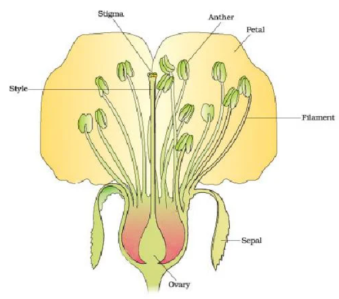

# Sexual Reproduction in Flowering Plants 

# Flower - A Fascinating Organ of Angiosperm 
Flowers are culturally significant since ancient time. They are an evolutionary marvel and sites of sexual reproduction. 

# Pre-Fertilization: Structure and Events
- Hormonal and structural changes lead to differentiation and development of the flower. 
- Inflorences are formed which bear the floral buds and then the flowers. 

# Stamen, Microsporangium and Pollen Grain 
- Stamen parts 
    - Filament 
    - Anther 

Proximal end of filament is attatched to thalamus or petal of a flower. 

> [!NOTE]
> Number of petals vary depending on flower species.

Typically, angiosperm anther is bilobed with each lobe having **two theca** (dithecous). Often a longitudinal groove separating the theca. 

> [!IMPORTANT]
> The anther is four sided structure consisting of four microsporangia located at the corners, two in each lobe.

# Seed Dormancy 

When all the required conditions are available, i.e., moisture, oxygen and temperature but still the seed doesn't germinate, it is called seed dormancy. The embryo is inactive during this stage. 

# Advantages of Seed 
It gives an advantage to angiosperms. 

1. Gives better adaptive strategies for dispersal to new habitats. Therefore, helping the species to colonize new areas. 
2. A Hard seed coat protects the embryo. 
3. They generate new genetic combination leading to variations. 
4. Food reserves help the growing sapling until it is capable of being independent.
5. Dehydration and dormancy of mature seeds are crucial for storage. 

> [!NOTE] Why aren't orchids found in every tree? 
> 1. The seeds are non-albuminous 
> 2. They need mycorrhizal association to germinate. 

- **Keystone species**: species which help to maintain an ecosystem. 
- **Flagship species**: conserve one species, other species will also flourish. 