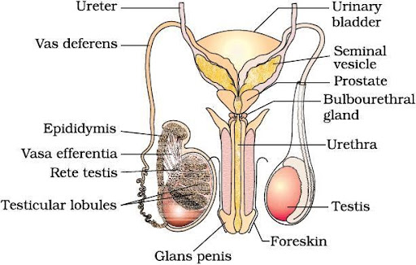
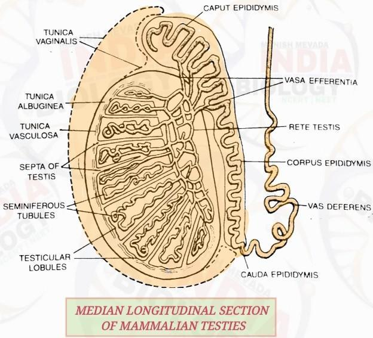

# 24/05/24  
## 1. What are the reproductive events found in human? 
The reproductive events found in humans are:  
1. **Gametogenesis**: production of gametes (sperm and eggs) through meiosis. 
2. **Insemination**: process of introducing sperm into the female reproductive tract to facilitate fertilization.
3. **Fertilization**: a sperm cell and an egg cell combine to form a zygote, initiating the development of a new organism.
## 2. Draw and label the structure of male reproductive system. 

## 3. Testis are outside the abdominal cavity. Why? 
Testis are located outside the body in a pouch called scrotum because spermatogenesis requires $2-2.5 \degree C$ lower temperature than the body in order to function efficiently. 

## 4. Explain the structure of the testis with a well-labeled diagram. 

- **Shape and size** 
    - **Shape**: Oval
    - **Length**: 4-5 cm
    - **Breadth**: 2-3 cm 
- **Location**: outside the abdominal cavity in a pouch called scrotum. 
- **Protective covering**
    - Tunica vaginalis: outer 
    - Tunica albuginea: middle 
    - Tunica vasculosa: inner 

- **Vas deferens**: it is a muscular tube that transports sperm from the epididymis to the urethra in preparation for ejaculation.

- **Cauda epididymis**: tail section of the epididymis where sperm are stored and mature before being transported to the vas deferens.

- **Corpus epididymis**: it is the middle section of the epididymis where sperm undergo further maturation as they are transported from the caput (head) to the cauda (tail).

- **Caput epididymis**: it is the head section of the epididymis where sperm enter from the testes and begin the maturation process.

- **Vasa efferentia**: it is a series of small ducts that transport sperm from the rete testis to the epididymis.

- **Rete testis**: is a network of tubules located within the testes that collects sperm from the seminiferous tubules and channels them into the vasa efferentia.

- **Seminiferous tubules**: Seminiferous tubules are coiled structures in the testes where spermatogenesis occurs. Spermatogonia, stem cells, divide and differentiate into sperm cells. Sertoli cells, supporting cells, form the blood-testis barrier, provide nutrients, and regulate temperature, crucial for sperm development.

- **Testicular lobules**: they are compartments within the testes, each containing one to four seminiferous tubules where sperm production occurs. There are around 250 lobules in each testis. 

- **Interstitial cells**: Interstitial cells, also known as Leydig cells, are found in the spaces between the seminiferous tubules within the testes and are responsible for producing and secreting testosterone, the primary male sex hormone.

- **Septa of testis**: The septa of the testis are connective tissue partitions that divide the testis into lobules, providing structural support and organization to the testicular tissue.

## 5. Write the differences between leydig cells and sertoli cells. 
| Characteristic     | Leydig Cells                                  | Sertoli Cells                                    |
|--------------------|----------------------------------------------|-----------------------------------------------|
| **Location**           | Found in the interstitial tissue of the testes, outside the seminiferous tubules. | Located within the seminiferous tubules of the testes. |
| **Function**           | Produce and secrete testosterone, the primary male sex hormone. | Provide structural and nutritional support for developing sperm cells, regulate spermatogenesis, and produce factors necessary for sperm maturation. |
| **Hormonal Regulation** | Stimulated by luteinizing hormone (LH) from the anterior pituitary gland. | Affected by follicle-stimulating hormone (FSH) and androgens, but not directly stimulated by a specific hormone from the anterior pituitary gland. |
| **Role in Spermatogenesis** | Indirectly support spermatogenesis by providing testosterone, which is essential for the development and maturation of sperm cells. | Directly support spermatogenesis by creating the microenvironment necessary for the process to occur, including providing structural support, nutrients, and regulating the movement of developing sperm cells. |

## 6. What are the accessory ducts in male reproductive system? State their functions. 
In the male reproductive system, the accessory ducts include the epididymis, vas deferens (also known as the ductus deferens), ejaculatory ducts, and urethra.

1. **Epididymis**: The epididymis is a coiled tube located on the surface of each testis where sperm from the testes mature and are stored. Its main functions include the maturation of sperm, storage of sperm, and transportation of sperm from the testes to the vas deferens.

2. **Vas Deferens**: The vas deferens is a muscular tube that extends from the epididymis to the ejaculatory duct. Its primary function is to transport mature sperm from the epididymis to the ejaculatory duct during ejaculation.

3. **Vasa Efferentia**: vasa efferentia are small ducts connecting the rete testis to the epididymis. Their primary function is to transport sperm from the rete testis to the epididymis, where they undergo further maturation and storage. Additionally, they are involved in reabsorption of fluid and secretory products from the testicular fluid, contributing to the concentration and composition of sperm.

4. **Rete testis**: rete testis serves as a network of tubules within the testicle, acting as a conduit for sperm to travel from the seminiferous tubules to the epididymis for maturation and storage. It also helps in maintaining a conducive environment for sperm development by facilitating the exchange of nutrients and waste products.

## 7. What are the accessory glands in the male reproductive system? State the functions. 
The accessory glands in the male reproductive system include the seminal vesicles, prostate gland, and bulbourethral glands (Cowper's glands). Here are their functions:

1. **Seminal Vesicles**: The seminal vesicles are two pouch-like glands located behind the bladder. Their main function is to produce and secrete seminal fluid, which constitutes a significant portion of semen. This fluid contains fructose, prostaglandins, and other substances that nourish and protect sperm, enhance sperm motility, and facilitate fertilization.

2. **Prostate Gland**: The prostate gland is a walnut-sized gland located below the bladder and surrounding the urethra. Its primary function is to produce prostatic fluid, which is a milky alkaline secretion that contributes to semen volume. Prostatic fluid contains enzymes, citric acid, and zinc, which help activate sperm and prolong their viability by neutralizing acidic conditions in the female reproductive tract.

3. **Bulbourethral Glands (Cowper's Glands)**: The bulbourethral glands are two pea-sized glands located beneath the prostate gland. Their function is to secrete a clear, viscous fluid known as pre-ejaculate or Cowper's fluid. This fluid lubricates the urethra, neutralizes any remaining acidity in the urethra from urine, and serves as a pre-ejaculatory flush to clear residual urine and lubricate the urethra in preparation for ejaculation.

---
# 27/6/24 

## Write the differences between spermatogenesis and oogenesis. 

| **Aspect**          | **Spermatogenesis**                                  | **Oogenesis**                                       |
|---------------------|------------------------------------------------------|----------------------------------------------------|
| **Multiplication**  | - Begins at puberty and continues throughout life    | - Begins during fetal development and ceases at old age            |
|                     | - Spermatogonia (diploid) divide by mitosis          | - Oogonia (diploid) divide by mitosis               |
|                     | - Forms primary spermatocytes (diploid)              | - Forms primary oocytes (diploid)                   |
| **Growth**          | - Primary spermatocytes grow minimally               | - Primary oocytes grow significantly                |
|                     | - Little increase in size                            | - Accumulate yolk and other materials               |
| **Maturation**      | - Primary spermatocytes undergo meiosis I to form two secondary spermatocytes (haploid) | - Primary oocytes begin meiosis I but arrest at prophase I until puberty |
|                     | - Secondary spermatocytes undergo meiosis II to form spermatids (haploid) | - At puberty, primary oocytes complete meiosis I to form a secondary oocyte (haploid) and a polar body |
|                     | - Spermatids differentiate into spermatozoa (sperm cells) | - Secondary oocyte begins meiosis II but arrests at metaphase II until fertilization |
|                     | - Continuous process                                 | - Meiosis II completes only if fertilization occurs, forming an ovum and another polar body |
|                     | - Produces millions of sperm daily                   | - Typically produces one ovum per menstrual cycle   |

