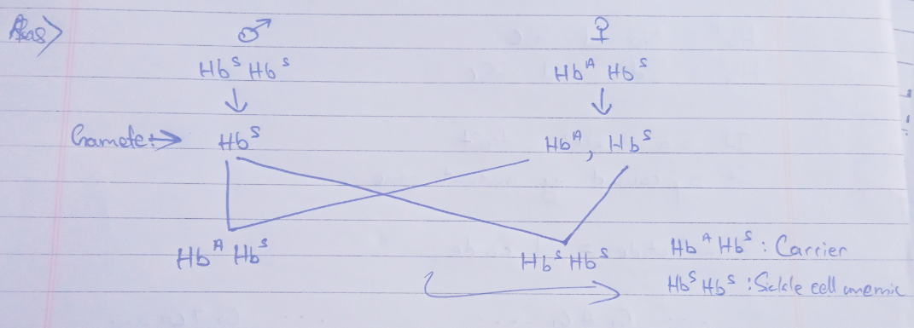

## 1. What is chromosomal aberration and mention its types.
Chromosomal aberrations, also known as chromosomal mutations, are changes in the structure or number of chromosomes within a cell. These changes can affect an organism's development and function, often leading to genetic disorders or diseases. Chromosomal aberrations can be categorized into structural and numerical types.

- Structural Chromosomal aberrations
  - Deletion
  - Duplication
  - Inversion
  - Insertion
- Numerical Chromosomal aberrations
  - Aneuploidy
    - Monosomy
    - Trisomy
  - Polyploidy

## 2. State the basic difference between Mendelian disorder and chromosomal disorder.

| **Characteristic** | **Mendelian Disorders**| **Chromosomal Disorders**|
|-|-|-|
| **Genetic Basis**| Mutation in a single gene | Abnormalities in chromosome number or structure|
| **Inheritance Pattern**| Follows Mendelian inheritance (autosomal dominant, autosomal recessive, X-linked dominant, X-linked recessive, mitochondrial) | Does not follow Mendelian inheritance patterns|
| **Type of Mutation** | Point mutations, insertions, deletions in a single gene | Deletions, duplications, inversions, translocations, aneuploidy |
| **Affected Genetic Material** | Single gene | Whole chromosomes or large segments of chromosomes |
| **Impact on Individual** | Specific symptoms based on the function of the affected gene | Wide range of physical and developmental abnormalities |
| **Examples** | Cystic fibrosis, Sickle cell anemia, Hemophilia | Down syndrome (Trisomy 21), Klinefelter's syndrome (insertion of extra X chromosome in XY combination) |

## 3. State the reason for polyploidy and aneuploidy.
### Reasons for Polyploidy and Aneuploidy

#### Polyploidy

Polyploidy is the condition in which a cell or organism has more than two complete sets of chromosomes. The main reasons for polyploidy include:

1. **Errors in Meiosis**: During meiosis, errors such as nondisjunction (failure of chromosome pairs to separate properly) can result in the formation of gametes with extra sets of chromosomes. If such gametes are involved in fertilization, the resulting zygote will be polyploid.

2. **Errors in Mitosis**: Polyploidy can also arise from errors during mitosis, where the chromosomes duplicate but the cell fails to divide. This leads to cells with multiple sets of chromosomes.

3. **Hybridization**: In plants, polyploidy often occurs through hybridization between different species, followed by chromosome doubling. This process, known as allopolyploidy, results in a new species with a combined chromosome number from both parent species.

4. **Chemical Induction**: Certain chemicals, such as colchicine, can induce polyploidy by disrupting spindle fiber formation during cell division, preventing the segregation of chromosomes.

#### Aneuploidy

Aneuploidy is the presence of an abnormal number of chromosomes in a cell, either more or fewer than the normal diploid number. The main reasons for aneuploidy include:

1. **Nondisjunction in Meiosis**: The most common cause of aneuploidy is nondisjunction during meiosis, where homologous chromosomes (in meiosis I) or sister chromatids (in meiosis II) fail to separate. This results in gametes with an abnormal number of chromosomes. If such gametes participate in fertilization, the resulting zygote will have an abnormal chromosome number.

   - **Meiosis I Nondisjunction**: Both homologous chromosomes go to one daughter cell, resulting in two gametes with an extra chromosome and two gametes missing a chromosome.
   - **Meiosis II Nondisjunction**: Sister chromatids fail to separate, resulting in one gamete with an extra chromosome and one gamete missing a chromosome, along with two normal gametes.

2. **Nondisjunction in Mitosis**: Nondisjunction can also occur during mitotic divisions in early embryonic development, leading to mosaicism where some cells have an abnormal chromosome number while others remain normal.

3. **Age-Related Factors**: In humans, the risk of aneuploidy increases with maternal age, particularly due to the prolonged arrest of oocytes in prophase I, which may lead to errors in chromosome segregation when meiosis resumes.

4. **Environmental Factors**: Exposure to certain environmental factors, such as radiation or chemicals, can increase the likelihood of nondisjunction events, leading to aneuploidy.

## 4. What is linkage?
Linkage refers to the phenomenon where genes that are located close to each other on the same chromosome tend to be inherited together during meiosis. This is because such genes are less likely to be separated by the process of crossing over, which occurs during prophase I of meiosis when homologous chromosomes exchange segments. The closer two genes are on a chromosome, the lower the probability that a crossover will occur between them, and thus the more likely they are to be inherited as a unit.

## 5. What are the characteristics considered by Morgan for his dihybrid cross?
Thomas Hunt Morgan conducted a series of experiments on **fruit flies** (*Drosophila melanogaster*) to study the inheritance patterns of different traits. In his famous dihybrid cross experiments, Morgan focused on yellow-bodied, white-eyed females and brown-bodied, red-eyed males and crossed them. 

## 6. Females rarely suffer from sex-linked diseases. Why?
Females rarely suffer from sex-linked diseases because sex-linked recessive traits require a pair of mutated X-chromosomes in females. So if a female is infected with the chromosome, it is likely to be a carrier rather than a sufferer. 

## 7. What is trisomy? Give one example.
Trisomy is a type of chromosomal disorder characterized by the presence of an extra chromosome in the cells of the organism. An example of trisomy is Down's Syndrome. 

## 8. What is the difference between co-dominance and incomplete-dominance?
| **Characteristic**           | **Co-dominance**                                   | **Incomplete Dominance**                             |
|------------------------------|---------------------------------------------------|-----------------------------------------------------|
| **Definition**               | Both alleles are expressed equally and distinctly | Phenotype is an intermediate blend of both alleles  |
| **Phenotype of Heterozygote**| Both traits are visible simultaneously            | Intermediate phenotype (blended trait)              |
| **Example**                  | ABO blood type (IAIA shows both A and B antigens) | Snapdragon flower color (Rr results in pink flowers)|
| **Visualization**            | Shows both traits distinctly                      | Shows a mixed or blended trait                      |

## 9. State the reasons and the symptoms of phenylketonuria.
Phenylketonuria (PKU) is a genetic disorder that results from a deficiency in the enzyme phenylalanine hydroxylase. This enzyme is necessary for converting the amino acid phenylalanine into tyrosine. When this enzyme is deficient or inactive, phenylalanine accumulates in the body, leading to various health problems such as: 

1. Intellectual disability
2. Developmental delays 
3. Growth problems
4. Behavioral problems 
5. Seizures
6. Pale skin and hair

It is caused due to: 

1. **Genetic Mutation**: Caused by mutations in the PAH gene, leading to a deficiency of the enzyme phenylalanine hydroxylase.
2. **Enzyme Deficiency**: The lack of phenylalanine hydroxylase results in the accumulation of phenylalanine in the body.
3. **Autosomal Recessive Inheritance**: PKU is inherited when an individual receives two copies of the mutated gene, one from each parent.

## 10. What is the use of test-cross?
A test cross is used to determine the genotype of an individual showing a dominant trait by crossing it with a homozygous recessive individual. This helps identify whether the dominant individual is homozygous dominant or heterozygous and verifies inheritance patterns.

## 11. Design a cross to show that phenotypic and genotypic ratios are 1:2:1 for $F_2$ generation.

## 12. Give two examples of male heterogamety.
The two examples of male heterogamety are humans and fruit flies. 

## 13. What are recessive alleles?
Recessive alleles are alternative forms of genes that only show their effect when an individual has two copies of the recessive allele. They're often masked by dominant alleles in heterozygous individuals and are associated with traits or disorders that appear when both copies of the gene are recessive.

## 14. Why did Morgan choose Drosophila for his experiment?
Morgan chose Drosophila (fruit flies) for his experiments because they have several characteristics that make them ideal for genetic research:

1. **Short Generation Time**: Fruit flies have a rapid life cycle, allowing for quick generation turnover.
2. **Large Offspring Number**: They produce many offspring, providing ample material for study.
3. **Easy Maintenance**: Fruit flies are easy to maintain in laboratory conditions.
4. **Visible Traits**: Drosophila exhibit a variety of visible traits suitable for genetic study.
5. **Well-Characterized Genome**: The Drosophila genome is well-studied, facilitating genetic research.

## 15. Compare the behavior of chromosomes and genes.
| Aspect | Chromosomes | Genes|
|-|-|-|
| **Function**   | Serve as physical carriers of genes, organizing genetic material within the cell. | Contain genetic information for encoding proteins and controlling cellular processes. |
| **Behavior**   | Undergo condensation, segregation, and distribution during cell division. | Are expressed or regulated according to cellular and environmental cues. |
| **Scale**      | Encompass entire lengths of DNA, including multiple genes and regulatory elements. | Specific segments of DNA that encode individual proteins or functional RNA molecules. |

# 15/05/24

## Q/ A sickle cell anemic man marries a woman who is a carrier of the disease but has normal traits, then what will be the probability of their child suffering from sickle cell anemia?

Therefore, the probability of the child suffering from sickle cell of anemia is 50%.

# 20/05/24

## Identify if the trait is dominant or recessive and sex-linked or autosomal.

From the picture, it can be seen that in the first generation, the father was the one with sickness, then after mating, the 4 children are fine which means it is a recessive trait. Since the father's genes go to the daughter, we have to consider the mating daughter in the 2nd generation will have the gene of the disease. Then in 3rd generation, the male is affected since the female's genes go to the male. 

This concludes that the disease we are considering in the picture is a **sex-linked, recessive trait**. 