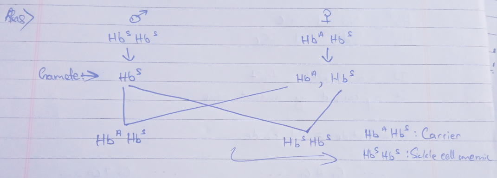

#### 1. What is chromosomal aberration and mention its types. 
#### 2. State the basic difference between Mendelian disorder and chromosomal disorder. 
#### 3. State the reason for polyploidy and aneuploidy.
#### 4. What is linkage? 
#### 5. What are the characteristics considered by Morgan for his dihybrid cross? 
#### 6. Females rarely suffer from sex-linked diseases. Why?
#### 7. What is trisomy? Give one example. 
#### 8. What is the difference between co-dominance and incomplete-dominance? 
#### 9. State the reasons and the symptoms of phenylketonuria. 
#### 10. What is the use of test-cross? 
#### 11. Design a cross to show that phenotypic and genotypic ratios are 1:2:1 for $F_2$ generation. 
#### 12. Give two examples of male heterogamety.
#### 13. What are recessive alleles? 
#### 14. Why did Morgan choose Drosophila for his experiment? 
#### 15. Compare the behavior of chromosomes and genes.

# 15/05/24 

#### Q/ A sickle cell anemic man marries a woman who is a carrier of the disease but has normal traits, then what will be the probability of their child suffering from sickle cell anemia? 

Therefore, the probability of the child suffering from sickle cell of anemia is 50%. 

