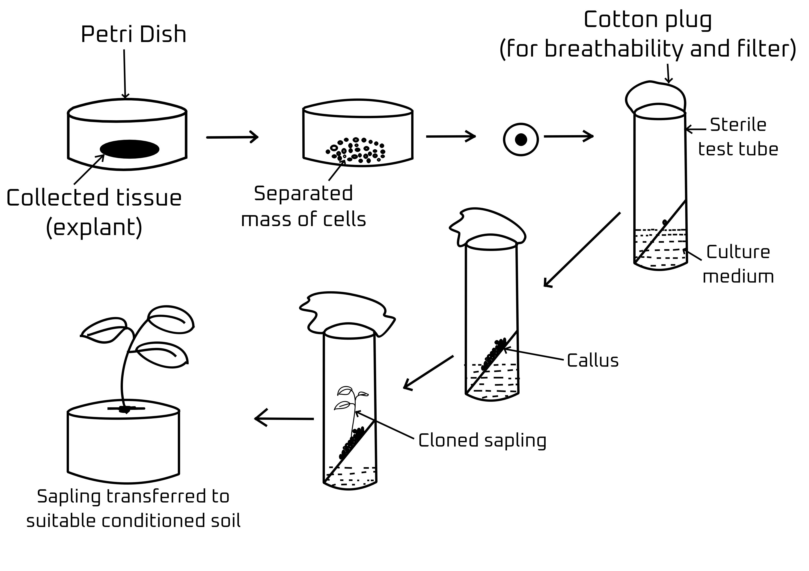

# Biotechnology and its Applications 

# Gene Therapy 
- Replace faulty gene with functional gene 
    - But not for all cases 
        - As it is not easy to reach every cell and cure disease. 

## ADA Deficiency Disease
It is a condition when the absence of an enzyme leads to decreased immunity. 

- Correction to ADA Deficiency Disease
    1. **Bone Marrow Transplantation (Temporary)**: the bone marrow from a healthy individual is taken out and implanted to the recipient that causes the person to get the ability to make normal lymphocytes. 
    2. **Inject ADA (Temporary)**: ADA is produced artificially and directly injected into the patient directly. But soon runs out and requires another dose. 
    3. **Lymphocyte Transplant (Temporary)**: The healthy Lymphocytes are taken out from the patient and with the help of bacteriophage complementary DNA, ADH is inserted into the lymphocyte that gives the temporary ability to produce ADA. But as cells die after some time, the process needs to be repeated again. 
    4. **Gene Therapy (Permanent)**: With the help of Amniocentesis, defects are detected in the early embryonic stage and is given gene therapy with the help of r-DNA technology which integrates with the foetus's DNA and solves the defect. 

# Transgenic Animals 
Transgenic animals are organisms whose genome has been intentionally modified by the introduction of one or more foreign DNA sequences from another species, especially human DNA for research purposes. 

- Uses of Transgenic Animals 
    1. **Vaccine safety**: to test the viability and safety of prototype vaccines.
    2. **Chemical safety**: to test the safety of chemical dosage combination. 
    3. **Study of diseases**: to test the symptoms of diseases on human body. 

An example of useful transgenic animal was Rosy the cow which produces more nutritional milk due to the presence of 2.4 g per liter human alpha-lactalbumin in the milk. 

# Ethical Issues
## GEAC 
- Stands for **Genetic Engineering Approval Committee**
It is an organization set up by the Indian government that makes user all Genetic Modification research are done safely and for the betterment of humanity. 

# Micropropagation
It is process by which new plants are made from cultured plant cells especially with the help of **agrobacterium** to modify its characteristics. 

## Tissue Culture
> [!IMPORTANT]
> Plant cells are cultured from the **apical meristem** as it's the dividing tissue and has no chance of carrying diseases. 

The collected tissue is placed in a petri dish with solutions and kept in a machine vibrating or rotating in certain RPM to separate all cells.  
Then the cells are used for making new plants as each cell has totipotency. 

> [!NOTE]
> If the cloned plant is genetically modified, then ** modified agrobacterium** is introduced in the cell transfer stage or separated cell stage. 

> [!CAUTION]
> **Q/ If every cell is totipotent, then why only the apical meristem used in cloning or GMing?** 
>
> Even though every cell is totipotent, the mature cells might be infected by bacteria, virus or might have some defects which will reflect in all the cloned plants. Since the apical meristematic tissue is continuously dividing, it has no chance of being defected or infected so all the cloned or GMed plants are normal. 

- **Clones**: genetically and morphologically identical organisms with single source of cell collection. 
- **Somatic-clones**: it is a group of genetically identical cells derived from a single ancestor cell through mitosis, found within the body's tissues but not involved in reproduction.
- **Somatic-hybridization**: when isolated protoplasts from two different variety or organism are fused to create a new individual with characteristic of the two ancestor cell is called somatic-hybridization

### Tissue Culture Process
1. Take explant (from meristematic tissue)
2. Transfer to petri dish
3. Vibrate or rotate in certain RPM with solution media. 
4. Take the cultured cells and transfer to a sterile growth media (test tube) with suitable temperature, pH level, nutrients and hormones.
5. Plug with cotton for exchange of gases without introducing unwanted agents.
6. After the sapling grows, transfer to sterile soil under shade to let the plant grow. 