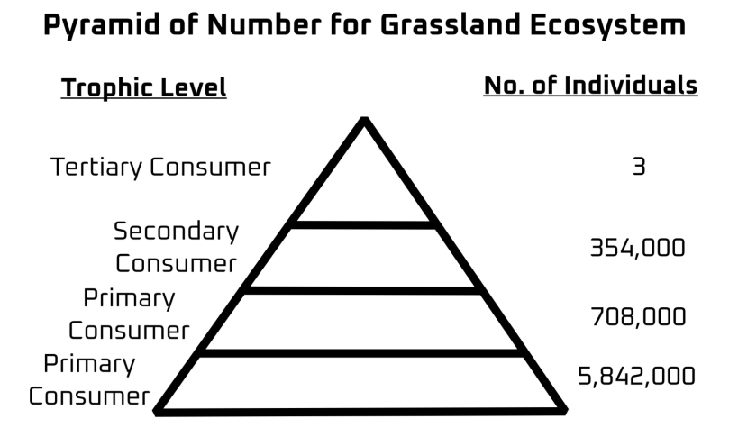
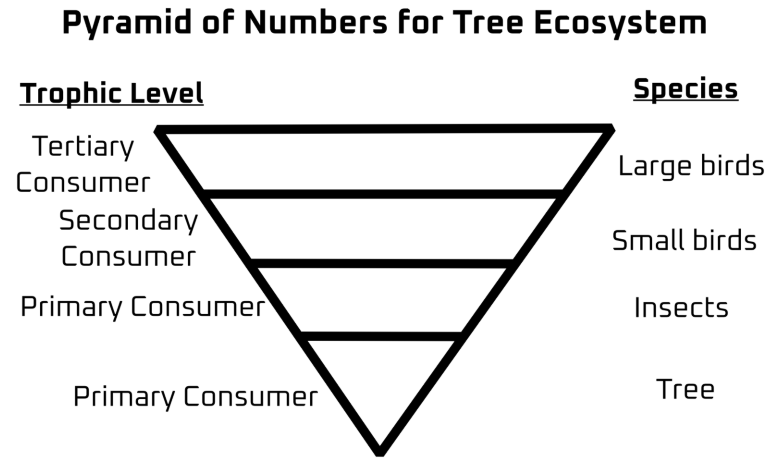
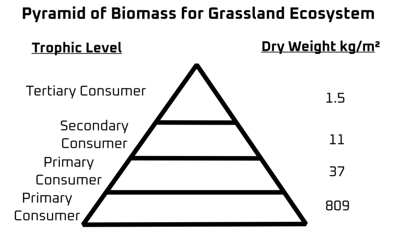
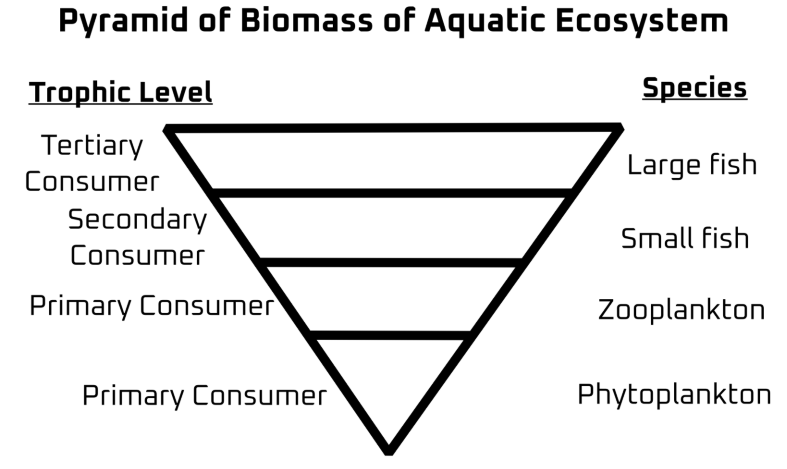
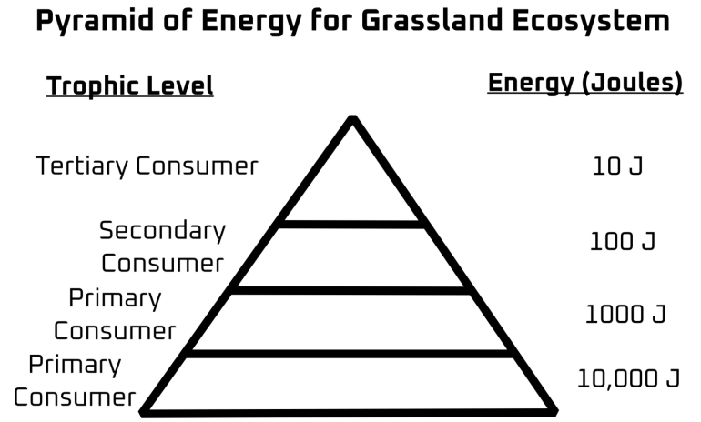

# Ecosystem 

> [!CAUTION]
> **Q/ What is ecological pyramid?**
>
>  An ecological pyramid is a graphical representation of the relationship between different organisms. Each bar of the pyramid represents a different trophic level. Ecological pyramid are of three types: 
> 1. **Pyramid of Numbers**: This represents the number of organisms in each trophic level, irrespective of their size. 
> 2. **Pyramid of Biomass**: represents the total mass of organisms at each trophic level. 
> 3. **Pyramid of Energy**: represents amount of energy present at each trophic level and the total energy lost between each trophic level. 

## Pyramid of Numbers 
This type of pyramid represents the number of entities/individuals present in an ecosystem as per trophic level. The amount of vegetation in far greater than the number of consumers present there and so we get an upright pyramid which also follows **Leindman’s 10% Law**.  
But in the case of an isolated ecosystem such as a tree, it shows an inversion where a single **large tree** supports the **invertebrates which are consumed by aves**. 
|  |  |
|:-:|:-|

## Pyramid of Biomass 
This pyramid represents the amount of weight carried per trophic level in an ecosystem. For a typical grassland, it contains shrubs and trees which weigh more than the animals that consume them and due to survivability with numbers, the **herbivores have more numbers than predators** which also give them **more biomass in the ecosystem**.  
But in the case of an aquatic ecosystem such as an ocean, the sheer number of autotrophs surpass the consumers but due to their size, the contribute much less to the biomass, whereas the upper trophic levels have much smaller number in comparison, their large body size and weight gives them more biomass.

|  |  | 
|:-:|:-:|

## Pyramid of Energy 
Important to note that the **Pyramid of Energy** is always upright due to **Leindman’s 10% Law**; as it says that energy is lost in the form of heat while transferring from one trophic level to another.  
Be it terrestrial or aquatic, the Law applies to all of them, also evident by how upper trophic level organisms are usually larger than lower ones which also proves they need more energy to survive which is lost in the form of heat per trophic level.

> [!CAUTION]
> **Q/ What are the advantages of Ecological Pyramids?**
>
> 1. **Simplified Representation**: Ecological pyramids provide a simple and visual way to understand the flow of energy, biomass, and number of organisms at different trophic levels in an ecosystem.
> 
> 2. **Clear Hierarchical Structure**: They clearly show the hierarchical structure of ecosystems, highlighting the relationships between producers, consumers, and decomposers.
>
> 3. **Quantitative Analysis**: Ecological pyramids allow for the quantification of energy, biomass, or numbers at each trophic level, making it easier to analyze and compare different ecosystems.
>
> 4. **Energy Flow Insight**: Pyramid of energy highlights the flow of energy across trophic levels, illustrating how much energy is lost at each level, which helps in understanding the efficiency of energy transfer.
>
> 5. **Indication of Ecosystem Health**: The shape and structure of ecological pyramids can indicate the health of an ecosystem. For example, a healthy ecosystem typically has a broad base (large number of producers) and a narrower top (fewer top predators).
>
> 6. **Predictive Value**: By understanding the distribution of energy, biomass, or numbers across trophic levels, ecological pyramids can help predict the impact of changes in one level on the entire ecosystem.
> 
> 7. **Educational Tool**: Ecological pyramids serve as effective educational tools to teach concepts of ecology, such as food chains, trophic levels, and energy flow in ecosystems.
>
> 8. **Detection of Ecosystem Imbalances**: They can reveal imbalances in ecosystems, such as overpopulation of a particular species or depletion of resources, which can lead to ecological problems.

> [!CAUTION]
> **Q/What are the limitations of Ecological Pyramids?**
>
> 1. **Does Not Capture Complexity**: Ecological pyramids oversimplify ecosystems, often not capturing the complexity of food webs where organisms feed at multiple trophic levels.
> 
> 2. **No Representation of Decomposers**: Decomposers, which play a crucial role in ecosystems by breaking down dead matter, are usually not represented in ecological pyramids.
> 
> 3. **Ignores Energy Transfers**: The pyramids do not show energy transfers that occur between organisms within the same trophic level or across multiple levels, leading to an incomplete picture of energy flow.
> 
> 4. **Inapplicability to Certain Ecosystems**: In some ecosystems, like aquatic systems, the pyramid of biomass can be inverted (where higher trophic levels have greater biomass than lower ones), making the pyramid representation misleading.
>
> 5. **Temporal Variations Not Shown**: Ecological pyramids represent a snapshot in time and do not account for seasonal or temporal variations in population sizes, energy flow, or biomass.
>
> 6. **Does Not Show Rate of Energy Flow**: The pyramid of energy does not account for the rate at which energy is produced and consumed, which can vary greatly between different ecosystems and even within the same ecosystem over time.
> 
> 7. **No Insight Into Species Interactions**: While ecological pyramids show the number, biomass, or energy at each level, they do not provide information on the interactions between species, such as competition, predation, or symbiosis.
> 
> 8. **Assumes Simple Linear Flow**: Ecological pyramids are based on the assumption of a linear flow of energy and nutrients, which does not account for the recycling of nutrients and energy that occurs in ecosystems.