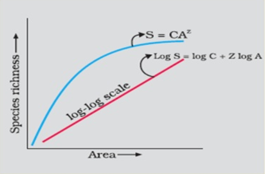
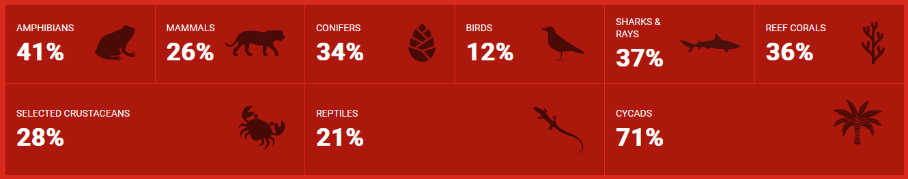
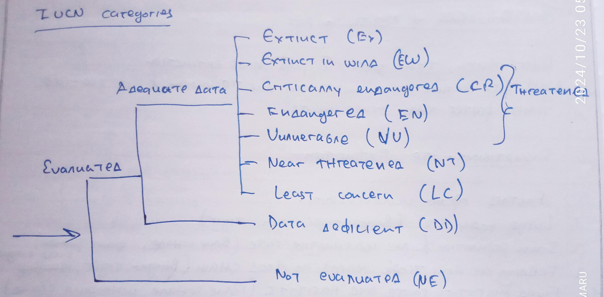
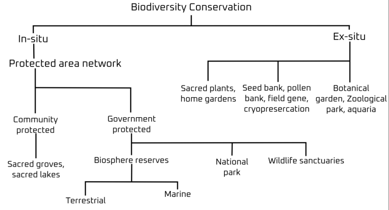
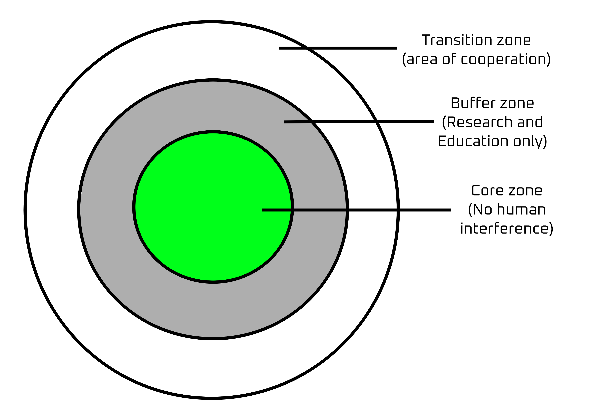

# Biodiversity and Conservation 
1. Enormous Diversity of Life: The sheer variety of species on Earth, including specific examples like
    - **Ants**: more than 20,000 species 
    - **Beetles**: more than 300,000 species 
    - **Fish**: more than 28,000 species
    - **Orchids**: Nearly 20,000 species

- **Diversification**: process by which a single species evolves into multiple distinct species or forms, often as a result of adapting to different environments or ecological niches. This process increases biodiversity and contributes to the variety of life on Earth.

> [!IMPORTANT]
> **Q/ Role of biodiversity in the functioning of ecosystems and the biosphere.**
> > Biodiversity plays a crucial role in the functioning of an ecosystem by enhancing its stability, productivity, and resilience. A diverse range of species ensures that ecosystems can provide essential services such as nutrient cycling, pollination, water purification, and climate regulation. Greater biodiversity also helps ecosystems adapt to environmental changes and disturbances, ensuring long-term sustainability and balance.

# Biodiversity 
> [!NOTE]
> **Q/ Why is biodiversity required in an ecosystem?**
> > Communities with more species tend to be more stable than that with less species that was confirmed by Davis Tilman. 

- Characteristics of a stable community: 
    1. Productivity should not vary too much year to year. 
    2. In should be resistant to occasional natural and man-made disturbances. 
    3. It should be resistant to invasion by foreign species.

## Species-area Relationships 

- This concept was given by German naturalist and geographer **Alexander von Humboldt** when he explored the South American jungles. 

During his research, he observed that the richness of regional species increases with increasing explored area. 

The graph shows that the richness of a species can only extend to a limit intersected by the log line and depends on the area.

- The angle of Z-line increases the more area we consider. 

### Rivet Popper Hypothesis by Paul Ehrlich 
1. Assumes the ecosystem to be an airplane and the species to the rivets joining all parts together. 
2. If every passenger pops a rivet to take home (resulting species extinction), it may not effect the flight safety initially (proper ecosystem functioning).
3. When with time as more rivets are removed the plane becomes dangerously weak and fatal to the life of other species. 

### Loss of Biodiversity 
- The colonization of tropical pacific island by humans has led to extinction of more than 2000 native bird species. 
- IUCN RED List (2004) enlists the extinction of 784 species in the last 500 years. 

- Evil quartet 
    - Habitat loss 
    - Overpopulation 
    - Alien species invasion 
    - Co-extinction

> [!NOTE] Co-Extinction 
> When more than one species become extinct due to the extinction of an other species. Eg.- near extinction of *Sideroxylon grandiflorum* due to the extinction of the **Dodo bird**.

# Types of Extinction 
1. **Natural Extinction**
    1. It is a natural process. 
    2. Gradual disappearance with change to natural condition. 
    3. Loss of species occurs in every slow rate. 
2. **Mass Extinction** 
    1. Large extinction due to sudden change in environment. 
    2. Theses are rare and occur in million of years. 
3. **Anthropogenic Extinction** 
    1. Disappearance due to human activities.
    2. Occurs very fast an short period of times and causes severe depletion of biodiversity. 

## Mass Extinction of Species in Past
- Before humans, there were 5 past mass extinctions 
- Now 6th extinction is happening due to human and is 100-1000 times faster than other events. 

# Susceptibility of Extinction 
- Factors of vulnerability 
    1. Large body size (bengal tiger, lion, tiger)
    2. Small population and low reproductive rate (blue whale and giant panda) 
    3. Feeding at high tropic levels in food chain (bengal tiger, bald eagle)
    4. Fixed migratory routes and habitats (blue whale, whooping crane) 
    5. Localized and narrow range of distribution island (woodland caribou) 

> [!NOTE]
> Due to DDT, there's shell failure in bald eagle's egg. 

# IUCN Red List / Red Data Book 
> [!WARNING] What is IUCN Red List? 
> It is a publication by International Union for Conservation of Nature which gives a compiled list of most of the species on a scale indicating their current situation with respect to extinction factors. 

## IUCN Categories 

## Threatened Species 
- Those species that are threatened with extinction and need to be conserved are called threatened species. They belong to three categories: 
    - **Vulnerable (VU)**: taxa faces high risk of extinction in the wild. Eg.- sarus crane
    - **Endangered (EN)**: taxa considered to face very high risk of extinction in the wild. Eg.- tiger
    - **Critically Endangered (CR)**: taxa considered to face extremely high risk of extinction in the wild. Eg.- great indian bustard 

## Rare Species
- These are the species with small population. They are thinly scattered all over the world. 
    - Neither endangered nor vulnerable but at risk due to small population. 

# Biodiversity Conservation 
- Reasons 
    1. **Narrow utilitarian** (food, fats & oils, firewood, fibers, timber, industrial product, drugs). 
        - More than 25,000 of drug are derived from plant. 
    2. **Broad utilitarian**
        - **Oxygen**: more than 20% oxygen is produced by the amazon rainforest. 
        - **Climate regulation**: forest and oceanic systems regulate global climate. 
        - **Prevents flood and erosion**: covers soil from water and soil erosion. Run off rain water is reduced so that flood water is rarely formed. 
        - **Biological pest control**
        - **Nutrient cycle**
        - **Recharging aquifers**: plant cover is essential for retention of rain water, its percolation and storage in aquifers and reservoirs. 
        - **Pollination**
        - **Aesthetic value (ecotourism)**
        - **Microbial waste treatment**

> [!NOTE]
> **Bioprospecting**: search for plants and animal species from which medicinal drugs and other commercially valuable compounds can be obtained. 

# Ramsar Convention
- It was a meeting held at Ramsar, Iran in 1971 on the conservation of wetlands. 

- **Ramsar sites**: wetlands recognized by Ramsar convention. 

### Ethical Argument 
Philosophy or spiritual, we need to realize that every species has an intrinsic value, even if it may not be of current or any economic value to us. We have our moral duty to care for their well-being. 

# Biosphere Reserves 

- Role 
    - Preserves wildlife population 
    - Preserves lifestyle of tribal
    - Preserves resources of domesticated plants and animals
- Helps in 
    - Conservation 
    - Promotes economic development 
    - Scientific research, monitoring and education

- Criteria for being a biodiversity hotspot
    1. Must have at least 1500 vascular plants es endemics 
    2. Must have 30% or less of its originated natural vegetation. 

# Wetlands
Wetlands are covered by water, either temporarily/seasonally or permanently. It is a characteristic of distinct ecosystem. 

- Importance
    - Key role in hydrological cycle, flood control, water supply, provides food, fiber and raw materials. 
    - Supports numerous migratory birds from colder regions of the world in summer apart from mangroves that protect coastlines and filter pollutants. 