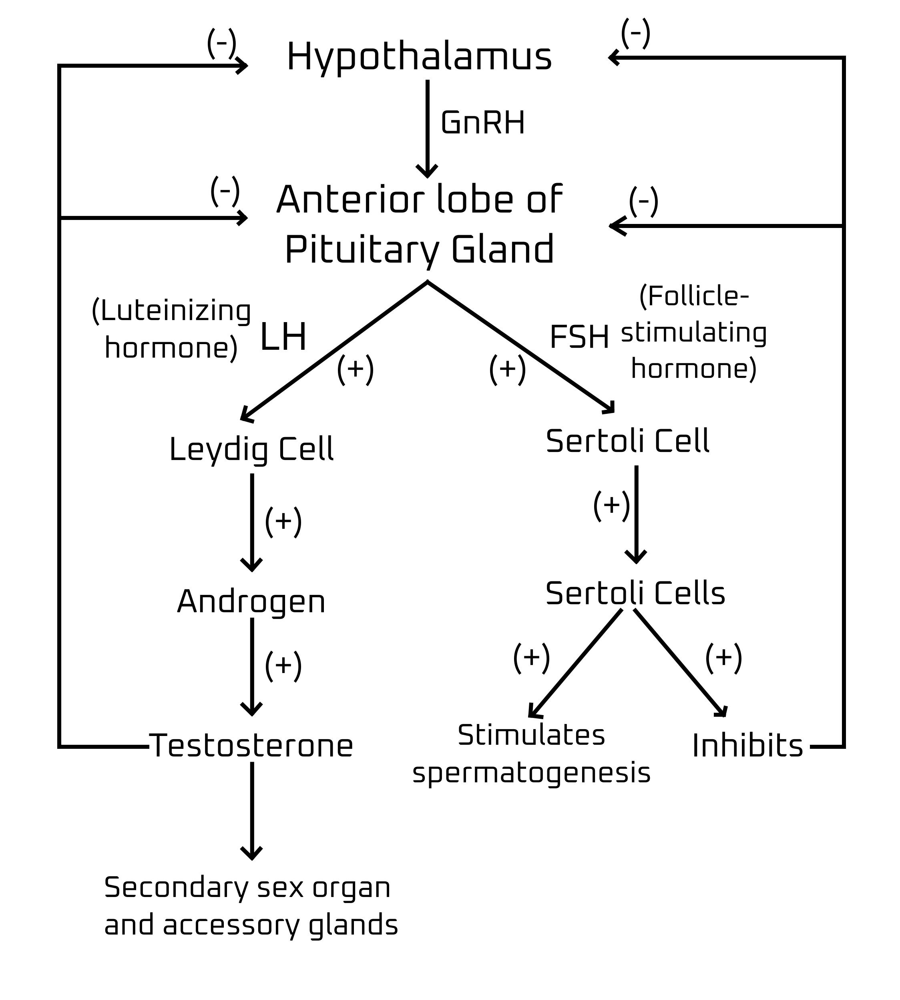
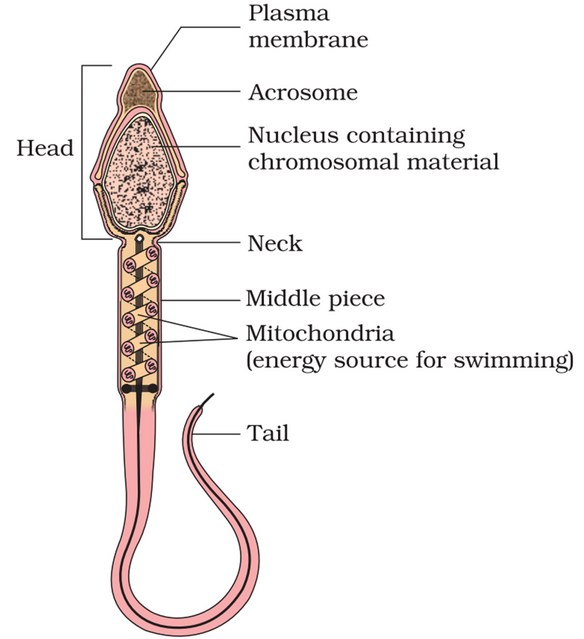
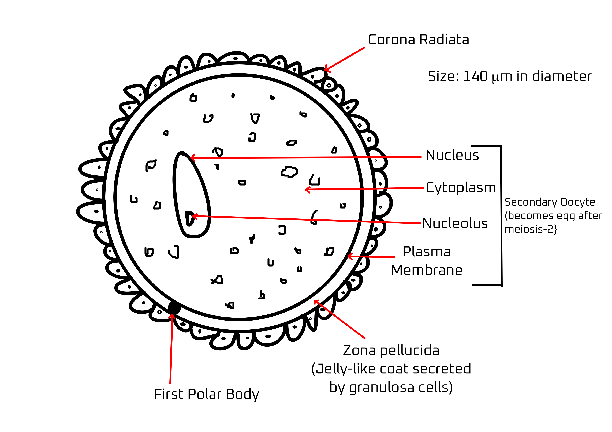
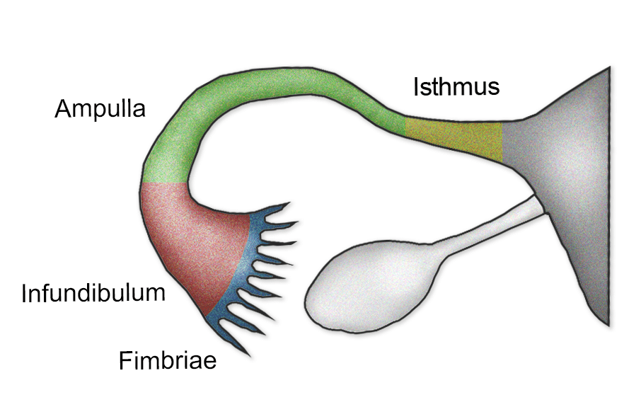
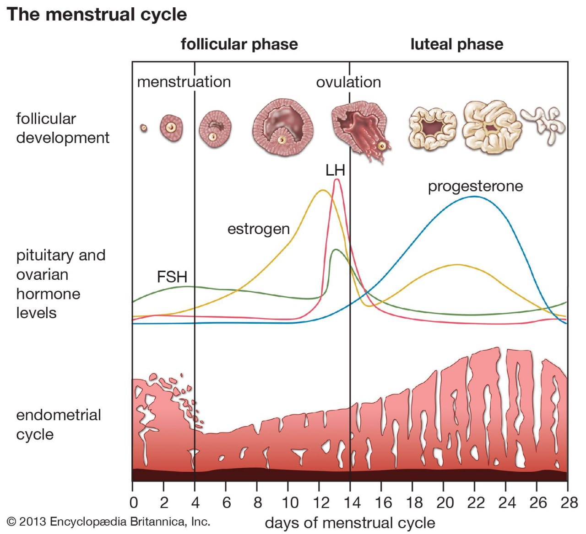
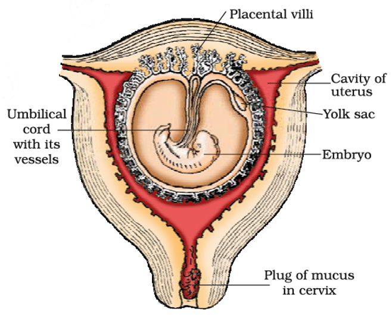

# Human Reproduction 

- Humans are **viviparous** 

> [!NOTE]
> - Important events in human reproduction
>   1. **Gametogenesis**: formation of gametes 
>   2. **Insemination**: transfer of sperms to the female genital tract
>   3. **Fertilization**: fusion of male and female gametes
>   4. **Implantation**: formation and development of blastocyst and its attatchment to the uterine wall
>   5. **Gestation**: period of embryonic development 
>   6. **Parturition**: delivery of the baby

> [!TIP]
> Male continues to develop sperms till very old age but females stop ovulating aronud the age of 50. 

# Male Reproductive System 

> [!IMPORTANT]
> - **Characteristics** 
>   1. Located in the pelvic region 
>   2. Includes: pair of testis, accessory ducts, glands and external genitalia. 
>   3. Testis are situated outside the abdominal cavity within a pouch called scrotum. 
>       - Helps to maintain temperature for spermatogenesis (2-2.5$\degree C$ lower than body temperature)
>   4. **Testis**:
>       1. Oval in shape
>       2. **Length**: 4-5 cm 
>       3. **Width**: 2-3 cm 
>   5. Testis is covered by a thick covering 

> [!IMPORTANT]
> - **Testis**
>   - Has about 250 compartments each called **testicular lobules**
>   - Each lobule contains 1-3 highly coiled **seminiferous tubules** in which **sperms are produced**. 
>   - Each seminiferous tubules is covered with **spermatogonia** and **sertoli cells**.  

- Leydig cells present outside the seminiferous tubules in interstitial spaces and they synthesize and secrete testicular hormones called androgen. 

- Fructose is found in the epididymis that nourishes the sperm. 

> [!IMPORTANT]
> - Male Reproductive Glands 
>   - **Bulbourethral gland**: provides lubrication and basicity to the seminal fluid. 
>   - **Prostate gland**: produce prostatic fluid, which is a milky alkaline secretion that contributes to semen volume. Prostatic fluid contains enzymes, citric acid, and zinc, which help activate sperm and prolong their viability by neutralizing acidic conditions in the female reproductive tract.
>   - **Seminal vesicle**: provides fructose to the newly formed sperms accumulated there allowing motility along with release of calcium and enzymes. 

> [!IMPORTANT]
> - Male accessory ducts 
>   1. **Rete testis**: rete testis serves as a network of tubules within the testicle, acting as a conduit for sperm to travel from the seminiferous tubules to the epididymis for maturation and storage. It also helps in maintaining a conducive environment for sperm development by facilitating the exchange of nutrients and waste products.
>   2. **Vasa efferentia**: vasa efferentia are small ducts connecting the rete testis to the epididymis. Their primary function is to transport sperm from the rete testis to the epididymis, where they undergo further maturation and storage. Additionally, they are involved in reabsorption of fluid and secretory products from the testicular fluid, contributing to the concentration and composition of sperm
>   3. **Epididymis**: The epididymis is a coiled tube located on the surface of each testis where sperm from the testes mature and are stored. Its main functions include the maturation of sperm, storage of sperm, and transportation of sperm from the testes to the vas deferens.
>   4. **Vas deferens**: The vas deferens is a muscular tube that extends from the epididymis to the ejaculatory duct. Its primary function is to transport mature sperm from the epididymis to the ejaculatory duct during ejaculation.

- Some behave like spermatozoa but others do not and provide nutrients. 
- Oogenesis starts in the fetal phase and stops temporarily and again starts in puberty. 

### Explain the hormonic control of spermatogenesis. 

Once the positives are excess in the blood, it signals the brain to spot producing more of the hormone.

# Human Sperm 
The formation of sperm, **spermatogenesis** starts at the age of puberty due to the release of **Gonadotropin Releasing Hormone (GnRH)** 

- GnRH acts at the pituitary gland and **secretes 2 gonadotropins**
    1. Lutenisign hormone 
    2. Follicle Stimulating Hormone 

> [!NOTE]
> LH acts at Leydig cells and stimulates secretion of androgens which stimulates the process of spermatogenesis.  
>
> FSH acts on Sertoli cells and stimulates secretion of factors which help in the process of spermatogenesis. 

> [!IMPORTANT]
> 1. The sperm of made of a tail, middle piece and a head. 
> 2. The anterior portion of the head is covered by acrosome filled with enzymes that help in the fertilization of the ovum. 
> 3. Middle piece contains mitochondria that produce energy for the movement of the tail. 

- A human male ejaculates around 200 to 300 million sperm in one ejaculation.
- For normal fertility, at least 60% of the sperm show normal shape and size with vigorous motility. 

The sperms released from seminiferous ducts are transported to accessory ducts. Sections of epididymis, vas deferens, seminal vesicle and prostate are essential for maturation and motility of the sperms. 

> [!NOTE]
> The seminal plasma along with sperms constiture the semen.  
> The functions of male sex accessorg ducts and glands are maintained by the androgens. 

# Female Reproductive System 
The ovaries take their characteristic shape when the female foetus is around 3 months old. 

During this, around **2 million egg-mother** cells are developed in **each ovary** but till the time of puberty, only **a few thousands remain**. 

- Uterus layers
    1. **Perimetrium**: anchors the uterus and serves as a barrier from infections and pathogens. 
    2. **Myometrium**: contracts during delivery which helps to take the fetus out. 
    3. **Endometrium**: provides a nourishing environment for a fertilized egg to implant and develop into a pregnancy. It also sheds during menstruation if no pregnancy occurs.

> [!NOTE]
> **Ectopic Fertilization**
>
> It is a condition when the fertilized eggs implants itself outside the uterus, usually in the fallopian tube, ovary, cervix or abdominal cavity. 
>
> This is a life-threatening condition which leads infertility. 

- Ovulation generally takes place on the 14th day. 

> [!NOTE]
> **Oogenesis**: formation and maturation of ovum from female germ cell.  
> Couple of million of oogonia are formed before birth.  
> In prophase 1, egg cells are produced and are temporarily stopped at the stage and called **primary oocytes**.   
> Each primary cells are surrounded by Granulosa cells and is called **Primary follicle**.  
> Till the time of puberty, only 60,000-80,000 primary follicles remain in each ovary.

- **Stem cell**: a cell that can develop into any other cell. 

## Structure of Secondary Oocyte 
It is a haploid cell formed when the primary oocyte divides by meiosis-1. The second meiosis division proceeds as far as metaphase but doesn't continue until a sperm fuses with the oocyte. At fertilization, the secondary oocyte undergoes the second meiotic division producing a large cell, the ovum and a small second polar body. 

- **Parts of Fallopian Tube** 
    1. **Isthmus**: facilitates their gradual release, and assists in the transport of the oocyte, increasing the chances of successful fertilization.
    2. **Ampula**: it is the site where fertilization typically occurs and facilitates the initial stages of the transport of the fertilized egg towards the uterus.
    3. **Infundibulum**: captures the ovulated oocyte and directs it into the oviduct for potential fertilization.
    4. **Fimbriae**: these are finger-like projections at the end of the infundibulum that sweep the ovulated oocyte into the oviduct.
     
> [!NOTE]
> If fertilized, embryo relases hormones that prevent the **breakdown of endometrium**.  
> It also provides nourishment to the developing embryo and holds it. 
>
> Note that the blood isn't shared between the mother and the foetus but nutrients and wastes are transferred through a semi-permeable layer. 

- **Human Papilloma Virus:** an STD that develops warts and tumors that lead to infertility due to the infection of the cervix and the tumors lead to cancer. 

# Mammary Gland
Most of the parts are muscle and fat. 

> [!NOTE]
> - **Mammary lobe**: contains 15-20 alveoli and acts as pouch to contain the alveoli. 
> - Mammary alveoli are connected via **lactiferous ducts** that secrete milk. 

# External Genitalia (Vulva)
1. **Mons Pubis**: The fatty area covered with pubic hair that lies over the pubic bone.
2. **Labia Majora**: The outer lips, which are fatty folds of skin that enclose and protect the other external genital organs.
3. **Labia Minora**: The inner lips, which are thin folds of skin situated within the labia majora, surrounding the vaginal and urethral openings.
4. **Clitoris**: A small, sensitive, and erectile part of the female genitalia, located at the front of the vulva.
5. **Clitoral Hood (Prepuce)**: The fold of skin that surrounds and protects the clitoris.
6. **Vaginal Opening (Introitus)**: The entrance to the vagina.
7. **Urethral Opening**: The opening through which urine exits the body.
8. **Vestibule**: The area between the labia minora that contains the openings to the urethra and vagina.
9. **Bartholin's Glands**: Glands located on either side of the vaginal opening that secrete fluid to lubricate the vagina.
10. **Perineum**: The area between the vaginal opening and the anus.

> [!NOTE]
> The vulva is often mistakenly referred to as the vagina, but they are not the same. The vulva includes all the external genital organs, while the vagina is the internal canal that connects the external genitalia to the cervix and uterus. Proper terminology is important for understanding female anatomy and for medical communication.

# The Menstrual Cycle

If menarche starts early, it may create abnormalities in hormones in later life. 

Primary oocyte forms estrogen covered by granulosa cell after multiple layers, it forms primary follicle and starts forming estrogen. 

- Corpus luteum forms progesterone from inside the ovary. 

On 14th day of ovulation, the egg is released and for 48 hours, it remains intact. If it is not fertilized, the body doesn't need the endometrium anymore so it degenerates the layers that cause menstrual bleeding. 

In pregnancy test kit, it checks for hormone present in the urine and finds if the zygote is present or not. 

Menopause begins at around 50 years of age.  
When this starts, it also affects other body parts including the brain.  
And due to this, it causes mental issues. 

Also, body homeostasis disruptions. 

Behavior also changes. 

# Pregnancy and Embryonic Development 
## Placenta Formation and Function
### Chorionic Villi and Placenta Development

- **Chorionic Villi:**
  - After implantation, finger-like projections called **chorionic villi** appear on the trophoblast.
  - These villi are surrounded by uterine tissue and maternal blood.
  - Chorionic villi and uterine tissue interdigitate, forming the **placenta**.

### Functions of the Placenta
- **Supply and Removal:**
  - Facilitates the supply of oxygen and nutrients to the embryo.
  - Removes carbon dioxide and excretory/waste materials produced by the embryo.
- **Connection:**
  - Connected to the embryo through the **umbilical cord**, aiding in the transport of substances.
- **Endocrine Functions:**
  - Acts as an endocrine tissue, producing several hormones:
    - **Human Chorionic Gonadotropin (hCG)**
    - **Human Placental Lactogen (hPL)**
    - **Estrogens**
    - **Progestogens**
  - Later in pregnancy, the **ovary** secretes the hormone **relaxin**.
  - **hCG, hPL, and relaxin** are produced only during pregnancy.

### Hormonal Changes During Pregnancy
- Increased levels of:
  - **Estrogens**
  - **Progestogens**
  - **Cortisol**
  - **Prolactin**
  - **Thyroxine**
- These increased hormone levels support:
  - Fetal growth
  - Metabolic changes in the mother
  - Maintenance of pregnancy

## Embryonic Development
### Differentiation of the Inner Cell Mass
- After implantation:
  - The inner cell mass (embryo) differentiates into:
    - **Ectoderm** (outer layer)
    - **Endoderm** (inner layer)
  - A **mesoderm** appears between the ectoderm and the endoderm.
  - These three layers give rise to all adult tissues and organs.

### Stem Cells
- The inner cell mass contains **stem cells**:
  - These cells have the potency to give rise to all tissues and organs.

> [!IMPORTANT]
> ## Different Stages during Embryonic Development
> 1. 4 weeks = development of heart 
> 2. 8 weeks = limbs and digits 
> 3. 12 weeks = major organ system (limbs and external genital organs)
> 4. 20 weeks = movements of foetus and development of hair on head 

## Gestation Period of Different Animals 

| 
 Animal | 
 Time | 
|:-:|:-:|
Elephant | 22 months 
Blue Whales | 12 months 
Horses | 11 months 
Cows | 9 months 
Deer | 6.5 months 
Lions | 3.5 months 
Dogs | 2 months 
Cats | 2 months 
Rats and Mice | 3 weeks 
Chicken | 21 days 
Ducks | 28 days 
Turtles | 60-120 days 
Snakes | 2-3 months 
Frogs | 6-21 days 

# Parturition and Lactation
## Parturition (Childbirth)
- **Duration**: Human pregnancy lasts about 9 months (gestation period).
- **Process of Childbirth**:
  - Induced by a complex neuroendocrine mechanism.
  - Signals originate from the fully developed foetus and the placenta.
  - These signals induce mild uterine contractions known as the foetal ejection reflex.
  - This reflex triggers the release of oxytocin from the maternal pituitary gland.
  - **Oxytocin**:
    - Acts on the uterine muscle, causing stronger contractions.
    - Stronger contractions stimulate further secretion of oxytocin.
    - This creates a positive feedback loop, leading to increasingly stronger contractions.
  - Result: Expulsion of the baby through the birth canal (parturition).
  - Post-delivery: The placenta is expelled from the uterus.

- **Medical Induction**: 
  - **Oxytocin** is commonly injected by doctors to induce or augment labor.

## Lactation
- **Mammary Glands**: Undergo differentiation during pregnancy.
- **Milk Production**:
  - Begins towards the end of pregnancy.
  - The initial milk is called **colostrum** which contains antibodies that help the fetus to develop immunity.
  - **Colostrum**:
    - Contains several antibodies.
    - Essential for developing resistance in newborn babies.
- **Breastfeeding**:
  - Recommended during the initial period of infant growth.
  - Important for nurturing a healthy baby.

# Summary 
## Human Reproductive System
### General Characteristics
- **Reproduction**: Humans are sexually reproducing and viviparous.

### Male Reproductive System
- **Components**:
  - Pair of testes
  - Male sex accessory ducts
  - Accessory glands
  - External genitalia
- **Testes**:
  - Contains about 250 compartments called testicular lobules.
  - Each lobule contains 1-3 highly coiled seminiferous tubules.
  - **Seminiferous Tubules**:
    - Lined by spermatogonia and Sertoli cells.
    - **Spermatogonia**: Undergo meiotic divisions to form sperm.
    - **Sertoli Cells**: Provide nutrition to the dividing germ cells.
  - **Leydig Cells**: Located outside the seminiferous tubules, secrete testicular hormones called androgens.
- **External Genitalia**: Penis

### Female Reproductive System
- **Components**:
  - Pair of ovaries
  - Pair of oviducts
  - Uterus
  - Vagina
  - External genitalia
  - Pair of mammary glands
- **Ovaries**:
  - Produce female gamete (ovum) and steroid hormones (ovarian hormones).
  - Ovarian follicles at different development stages are embedded in the stroma.
- **Female Accessory Ducts**:
  - Oviducts, uterus, and vagina.
  - **Uterus**: Three layers - perimetrium, myometrium, endometrium.
- **External Genitalia**:
  - Mons pubis, labia majora, labia minora, hymen, and clitoris.
- **Mammary Glands**: Secondary sexual characteristics.

### Spermatogenesis
- Formation of sperms transported by male sex accessory ducts.
- **Sperm Structure**: Head, neck, middle piece, and tail.

### Oogenesis
- Formation of mature female gametes.
- **Menstrual Cycle**:
  - Reproductive cycle of female primates.
  - Begins after attaining sexual maturity (puberty).
  - One ovum released per cycle during ovulation.
  - Cyclical changes in ovary and uterus induced by pituitary and ovarian hormones.

### Fertilization and Pregnancy
- **Post-Coitus**:
  - Sperms transported to ampulla, fertilize the ovum, forming a diploid zygote.
  - Sperm's X or Y chromosome determines embryo's sex.
- **Zygote Development**:
  - Undergoes mitotic division to form a blastocyst.
  - Blastocyst implantation in the uterus results in pregnancy.
- **Parturition (Childbirth)**:
  - Induced by neuroendocrine mechanism involving cortisol, estrogens, and oxytocin.
  - Occurs after nine months of pregnancy.

### Lactation
- **Mammary Glands**:
  - Differentiate during pregnancy.
  - Secrete milk post-childbirth.
- **Feeding**: New-born is fed milk by the mother during initial months of growth. 