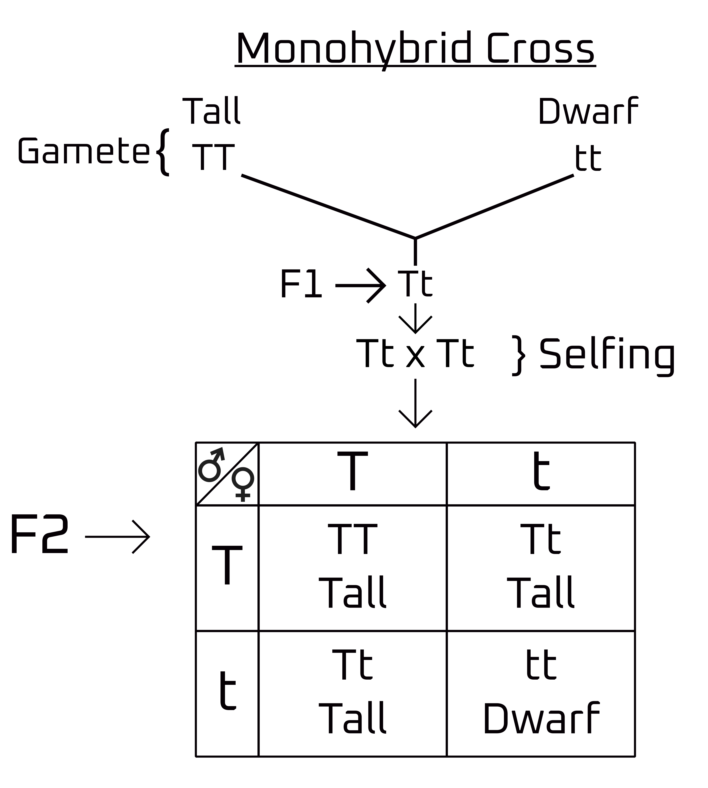
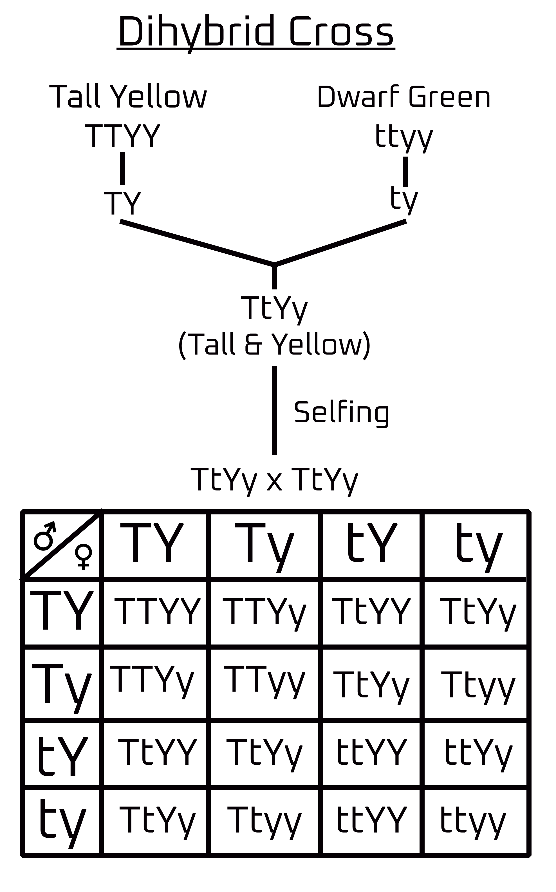
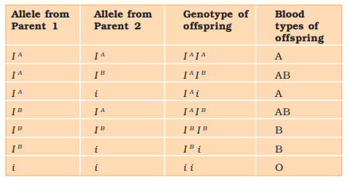

# Principle of Inheritance and Variation

- **Inheritance**: carrying of genetic characteristics from parents to the offspring is called inheritance. 

> [!WARNING] How is transfer of character possible?  
> It is done via gametes (reproduction).

> [!WARNING] What's in a Gamete?
> DNA in nucleus inside chromosomes. 

> [!IMPORTANT]
> The copying of DNA takes place in **S-phase**.

- There are 46 chromosomes in our body that make around 30,000 genes. 

**Homologous chromosome**: Two set of similar chromosomes (diploid)

Anaphase it the time when **duplicated genetic material starts separating**.

> [!NOTE]
> To **maintain Ploidy level**, chromosomes are halved in gametes. 

- **Trait**: particular characteristics of an organism based on genetics 
- **Character**: special feature that make an organism different from others of the same species. 

# Central Dogma of Molecular Biology 

$\overset{Replication}{\circlearrowleft}$ DNA $\overset{\text{Transcription}}{\rightarrow}$ RNA $\overset{Translation}{\rightarrow}$ Protein

**Hybridization**: intermixing of character  
**Artificial Hybridization**: controlled reproduction to achieve a specific feature. 

- Genes have specific area to function. 

- Gene work types 
    - One gene one function
    - One gene many function
    - Many gene one function

- **Crossover**: exchange of genetic material which leads to variation.

> [!NOTE]
> **Housekeeping genes**: genes that work 24/7  
> **Temporary work genes**: works one time and then hibernates  
> **One time work genes**: works one time and then destroys itself 

# Mandell's Inheritance 

- Mandell was also known as the **father of inheritance**

Mandell started his genetics experiment on pea plants due to their various characteristics. 

| S.No.  | Characters   | Contrasting Traits   |
| :----: | :----: | :----: |
| 1..  | Stem height   | Tall/dwarf   |
| 2.  | Flower color   | Violet/white   |
| 3.  | Flower position   | Axial/terminal   |
| 4.  | Pod shape   | Inflated/constricted   |
| 5.  | Pod color   | Green/yellow   |
| 6.  | Seed shape   | Round/wrinkled   |
| 7.  | Seed color   | Yellow/Green   |

- **Gene**: Factors that decide the characteristics of an organism. 
- **Artificial hybridization**: crossing two genetically diverse individuals to obtain offspring with the dominant traits.

> [!NOTE]
> A gene might not be seen but it exists supressed in the DNA.

> [!IMPORTANT]
> 1. Genes are represented by alphabets.
> 2. Genes are always occured in pairs.
> 3. To represent one gene for a particular character, we use only one alphabet. 
> 4. During gamete formation, genes get segregated/separted. 

# Monohybrid Cross

 

> [!NOTE]
> T = Dominant allele  
> t = Recessive allele  
> Tall = Dominant trait  
> Dwarf = Recessive trait  

> [!NOTE]Ratios
> Phenotypic ratio: 3:1  
> Genotypic ratio: 1:2:1

- Alleles are an alternative form of genes 

- **Homozygous**: TT, tt 
- **Heterozygous**: Tt

> [!IMPORTANT]
> The character which is represented in heterozygous condition is called **dominant trait** and the other **recessive trait**

Almost every experiment Mandell did gave him almost the same result. 

# Dihybrid Cross

- Tall, Yellow: 9
- Dwarf, Yellow: 3 
- Tall, Green: 3 
- Dwarf, Green: 1

> [!IMPORTANT]
> - **Phenotypic ratio**: 9:3:3:1
> - **Genotypic ratio**: 1:2:1:2:4:2:1:2:1

# Laws 

## Law of Dominance 
When a pair is present, only one allele will express itself. 

## Law of Segregation
The pair of genes will get separated.

## Law of Independent Assortment
A characteristic can move independently regardless of other characteristics. 

> [!IMPORTANT]
> 1. First two laws are derived from **Monohybrid cross** and third is from **dihybrid cross**. 
> 2. Out of 3 laws, only one is universally accepted, i.e., **Law of Segregation**

# Incomplete Dominance

A good example of incomplete dominance can be seen in the plant **Snapdragon**.

In this experiment, two pure breed flowers are taken, i.e., red and white and then they are crossed to give a pink offspring. When that pink offspring is self-pollinated, it gives 4 types of flowers, namely, red, pink and white. It is found that the phenotypic and genotypic ratios are same, i.e., **1:2:1**. This shows that both alleles are not completely dominant which led to the appearance of P generation feature in $F_2$ generation. 

# Co-Dominance

A very good example of Co-Dominance can be explained by the **blood group** of human beings which is **controlled by gene I**.

- Gene **I** has 3 alleles:
    - $I^A$
    - $I^B$
    - i 

Here, $I^A$ and $I^B$ are both equally dominant which gives a combination blood group **AB**.

# Chromosomal Theory of Inheritance 

In 1900, three scientists, de Vries, Correns and von Tschermak rediscovered Mendel's results in the inheritance of characteristics. 

- Mendel's Experiment wasn't well known when he was alive due to:
    1. No widespread journals 
    2. Statistics in biology were considered irrelevant
    3. Miscommunication between Mendel and other scientist

The pea plant's chromosomes weren't the same for the characters he chose to distinguish. 

> [!IMPORTANT]
> Morgann experimented with fruit fly (*Drosophila melanogaster*)

- Reasons for experimenting with specific organisms: 
    1. Short lifespan 
    2. Controlled reproduction
    3. Distinctive traits
    4. Large number of offspring 
    5. Culture in laboratory or synthetic medium.

- Fruit flies had distinctive features
    - **Male**: red eye, brown body 
    - **Female**: white eye, yellow body. 

# Linkage and Recombination 
## Linkage 
Two different traits are present in different chromosomes.  

- If a locus combination enters the next generation without any alternation is called linkage. 
- If all genes in a parent move to the next generation is called **complete linkage** which is extremely rare. 

- **Crossing over**: gene exchange
- **Incomplete linkage** some of the genes aren't changed. 

If the distance between genes is greater, the chances of recombination are increased. 

> [!IMPORTANT]
> **Centimorgan unit** is used in gene mapping. 

# Pollen Grain

- Pollen grains of many series cause allergies and bronchial afflictions in some people leading to respiratory disorders like asthma, bronchitis, etc. 
- Carrot grass (*Parthenium hysterophorus*) is an invasive grass species from the **American tropics** that came to India via. food transport trains during the Indian Famine 

> [!NOTE]
> Pollen grains are rich in nutrients and are popularly taken as food supplements by athletes and race horses alike. 

Once pollen grains are released, they have to be fertilized quickly before they lose viability.  
Food grains such as **rice and wheat** only have **viability for about 30 minutes** whereas members of **Rosaceae, Leguminoseae and Solanaceaee** have **viability up to a few months**.

For storage of pollen grains as well as human sperms, they are cryogenically frozen (in liquid nitrogen) to last many months. 

# The Pistil, Megasporangium (ovule) and Embryo 

> [!NOTE]
> 1. **Single pistil**: monocarpellary 
> 2. **Many pistil**: multicarpellary 
> 3. **Fused pistil**: syncarpous
> 4. **Free pistil**: apocarpous

- Parts of pistil 
    - **Stigma**: landing place for pollen grains.
    - **Style**: allows pollen to reach the ovary. 
    - **Ovary**: prepares ovules for fertilization. 

Megasporangia arise from the placenta and are commonly called ovules and can occur in many numbers.