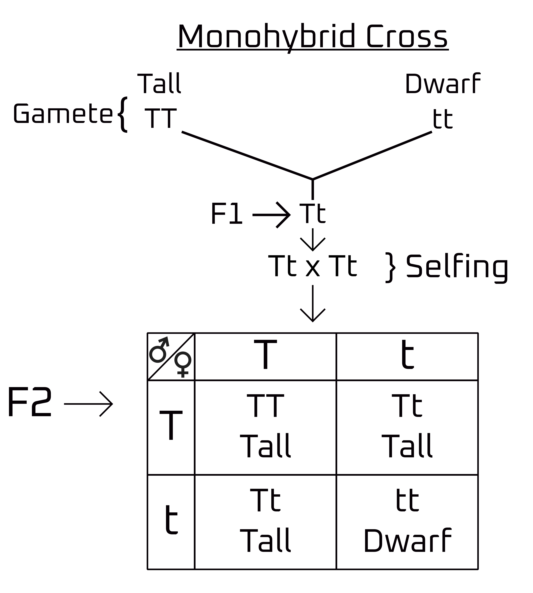
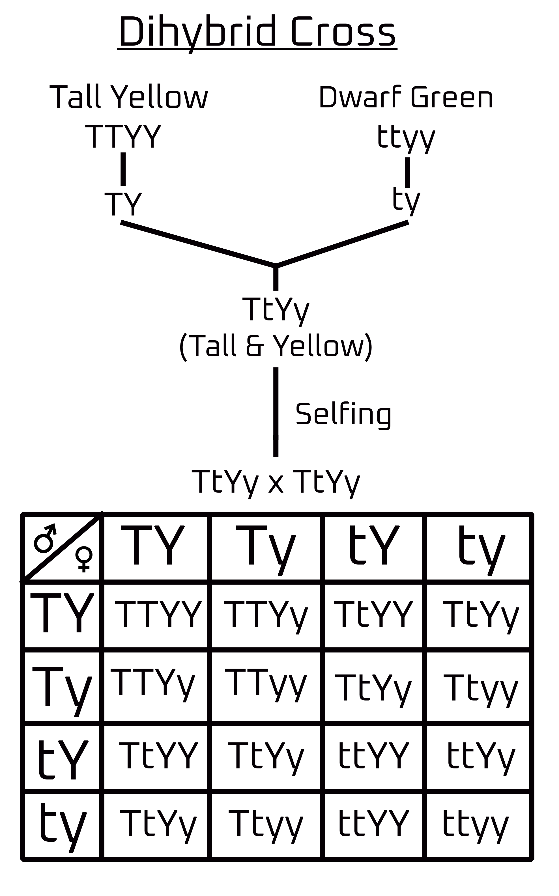
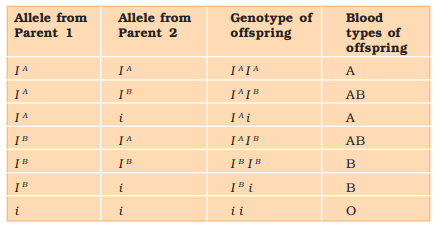
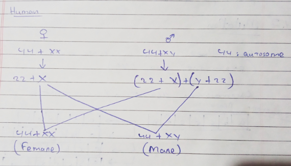
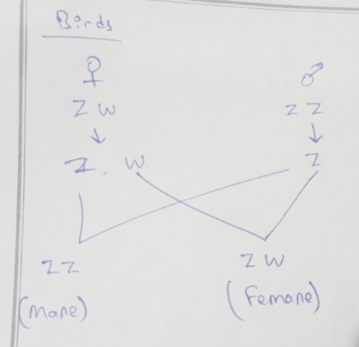
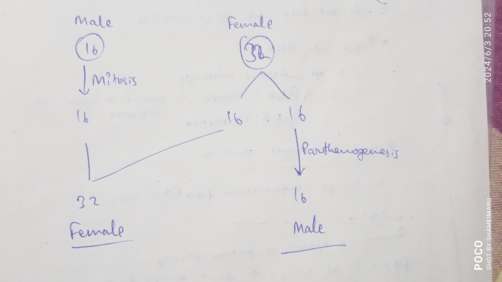
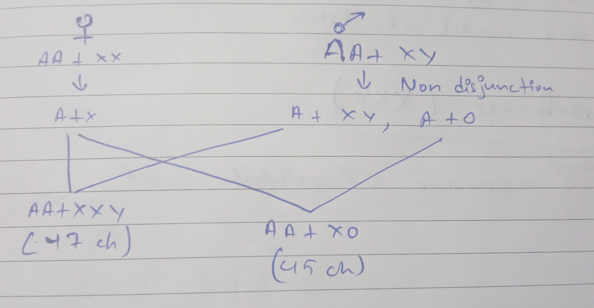
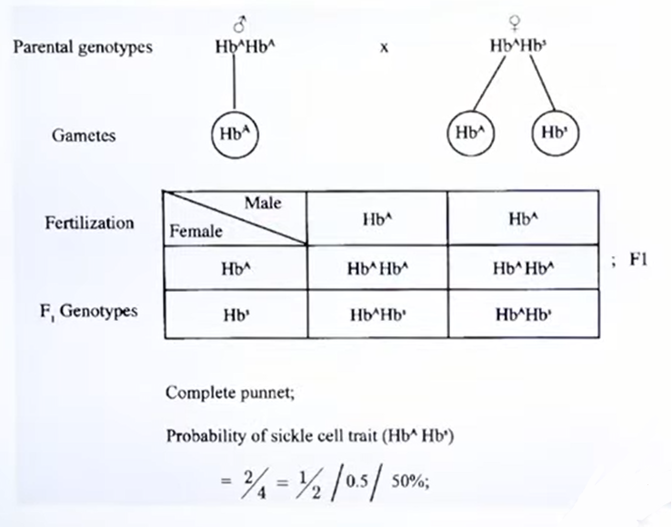
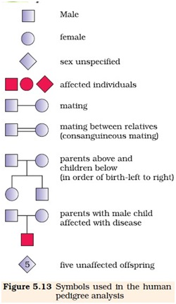

# Principle of Inheritance and Variation

- **Inheritance**: carrying of genetic characteristics from parents to the offspring is called inheritance. 

> [!WARNING] How is transfer of character possible?  
> It is done via gametes (reproduction).

> [!WARNING] What's in a Gamete?
> DNA in nucleus inside chromosomes. 

> [!IMPORTANT]
> The copying of DNA takes place in **S-phase**.

- There are 46 chromosomes in our body that make around 30,000 genes. 

**Homologous chromosome**: Two set of similar chromosomes (diploid)

Anaphase it the time when **duplicated genetic material starts separating**.

> [!NOTE]
> To **maintain Ploidy level**, chromosomes are halved in gametes. 

- **Trait**: particular characteristics of an organism based on genetics 
- **Character**: special feature that make an organism different from others of the same species. 

# Central Dogma of Molecular Biology 

$\overset{Replication}{\circlearrowleft}$ DNA $\overset{\text{Transcription}}{\rightarrow}$ RNA $\overset{Translation}{\rightarrow}$ Protein

**Hybridization**: intermixing of character  
**Artificial Hybridization**: controlled reproduction to achieve a specific feature. 

- Genes have specific area to function. 

- Gene work types 
    - One gene one function
    - One gene many function
    - Many gene one function

- **Crossover**: exchange of genetic material which leads to variation.

> [!NOTE]
> **Housekeeping genes**: genes that work 24/7  
> **Temporary work genes**: works one time and then hibernates  
> **One time work genes**: works one time and then destroys itself 

# Mandell's Inheritance 

- Mandell was also known as the **father of inheritance**

Mandell started his genetics experiment on pea plants due to their various characteristics. 

| S.No.  | Characters   | Contrasting Traits   |
| :----: | :----: | :----: |
| 1..  | Stem height   | Tall/dwarf   |
| 2.  | Flower color   | Violet/white   |
| 3.  | Flower position   | Axial/terminal   |
| 4.  | Pod shape   | Inflated/constricted   |
| 5.  | Pod color   | Green/yellow   |
| 6.  | Seed shape   | Round/wrinkled   |
| 7.  | Seed color   | Yellow/Green   |

- **Gene**: Factors that decide the characteristics of an organism. 
- **Artificial hybridization**: crossing two genetically diverse individuals to obtain offspring with the dominant traits.

> [!NOTE]
> A gene might not be seen but it exists supressed in the DNA.

> [!IMPORTANT]
> 1. Genes are represented by alphabets.
> 2. Genes are always occured in pairs.
> 3. To represent one gene for a particular character, we use only one alphabet. 
> 4. During gamete formation, genes get segregated/separted. 

# Monohybrid Cross

 

> [!NOTE]
> T = Dominant allele  
> t = Recessive allele  
> Tall = Dominant trait  
> Dwarf = Recessive trait  

> [!NOTE]Ratios
> Phenotypic ratio: 3:1  
> Genotypic ratio: 1:2:1

- Alleles are an alternative form of genes 

- **Homozygous**: TT, tt 
- **Heterozygous**: Tt

> [!IMPORTANT]
> The character which is represented in heterozygous condition is called **dominant trait** and the other **recessive trait**

Almost every experiment Mandell did gave him almost the same result. 

# Dihybrid Cross

- Tall, Yellow: 9
- Dwarf, Yellow: 3 
- Tall, Green: 3 
- Dwarf, Green: 1

> [!IMPORTANT]
> - **Phenotypic ratio**: 9:3:3:1
> - **Genotypic ratio**: 1:2:1:2:4:2:1:2:1

# Laws 

## Law of Dominance 
When a pair is present, only one allele will express itself. 

## Law of Segregation
The pair of genes will get separated.

## Law of Independent Assortment
A characteristic can move independently regardless of other characteristics. 

> [!IMPORTANT]
> 1. First two laws are derived from **Monohybrid cross** and third is from **dihybrid cross**. 
> 2. Out of 3 laws, only one is universally accepted, i.e., **Law of Segregation**

# Incomplete Dominance

A good example of incomplete dominance can be seen in the plant **Snapdragon**.

In this experiment, two pure breed flowers are taken, i.e., red and white and then they are crossed to give a pink offspring. When that pink offspring is self-pollinated, it gives 4 types of flowers, namely, red, pink and white. It is found that the phenotypic and genotypic ratios are same, i.e., **1:2:1**. This shows that both alleles are not completely dominant which led to the appearance of P generation feature in $F_2$ generation. 

# Co-Dominance

A very good example of Co-Dominance can be explained by the **blood group** of human beings which is **controlled by gene I**.

- Gene **I** has 3 alleles:
    - $I^A$
    - $I^B$
    - i 

Here, $I^A$ and $I^B$ are both equally dominant which gives a combination blood group **AB**.

# Chromosomal Theory of Inheritance 

In 1900, three scientists, de Vries, Correns and von Tschermak rediscovered Mendel's results in the inheritance of characteristics. 

- Mendel's Experiment wasn't well known when he was alive due to:
    1. No widespread journals 
    2. Statistics in biology were considered irrelevant
    3. Miscommunication between Mendel and other scientist

The pea plant's chromosomes weren't the same for the characters he chose to distinguish. 

> [!IMPORTANT]
> Morgann experimented with fruit fly (*Drosophila melanogaster*)

- Reasons for experimenting with specific organisms: 
    1. Short lifespan 
    2. Controlled reproduction
    3. Distinctive traits
    4. Large number of offspring 
    5. Culture in laboratory or synthetic medium.

- Fruit flies had distinctive features
    - **Male**: red eye, brown body 
    - **Female**: white eye, yellow body. 

# Linkage and Recombination 
## Linkage 
Two different traits are present in different chromosomes.  

- If a locus combination enters the next generation without any alternation is called linkage. 
- If all genes in a parent move to the next generation is called **complete linkage** which is extremely rare. 

- **Crossing over**: gene exchange
- **Incomplete linkage** some of the genes aren't changed. 

If the distance between genes is greater, the chances of recombination are increased. 

> [!IMPORTANT]
> **Centimorgan unit** is used in gene mapping. 

# Pollen Grain

- Pollen grains of many series cause allergies and bronchial afflictions in some people leading to respiratory disorders like asthma, bronchitis, etc. 
- Carrot grass (*Parthenium hysterophorus*) is an invasive grass species from the **American tropics** that came to India via. food transport trains during the Indian Famine 

> [!NOTE]
> Pollen grains are rich in nutrients and are popularly taken as food supplements by athletes and race horses alike. 

Once pollen grains are released, they have to be fertilized quickly before they lose viability.  
Food grains such as **rice and wheat** only have **viability for about 30 minutes** whereas members of **Rosaceae, Leguminoseae and Solanaceaee** have **viability up to a few months**.

For storage of pollen grains as well as human sperms, they are cryogenically frozen (in liquid nitrogen) to last many months. 

# The Pistil, Megasporangium (ovule) and Embryo 

> [!NOTE]
> 1. **Single pistil**: monocarpellary 
> 2. **Many pistil**: multicarpellary 
> 3. **Fused pistil**: syncarpous
> 4. **Free pistil**: apocarpous

- Parts of pistil 
    - **Stigma**: landing place for pollen grains.
    - **Style**: allows pollen to reach the ovary. 
    - **Ovary**: prepares ovules for fertilization. 

Megasporangia arise from the placenta and are commonly called ovules and can occur in many numbers.

---

- Autosomal: genes that aren't present in sex chromosome. 

**Phenylketonuria** is a recessive mendelian pleiotropic disease.

# Mutation 
- It is a sudden change in genetic material (chromosome, gene, DNA)

# Chromosomal Aberration/Abnormalities 
1. **Deletion**: genes are removed.
2. **Duplication**: genes are copied. 
3. **Inversion**: sequence of genes is inverted.
4. **Insertion**: a new gene(s) is introduced. 

# Mutagen 

These are agents that cause mutation. 

- Agents:
    - **Physical Mutagen**: high ionizing radiation (x-ray, UV ray, gamma ray) alters genetic material. 
    - **Chemical Mutagen**: Mustard gas 
    - **Biological Mutagen**: virus

# Sex Determination 

- **Autosome**: determine features other than sex. 
- **Sex chromosome**: determines sex 

## Human 

> [!IMPORTANT]
> Autosomes may not be mentioned. 

## Drosophila (Fruit Fly)

- Mechanism is same as humans. DO NOT MENTION CHROMOSOME NUMBER 

## Birds 

## Honeybee 

# Chromosomal Disorders  

## Klinefelter's Syndrome 

This trisomy genetic disorder is caused by the presence of an additional copy of chromosome resulting in a karyotype of 47,XXY. Such individuals are male and sterile (not able to reproduce) with female characteristics like gynecomastia (growth of breasts). 

## Turner's Syndrome

This monosomy genetic disorder is seen in females due to the above cross if **anaphase** fails to divide the chromosomes equally. This causes the offspring to be a sterile female with underdeveloped characteristics. The ovaries are rudimentary (basic with no actual work). 

## Superfemale 
Karyotype AA+XXX. Sterile female with abnormalities. 

## Supermale 
Karyotype AA+XYY. Sterile male with abnormalities.

## Down's Syndrome
**Trisomy of chromosome 21** leads to a small round head, furrowed tongue and partially open mouth. Palm is broad with characteristic palm crease. Physical, psychomotor nad mental development is retarded. 

--- 

**Karyotyping**: arranging homologous chromosomes and finding abnormalities. 

# Mendelian Disorder 

Some disorders are sex-linked and are recessive traits. 

- Sex-linked, recessive trait. 
    - Genes in sex chromosome.
- Autosomal trait 
    - Found in autosomes 
    - Never consider sex chromosomes 

## Colorblindness 

Always expressed in homozygous condition. 

$X^C$: recessive trait for colorblindness   
| Female  | Male |
| :---- | :---- |
| $X^CX^C$: Colorblind | $X^CY$: Colorblind | 
| $X^CX$: Carrier but normal | $X^CY$: Colorblind |
| $XX$: Normal | | 

#### Q/ A colorblind male marries a female which is normal which is normal for that trait. Then what will be the possibility that their girl child will suffer from colorblindness? 

Therefore the daughter will not be colorblind but will be a carrier of that chromosome. 

Probability of colorblindness in the daughter: 0% 

> [!IMPORTANT]
> Male contributes defective gene to daughter.  
> Female contributes defective genet to son. 

#### Q/ If a colorblind woman marries a man who is normal for that trait. Then find the probability of their male and female child suffer from colorblindness. 

Son will be colorblind and daughter will be a carrier. 

Probability: son has 100% chance of colorblindness. Daughter has 0% chance of being colorblind but 100% of being a carrier. 

## Haemophilia 
It is also a sex-linked, recessive trait.  
In this disease, a small cut leads to excessive bleeding. 

| Female  | Male   |
| :---- | :---- |
| $X^hX^h$: haemophilic | $X^hY$: haemophilic |
| $X^hX$: carrier | $XY$: normal | 
| $XX$: normal | | 

#### Q/ A haemophilic man marries a woman which is a carrier of the trait but is not suffering from the disease. Find the probability of the male and female child suffering from haemophilia. 

The offsprings will have the following chromosomes: $X^hX^h, X^hX, X^HY, XY$

Probability:  
| Female  | Male   | 
| :---- | :---- | 
| Haemophilic female: 50% | Haemophilic male: 50% | 
| Carrier female: 50% | Normal male: 50% |
| Normal female: 0% |  | 

## Sickle-cell Anaemia 

- This is an autosome-linked recessive trait transmitted from parents to offspring when both the parents are carriers of the gene (heterozygous). 

- There are 4 globins in haemoglobin
    - $\alpha_1$
    - $\alpha_2$
    - $\beta_1$
    - $\beta_2$

The **6th amino acid of** $\beta_2$ **globin** is called GAG (Glutamic Acid). Due to **mutagen****, the GAG becomes GUG (valine). This leads to abnormal hemoglobin formation.

GAG to GUG is a point mutation and is called **transversion**.

When in need of oxygen by the body, the defected hemoglobin isn't able to carry it and over time, polymerizes and shrinks. Therefore, there's a chronic lack of oxygen in the body. 

The sickle-shaped hemoglobin, due to its shape, can block the blood vessels and lead to death in most cases and if not, lead to early death. 

To avoid this, the patient needs frequent normal blood transfusions.

> [!NOTE]
> 1. It i autosomal recessive disease therefore, it can be transmitted from parents to the offspring when both male and female individuals are carrier (heterozygous) of the gene.
> 2. The disease is controlled by a single pair of allele, $Hb^A$ and $Hb^S$

> [!IMPORTANT]
> - $Hb^AHb^A$ (Normal, homozygous)
> - $Hb^AHb^S$ (Normal, carrier)  
> - $Hb^SHb^S$ (Diseased, die before attaining maturity)

> [!IMPORTANT]
> - Heterozygous $(Hb^AHb^S)$ individuals appear apparently unaffected but they are carrier of the disease.  
> - Disease/defect is caused by mutation (transversion) of the gene-controlling $\beta$-chain of hemoglobin. 

## Phenylketonuria 
This is an **autosomal recessive trait**. 

The affected individual lacks the enzyme that converts the amino acid **phenylalanine** into thyroxine. 

**Phenylalnine** (amino acid) converts into **tyrosine** in the presence of an enzyme **phenylalanine hydroxylase**. Tyrosine is a precursor for many processes like production of melanin, adrenaline, dopamine, thyroxine, etc.

- Phenylalanine hydroxylase enzyme is made in the liver.

Phenylalanine hydroxylase defect is cause by mutagen which leads to the formation of **phenylpyruvic acid** and get deposited into various body parts and leads to accumulation. This causes **mental retardation, depigmentation, basal metabolic rate imparation, cataract, jaundice, enlarged liver and kidney damage.** 

## Thalassemia 
It is an **autosomal recessive trait.**

It **impairs** the **quantity of hemoglobin** formed.

- Thalassemia
    - $\alpha$-thalassemia: 11th chromosome must have **thalassemic gene** and leads to lack in the production of $\alpha$-globin
    - $\beta$-thalassemia: 11th chromosome must have **thalassemic gene** and leads to lack in the production of $\beta$-globin.
- This leads to collective deficiency in hemoglobin *mainly seen in africans*.

> [!NOTE]
> 1. In this situation, free globin chains, which are insoluble, accumulate inside red blood cells and form precipates which demage the cell, causing **cell lysis** and resulting in **anaemia**. 
> 2. There are two main types of thalassemias in thi synthesis of $\alpha$ and $\beta$ globins are defective. 

### Beta Thalassemia 
- There is decrease synthesis of $\beta$-globin. 
- The defect is due to alleles $HBB$ gene present on chromosome 11. 
- Person with one defective allele suffer from **thalassemia minor** with larger number of microcytic erythrocytes and lesser amount of hemoglobin. 
- Persons with both the defective alleles suffer from **Cooley's anaemia** or **thalassemia major**.
- There is severe **hemolytic anaemia, hepatosplenomegaly, cardiac enlargement and skeletal deformities.**

### Delta Thalassemia 
- It occurs due to **defective allele of $HBD$ gene present on chromosome 11** that forms delta chain of hemoglobin. 
- Adults hav eabout 3% hemoglobin cansisting of $\alpha$ and $\beta$ chains. Therefore, the effect of this **thalassemia is minor**.
- It is an abnormal 

# Pedigree Analysis 

