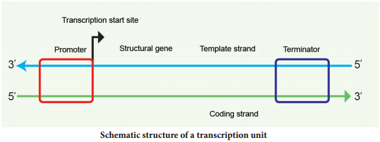

# Molecular Basis of Inheritance 

# The DNA 

The **Central Dogma of Molecular Biology** was given by **Francis Crick in 1957** and published in 1958.  

DNA replication takes place in the S-phase of the interphase. 

> - Components of DNA 
>   - **Nucleotides**:
>       - Phosphate Group
>       - Deoxyribose Sugar
>       - Nitrogenous Base: Adenine (A), Thymine (T), Cytosine (C), Guanine (G)
>   - **Double Helix Structure**:
>       - Two strands of nucleotides coiled around each other
>       - Hydrogen bonds between complementary bases (A-T, C-G)
>   - **Sugar-Phosphate Backbone**:
>   - Alternating sugar and phosphate groups forming the structural framework
>
> - **Nature**: acidic 
> - **Charge**: $-ve$

- DNA is found in nucleus (chromosomal DNA) and plastid and mitochondria. 

> [!NOTE]
> - There are $6.6 \times 10^9$ base pairs in human DNA. 
> - **Length of DNA**: 2.244 m 
> - **Distance between two consecutive base pair**: 0.34 $nm$
> - There are **10 base pairs** in one turn of DNA 
> - **Pitch of helix**: 3.4 $nm$

> [!IMPORTANT] Nitrogenous bases 
> **Purine**: double ring, larger in size  
> **Pyrimidine**: single ring, smaller in size
> - Classification
>   - **Purine**: Adenine, Guanine
>   - **Pyrimidine**: Cytosine, Thymine, Uracil (only in RNA)

> [!TIP] Linkage 
> - A $=$ T
> - T $=$ A 
> - G $\equiv$ C 
> - C $\equiv$ G 

> [!NOTE]
> - **Nucleotide**: phosphate group, pentose sugar, nitrogenous base
> - **Nucleoside**: nitrogenous base, pentose sugar

## Salient Features of DS-DNA 
1. It consists of two polynucleotide chains with a sugar-phosphate backbone and bases projecting inward.
2. The two chains are anti-parallel: one is $5' \rightarrow 3'$ and the other is $3' \rightarrow 5'$.
3. Bases in the strands pair through hydrogen bonds: adenine with thymine (two H-bonds) and guanine with cytosine (three H-bonds). This purine-pyrimidine pairing ensures a uniform distance between the helix strands.
4. The two chains are coiled right-handed. The helix pitch is 3.4 nm with about 10 bp per turn, so the distance between base pairs is approximately 0.34 nm.
5. Base pairs stack on top of each other, adding to the stability of the helix along with hydrogen bonds.

## Chargaff's Rule 
Chargaff's rule states that in DNA, the amount of adenine (A) equals thymine (T), and the amount of guanine (G) equals cytosine (C). This means A pairs with T and G pairs with C, maintaining a consistent ratio of purines to pyrimidines.

Therefore, Purine to Pyrimidines ratio: 1:1.

# The RNA 

- It is the first genetic material.

> [!IMPORTANT]
> - Full from: **Ribonucleic acid**  
> It is a **single strand of polynucleotide**.
> - **Components**
>     - Ribose sugar (pentose sugar)
>     - Phosphate group 
>     - Nitrogenous base (A,U,C,G) 

> [!NOTE] 
> - Type of RNA 
>   1. **mRNA**: carries the genetic code from DNA to the ribosome for protein synthesis.
>   2. **tRNA**: brings amino acid from amino acide pool to ribosome.
>   3. **rRNA**: forms ribosome along with protein. 

> [!TIP]
> - mRNA
>   - 3 nucleotides make one **codon**
>   - **One codon** represents **one amino acid**.  
>   - 20 amino acids are represented by 61 codon. 
> - tRNA 
>   - **3 consecutive bases of tRNA** are called **anticodon**

| | **DNA** | **RNA** | 
|-|-|-|
| **Strands** | It is double stranded. | It is single stranded.| 
| **Sugar** | Sugar is deoxyribose. | Sugar is ribose. | 
| **Bases** | Adenine, **Thymine**, Cytosine, Guanine | Adenine, **Uracil**, Cytosine, Guanine. |

> [!NOTE]
> RNA is the first evolved genetic material but DNA is more stable. 

> [!IMPORTANT] 
> - Criteria for Genetic Material
>   1. Should be able to replicate
>   2. Should be chemically and structurally stable. 
>   3. Should provide scope for slow mutations for volution. 
>   4. Should be able to express itself in the form of 'Mendelian Characters'.  

> [!NOTE]
> - RNA is the first genetic material because: 
>   1. It is used as both genetic material and catalyst.
>   2. Some chemicals can only be processed by RNA and not by other enzyme. 
>   3. Essential life processes (metabolism, translation, splicing, etc.) evolved around RNA. 

- RNA directly maintains metabolism due to protein. 

DNA is associated with histone protein because **histone octamer** helps to **wrap DNA compactly**. Since DNA has $-ve$ charge due to phosphate group, histone is positively charged. 

- Nucleosome: contains **Arginine** and **Lysine** amino acids. 

> [!NOTE]
> A nucleosome contains aaround 200 base pair. 

- **Beads-on-string**: a structure seen under Electron Microscope contains beads which are the histone octamers with DNA wrapped around it. Each bead is one nucleosome. 

After staining, darker beads are called **Heterochromatin** and the lighter are **Euchromatin**. 

- **Heterochromatin**: Transcriptionally inactive 
- **Euchromatin**: Transcriptionally active 

In our DNA, 98% of it is non-functional.  
Therefore, heterochromatin is the 98% part.

| Feature             | Heterochromatin                          | Euchromatin                           |
|---------------------|------------------------------------------|---------------------------------------|
| **Structure**       | Tightly packed                           | Loosely packed                        |
| **Staining**        | Darkly stained (with Giemsa stain)       | Lightly stained (with Giemsa stain)   |
| **Gene Activity**   | Generally inactive (gene-poor regions)   | Generally active (gene-rich regions)  |
| **Location**        | Often found at the periphery of the nucleus | Dispersed throughout the nucleus      |
| **DNA Sequence**    | Contains repetitive DNA sequences        | Contains unique DNA sequences         |
| **Function**        | Structural role, maintaining chromosome stability and regulating gene expression | Active role in transcription and gene regulation |
| **Replication Timing** | Late S phase                           | Early S phase                         |
| **Examples**        | Centromeres, telomeres, Barr bodies      | Actively transcribed genes            |

# Replication of DNA 
- Replication of DNA takes place in the **S-Phase** of interphase. 

- Components required to make DNA
    1. Nucleotide 
        1. Phosphate group 
        2. Pentose sugar 
        3. Nitrogenous bases (A, T, C, G)
    2. Energy (From ATP)
    3. Enzymes 
        1. **DNA Dependent DNA Polymerase**: synthesizes a new DNA strand using an existing DNA strand as a template during DNA replication. It ensures the accurate duplication of the genetic material, enabling cell division and the transmission of genetic information to daughter cells.
        2. **Topoisomerase**: relieve tension in DNA during replication and transcription by cutting and rejoining the DNA strands, preventing the DNA from becoming too twisted or tangled.
        3. **Helicase**: unwinds the DNA double helix into single strands, making it possible for replication and transcription to occur.
        4. **Primase**: creates a short RNA primer on a DNA strand, providing a starting point for DNA polymerase to begin DNA synthesis during replication.
    4. Primer (Short strand of RNA)

- 2 enzymes are required to dissolve DNA and break the helix. 

> [!IMPORTANT]
> DNA replication starts in the place called **Ori** (Origin of Replication) that develops into a Y-shaped structure called **Fork of Replication**.

To remove all H-bonds, huge energy is required and not sufficiently present in the cell. Therefore, a Replication fork opens where the synthesis of DNA occurs. 

During replication, the nitrogenous bases combine with ATP to form the following Triosephosphates that provide energy. 

- $\text{dAMP} + ATP\ \rightarrow ATP \text{ (Adenine triphosphate)}$
- $\text{dTMP} + ATP\ \rightarrow TTP \text{ (Thymine triphosphate)}$
- $\text{dCMP} + ATP\ \rightarrow CTP \text{ (Cytosine triphosphate)}$
- $\text{dGMP} + ATP\ \rightarrow GTP \text{ (Guanine triphosphate)}$

Now, DNA polymerase brings the complementary nucleotide and places it with the complementary base pair. 

- Deoxyribonucleoside triphosphate
    - Acts as substrate 
    - Provide energy for polymerization 

> [!NOTE]
> Direction of synthesis: $5' \rightarrow 3'$ 

- The above shows the **semi-conservative method of DNA replication**, i.e., one part is old and the other is new. It consists of **2 DNA and 4 strands**. 

After the synthesis is over, RNA primers are removed from DNA and Okazaki fragments are joined then Ligase establishes bonds between them. 

- **Proof-reading**: mismatches are removed from DNA and correct bases are placed. 

> [!NOTE]
> **Rate of polymerization**: 2000 base pair per second

# Transcription 
It is the process of forming DNA-dependent RNA

> [!IMPORTANT]
> - Requirements for making RNA 
>   1. RNA nucleotide (Pentose sugar, nitrogenous bases, phosphate group)
>   2. DNA 
>   3. RNA polymerase 

> [!NOTE]
> The entire DNA doesn't form RNA. 

> [!NOTE]
> - $3'-5'$: template strand has structure gene and copies over to the DNA
> - $5'-3'$: coding strand that doesn't has any info about amino acid. 

### Why don't both the DNA strands transcribe? 
1. Both strands are complementary 
    - If both strands are used in RNA making, it makes them complementary. This has a huge chance of making **double-stranded RNA** which doesn't function as regular mRNA in protein synthesis. 
2. Two different proteins will form. 
    - Creates chaos in the cellular environment because there'll be two instructions for one protein and this causes the formation of proteins that aren't expected to be in that place at that specific time.

> [!NOTE]
> - Types of Transcription
>   1. **Eukaryotic transcription**: takes place in nucleus.
>   2. **Prokaryotic transcription**: takes place in nucleoid (region in prokaryotic cell where genetic material is located, not enclosed by a membrane).

## Transcription in Prokaryotes

1. **Initiation**
    1. **Promoter recognition**: the RNA-polymerase holoenzyme (core enzyme + sigma factor) binds to the promoter sequence in the DNA. 
    2. **Formation of Transcription Bubble**: RNA polymerase unwinds the DNA, creating a transcription bubble that exposes the template strand. 
    3. **Synthesis of initial nucleotides**: RNA polymerase begins synthesizing the first few RNA nucleotides. After about 10 nucleotides, the sigma factor is released, allowing the core enzyme to proceed with elongation.
2. **Elongation**
    1. **RNA Chain Extension**: The core RNA polymerase moves along the DNA template strand, adding complementary ribonucleotides (rNTPs) in the 5' to 3' direction. The transcription bubble moves with the polymerase as it progresses.
    2. **Proofreading**: RNA polymerase pauses and backtracks to remove incorrectly incorporated nucleotides, ensuring accuracy in RNA synthesis.
3. **Termination**
    1. **Rho-Dependent Termination**: The rho protein binds to the rut site on the nascent RNA and moves towards the RNA polymerase. Upon reaching the transcription complex, rho unwinds the RNA-DNA hybrid, releasing the RNA transcript and disassembling the transcription machinery.
    2. **Rho-Independent Termination**: Specific sequences in the RNA form a stable hairpin structure followed by uracil residues. This causes RNA polymerase to pause, and the weak A-U base pairing leads to the release of the RNA transcript and termination of transcription.

> [!NOTE]
> - Direction of RNA synthesis: $5'-3'$
> 
> Note that this is the same as the synthesis of DNA. 

## Eukaryotic Transcription

1. **Initiation**
    1. **Promoter Recognition and Pre-Initiation Complex Formation:** Transcription factors (TFs) bind to the promoter regions (TATA box at -25) and recruit RNA polymerase II. Additional TFs and mediator proteins assemble to form the pre-initiation complex, positioning RNA polymerase II at the transcription start site.
    2. **DNA Unwinding and Transcription Bubble Formation:** RNA polymerase II, along with TFs, unwinds a small portion of the DNA, creating a transcription bubble that exposes the template strand.
    3. **Synthesis of Initial RNA Nucleotides:** RNA polymerase II begins synthesizing RNA. After the synthesis of around 25 nucleotides, it transitions to elongation mode and the TFs are released.
2. **Elongation**
    1. **RNA Chain Extension:** RNA polymerase II moves along the DNA template strand, adding ribonucleotides (rNTPs) complementary to the DNA template in a 5' to 3' direction. The transcription bubble moves with the polymerase.
    2. **RNA Processing:** As RNA polymerase II synthesizes the RNA, it simultaneously undergoes capping (addition of a 5' cap), splicing (removal of introns), and polyadenylation (addition of a poly-A tail) with the help of various processing factors.
3. **Termination**
    1. **Cleavage and Polyadenylation:** RNA polymerase II transcribes the polyadenylation signal sequence (AAUAAA), and the RNA transcript is cleaved downstream of this site.
    2. **Release of RNA Transcript:** After cleavage, a poly-A tail is added to the 3' end of the RNA. RNA polymerase II continues transcribing for a short distance before dissociating from the DNA, effectively terminating transcription.

## Differences between Transcription in Prokaryotes and Eukaryotes
| **Aspect**                  | **Prokaryotic Transcription**                                          | **Eukaryotic Transcription**                                               |
|-----------------------------|-------------------------------------------------------------------------|--------------------------------------------------------------------------|
| **RNA Polymerase**          | Single RNA polymerase (holoenzyme with sigma factor)                    | Three RNA polymerases (I, II, III) with RNA polymerase II for mRNA        |
| **Promoter Recognition**    | Sigma factor recognizes -10 (Pribnow box) and -35 regions               | General transcription factors (TFs) and TATA box at -25                   |
| **Initiation Complex**      | Simple; RNA polymerase holoenzyme binds directly to DNA                 | Complex; pre-initiation complex with multiple TFs and mediator proteins   |
| **DNA Unwinding**           | RNA polymerase unwinds DNA to form transcription bubble                 | TFs and RNA polymerase II unwind DNA to form transcription bubble         |
| **Elongation**              | RNA polymerase synthesizes RNA while proofreading                       | RNA polymerase II synthesizes RNA with concurrent capping, splicing, and polyadenylation |
| **RNA Processing**          | No processing; transcription and translation are coupled                | Extensive processing; 5' capping, splicing, and 3' polyadenylation        |
| **Termination**             | Rho-dependent or rho-independent mechanisms                             | Cleavage and polyadenylation signals; RNA polymerase II dissociates after transcribing downstream |
| **Transcription Site**      | Cytoplasm                                                               | Nucleus                                                                   |
| **Transcript Stability**    | mRNA generally has a short half-life                                     | mRNA is more stable due to processing and poly-A tail                     |
| **Regulation Complexity**   | Less complex; primarily involves sigma factors and simple repressors    | Highly complex; involves enhancers, silencers, insulators, and various TFs|

> [!NOTE]
> - **Cistron**: segment of DNA coded for polypeptide (has info about protein)
> - **Exon**: functional part of mRNA 
> - **Intron**: non-functional part of mRNA
> - **Monocistorn**: it is an mRNA in both prokaryotes and eukaryotes carries the coding sequence for a single protein, allowing for focused and regulated expression of individual genes.
> - **Polyciston**: - it is an mRNA in prokaryotes is a single transcript containing the coding sequences for multiple proteins, transcribed from a single operon and translated into distinct polypeptides by ribosomes.