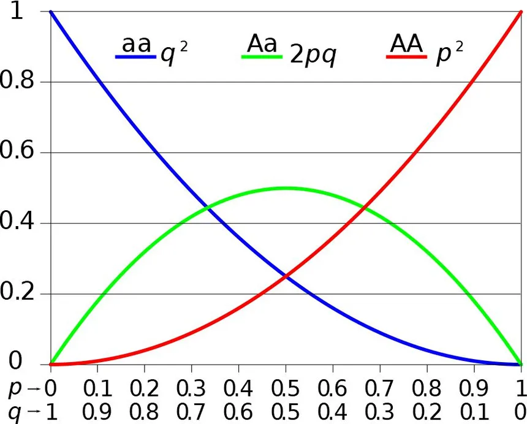

# Evolution 
- Spontaneous generation of life: Louis Pasteur 
    - Louis Pasteur's experiments in the 19th century disproved the theory of spontaneous generation, demonstrating that life does not arise from non-living matter spontaneously but rather from pre-existing life, using sterilized broth and swan-neck flasks to show that microbes come from the air, not the broth itself.

- **Oparin and Haldane** gave the theory that life on Earth arose from non-living matter through a process of gradual chemical evolution

> [!NOTE]
> Organisms are classified by phylogenetic manner.  
> The most latest evolution is kept in last. 

# Miller's Experiment (1953)
- Chemicals used in the experiment: $CH_4, NH_3, H_2O, H_2$
    - The inorganic substances when struck by electrical discharge, form organic substances like pigments, fatty acids, etc. 

- Only 2000 million years ago, the first cellular form of life originated. 

First life originated via chemical evolution from inanimate matter and by the process of biogenesis gave rise to first form of life. 

# Evidences of Evolution 
1. **Fossil evidence**: preserved fossils of extinct animals.
2. **Embryological evidence**: The shapes of embryos of almost all mammals are indistinguishable. 
3. **Homologous organ**: organs with similar anatomical positions but different functions 
4. **Analogous organ**: organs with different anatomical positions but perform similar functions. 

# Lamarck's Theory of Evolution (Pre-Darwin)
1. **Lamarck's Theory of Evolution (Pre-Darwin)**
   - Proposed by French naturalist Jean-Baptiste Lamarck.
   - Suggested evolution is driven by the *use and disuse of organs*.
   - Example: Giraffes elongated their necks to reach tall trees for foraging, passing this acquired trait to subsequent generations.
   - This theory of acquired characteristics has been largely discredited.

2. **Concept of Evolution**
   - Evolution can be understood both as a process and as a result:
     - **As a process**: Describes the changes and adaptations over time (e.g., changes in life forms or environment).
     - **As a result**: The success stories we observe today, including both animate and inanimate objects.

3. **Natural Selection**
   - Evolution is often regarded as a consequence of natural selection.
   - Natural selection is a mechanism that drives evolutionary change based on survival and reproduction advantages.

4. **Ambiguity in Definitions**
   - There is still some lack of clarity in distinguishing whether evolution and natural selection are processes themselves or outcomes of unknown processes.

# Malthus's Influence on Darwin
1. **Influence of Thomas Malthus**
   - Darwin was possibly influenced by Malthus's work on population growth and resource limitations.
   - Malthus noted that populations grow exponentially if unchecked, while resources remain limited.

2. **Key Observations Underlying Natural Selection**
   - **Limited Natural Resources**: Resources are finite, creating competition.
   - **Stable Population Size**: Populations generally remain stable in size, except for seasonal fluctuations.
   - **Variability Among Individuals**: No two individuals are exactly alike, even if they appear superficially similar.
   - **Inheritance of Variations**: Most variations within a population are heritable.

3. **Population Growth and Competition**
   - Theoretical population size would grow exponentially if every individual reproduced to their full potential (e.g., bacterial growth).
   - In reality, population sizes are limited due to resource competition, leading to only some individuals thriving.

4. **Darwin's Novel Insight**
   - Variations that are heritable and improve resource utilization (adaptations) enable those individuals to survive and reproduce.
   - Over many generations, the survivors with advantageous traits will leave more progeny, gradually changing population characteristics.
   - This process leads to the emergence of new forms and species over time.

# Mechanism of Evolution 
1. **Mendel's Inheritable 'Factors'**:
   - Mendel talked about inheritable factors (now known as genes) that influence phenotype.
   - Darwin did not address or acknowledge these factors directly in his work.

2. **Hugo de Vries and Mutation Theory**:
   - Early 20th century: Hugo de Vries proposed the idea of **mutations** based on his work with the evening primrose.
   - He suggested that **mutations**, large and sudden changes in a population, drive evolution.
   - He contrasted this with Darwin's idea of small, gradual variations.

3. **Mutations vs Darwinian Variations**:
   - **Mutations**: Random and directionless; large differences appear suddenly.
   - **Darwinian Variations**: Small, heritable, and directional changes that accumulate gradually.

4. **Speciation Theories**:
   - Darwin believed evolution was **gradual**, with speciation occurring through small variations over time.
   - De Vries believed in **saltation**, where speciation occurs due to a **single large mutation** (sudden).

5. **Population Genetics**:
   - Later studies in population genetics clarified the processes of evolution and speciation, incorporating both gradualism and mutation-driven changes.

# Hardy-Weinberg Principle 

This principle states that **allele frequencies in a population are stable** and is **constant from generation to generation** and the **gene pool remains constant**. **This is called genetic equilibrium** and the **sum of total of all the allelic frequencies is 1**.

During normal conditions, the variation in the population can be represented by the green line. Due to environmental requirements, it may shift either towards the right or left end. And in certain cases, if the environment demands the extremes, there will be two peaks in the graph.

## Binomial Expression of Hardy-Weinberg Principle
The **Hardy-Weinberg Principle** is a fundamental concept in population genetics that describes the genetic variation in a population under ideal conditions. It states that allele and genotype frequencies will remain constant from generation to generation in the absence of evolutionary influences (e.g., mutation, selection, gene flow, genetic drift, and non-random mating).

For a gene with two alleles, $A$ (dominant) and $a$ (recessive), the Hardy-Weinberg principle is expressed as:

$(p + q)^2 = p^2 + q^2 + 2pq = 1$

Where:
- $p$ = frequency of allele $A$
- $(q)$ = frequency of allele $a$
- $(p^2)$ = frequency of homozygous dominant $(AA)$
- $(q^2)$ = frequency of homozygous recessive $(aa)$
- $(2pq)$ = frequency of heterozygous $(Aa)$

Even though the homozygous and heterozygous have different frequencies, the overall alleles remain the same and is present in 100% of the population; so the result it 1. 

## Factors that affect Hardy-Weinberg Equilibrium 
1. **Gene flow/migration**: Movement of allele between population/place, introducing genetic diversity. 
2. **Genetic drift**: Random changes in allele frequencies, especially in small population, leading to a variation loss. 
3. **Mutation**: Permanent change in DNA sequence, creating new alleles and genetic diversity. 
4. **Genetic recombination**: The reshuffling of genetic material during sexual reproduction, increasing variation in offspring.
5. **Natural selection**: Process where advantageous traits increase in frequency because they improve survival or reproduction.

> [!NOTE]
> When a population migrates into a new region and reproduces with the natives, it leads to new combination and eventually become different species. In this, the migrators become the founder and its called the **Founder Effect**. 

## Short Topics 
- Microbial research show that pre-existing advantageous mutations when selected will result in new phenotypes. Over time, this leads to **speciation**. 
- **Speciation**: an evolutionary process by which a population evolves into a new species. 
- Critical thinking shows that variation due to mutation or due to recombination during gametogenesis, or due to **gene flow** or **genetic drift** results in **changed frequencies of genes and alleles in future generation**.
- Natural selection leads to stabilization, directional change or disruption. 
   - **Stabilization**: more individuals acquire mean character value. 
   - **Directional change**: more individuals acquire value other than mean character value.
   - **Disruption**: natural selection prefers both extremes of a trait distribution, rather than favoring intermediate or average traits. 

# Species struggles 
- **Interspecific struggle**: competition among individuals of the same species. 
- **Intraspecific struggle**: competition among individuals of different species. 

# Origin and Evolutions of Man
- **Dryopithecus**: more ape-like 
- **Ramapithecus**: more man-like 

- Man-like bones were found in Ethiopia and Tanzania. 
- Man-like primates walked upright in Eastern Africa. 
- 2 mya: australopithecus lived in eastern african grasslands. 
- *Homo habilis* had brain capacity of 600-800 cc. 
    - They hunted with tools but ate fruit 

 

- *Homo erectus*
    - Fossils found in Java 
    - Ate meat 
    - 900 cc brain
- *Neanderthal* 
    - 1400 cc brain 
    - Lived near east asia and central asia. 
    - Used hides to protect and buried the dead. 
- *Homo sapiens* 
    - 75000-10000 years ago they arose during the ice age. 
    - Pre-historic cave art developed 18000 years ago. 
    - Agriculture developed 10000 years ago. 

<Fig-6.9>

--- 

# Introduction
- Why is knowing about Evolution important? 
    - It helps us inderstand the changes in flora and fauna that have occurred over millions of years. 

# Origin of Life 
## Big Bang Theory 
- When we see the stars on a night sky, we are actully seeing their light reach us which is millions of years old. 
- The universe is about **20 billion years old**. It is found by several methods such as **Hubble's Law**.
- **Big Bang Theory** attempts to explain the origin of universe in which a huge explosion which spread the the matter in space. Hydrogen and Helium formed sometime later. These gases condensed under gravitation and gave rise to galaxies of present day universe. 
- **Earth** is supposed to be formed **4.5 billion years** ago. 
    - Water vapor, methane, carbon dioxine and ammonia released from molten mass that covered the surface. 
    - UV rays from the sun broke up water into hydrogen and oxygen. 
    - **Oxygen** combined with **methane and ammonia** to form **water, $CO_2$, etc.**
    - **Ozone layer** was formed by **photodissociation of Oxygen** by UV rays. 
    - As Earth cooled, water vapor fell as **rain** that **fell the depressions to form oceans**. 

## Theory of Spontaneous Generation
- Early Greeks thought units of life called **spores** were transferred to Earth. 
- It is also thought that life came from decaying matter like straw, mud, etc. 
- **Louis Pasteur proved this theory wrong** by experimentally demonstrating life comes from pre-existing life. 
    - He showed sterilized flasks with killed yeast only arose other organisms when it was exposed to outside air. 

Therefore Theory of Spontaneous generation was **dismissed** but it didn't answer how life first came to Earth. 

## Oparin and Haldane's Experiment 
- **Oparin from Russia and Haldane from England** proposed life came from pre-existing non-living organic molecules and formation of life was preceded by chemical evolution, i.e., formation of diverse organic molecules from inorganic components. 

# Evidences for Evolution
# Adaptive Radiation 
# Biological Evolution 
# Mechanism of Evolution 
# Hardy-Weinberg Principle 
# Brief Account of Evolution 
# Origin and Evolution of Man 
