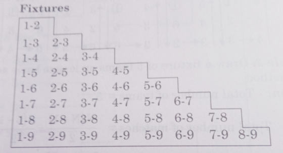

# Functions of Sports Events Management

# Functions

1. **Planning**: Process of creating a comprehensive action plan to achieve organizational goals.
2. **Organizing**: Process of bringing physical, financial, and human resources and good relationships for the achievement of organization goals.
3. **Staffing**: Process of putting the right man at the right job at the right time to gain maximum productivity.
4. **Directing**: Process of inspiring, guiding, counseling, motivating and leading all individuals toward the accomplishment of organizational goals.
5. **Controlling**: Functions that ensure that the events do not deviate from the pre-arranged plans.

# Various Committees and Their Responsibilities

Sports require a great deal of cooperation among the designated groups to function smoothly. It is **led by General Committee** which is headed by **Administrative Director** under whom the **Executive Committee** performs its duties. The **Organizing Committee for Games/Sports** works under the Executive Committee which is responsible for the successful and smooth conduct of sports meets/events.

Some of the committees and their functions are given below:

1. **Publicity Committee**: tasked with the announcement of dates, venues and sports events, provides advance information to the institutions. It is also responsible for the advertisement of sports events.
2. **Transportation Committee**: tasked with providing facilities for transportation of various teams to the venue of sports events or the place of boarding and lodging as the case may be. It's primarily tasked with transportation arrangements.
3. **Boarding and Lodging Committee**: it is responsible for making necessary arrangements for providing accommodation and serving meals for sportspersons and officials. 
4. **Decoration and Ceremony Committee**: it is responsible for the decoration of the sports arena or stadium and making necessary arrangements for the opening ceremony, victory ceremony and closing ceremony. This committee also arranges the trophies, medals and certificates. 
5. **Ground and Equipment Committee**: it is tasked with preparing the ground and laying out the track and field. It also makes necessary arrangements for equipment related to the game/athletic meets. This committee is also responsible for providing equipment according to specifications.
6. **Committee for Refreshments and Entertainment**: it is tasked with supplying refreshments and drinks to guests, officials, competitors, etc. and arrangements for entertainment programs during the opening ceremony and closing ceremony of the sports event. 
7. **Reception Committee**: This committee is responsible for welcoming the chief guests at the opening and closing ceremonies. This committee also has to welcome other guests and spectators. 
8. **Committee on Enties and Programmes**: The committee manages entry forms, assigns competitor numbers, arranges seating, and creates game schedules. It also organizes the printing of programs and the distribution of souvenirs to guests, team managers, and officials.
9. **Committee for Officials**: this committee selects various officials such as referees, judges, recorders, clerks, starters, marshalls, track umpires, timekeepers, etc. as per the game requirement. 
10. **Announcement Committee**: The committee makes announcements during the sports meet, including details about opening and closing ceremonies, event schedules, and officials, and provides running commentary during games/events.
11. **First Aid Committee**: Led by a qualified doctor, this committee offers immediate first aid to injured athletes. It ensures pre-event medical preparations and stands ready to assist athletes during competitions due to potential injuries.
12. **Finance Committee**: related to financial management, it prepares the budget and maintains the account of income and expenditure. 

# Pre, During and Post-Tournament Responsibilities of Committees 
Due to the demands, it is expected that sports events to be magnificent and for smooth conduct, officials of the tournament need to know the pre-, during and post-game responsibilities or duties. These duties can be classified as:

## Pre-Tournament Responsibilities
These are done before the commencement of the tournament or sports event. 

1. To prepare the budget of the tournament/sports event with the authority because without a sufficient budget, it may be difficult to organize the tournament splendidly and systematically. 
2. To prepare the schedule or program of the sports tournament, i.e., the dates and venue of the tournament. 
3. To prepare sports grounds/courts/tracks, and sports equipment which are essential for organizing a sports tournament. 
4. To form various committees for organizing sports tournaments.
5. To send the information to the various teams about dates and venues of the tournament. 
6. To make necessary arrangements regarding boarding and lodging of sportspersons and officials. 
7. To arrange prizes and certificates for winners. 
8. To send the entry forms to the various institutions early and receive them on time for timely preparation of fixtures. 

### Committees Involved 

1. Publicity Committee
2. Transportation Committee
3. Boarding and Lodging Committee
4. Decoration and Ceremony Committee
5. Ground and Equipment Committee
6. Committee for Refreshments and Entertainment
7. Reception Committee
8. Committee on Entries and Programs
9. Committee for Officials
10. First Aid Committee
11. Finance Committee

## During Tournament Responsibilities
To make sure that the event goes smoothly, the communities also have to perform various works to make sure that everything goes systematically. 

1. To ensure proper arrangement during the inauguration of the sports tournament. 
2. To check that the sports ground/field/court and related sports equipment are in order. 
3. To ensure that the sports events/tournament is being organized as per schedule. 
4. To check the arrangement of refreshments for players and officials. 
5. To make necessary announcements regarding the progress of the tournament. 
6. To impart first aid to the injured athletes/sportspersons. 
7. To impart first aid to the injured athletes/sportspersons.
8. To prepare a proper scoresheet for the record. 
9. To provide and update information to the electronic and print media. 
10. To maintain proper discipline. 

### Committees Involved 
1. Announcement Committee
2. Committee for Refreshments and Entertainment
3. First Aid Committee

## Post Tournament Responsibilities 
These activities are performed by officials after the tournament. 

1. To give away the prizes and certificates to the winners. 
2. To provide detailed results and other necessary information to the media. 
3. To provide security refunds to the departing teams. 
4. To collect all the records/files related to the sports tournament. 
5. To make the payments to the officials and other concerned persons. 
6. To prepare reports related to the expenditure of the tournament. 
7. To present mementos to the chief guest or guest or honor, etc.

### Committees Involved 
1. Decoration and Ceremony Committee
2. Committee for Refreshments and Entertainment
3. Committee on Entries and Programs
4. Announcement Committee
5. Finance Committee

# Procedure to Draw Fixtures: Knock-out and League
- Knock-out
    - Bye 
    - Seeding 
- League 
    - Cyclic 
    - Staircase 
    - Tabular 

## Essential Points for a Knock-out Tournament 
1. The total number of teams participating in the tournament. 
2. The total number of byes.
3. The number of teams in each half of the quarter. 
4. The number of byes to be given in each half or quarter. 
5. The total number of rounds. 
6. The total number of matches. 

# Method of Preparing Fixture in a Knock-out Tournament

> [!IMPORTANT]
> **Bye** refers to a team which is qualified to play in the next round due to its positioning or due to qualification in previous tournaments.

## Calculating Byes based on the number of Teams 
Take for example the **number of teams is *19***.

Now check for the next highest power of 2. 

$\implies 2, 4, 8, 16, 32, 64....$

$\therefore$ Next power of 2 to 15 = 32

Difference = $32 - 19 = 13$

$\therefore \text{13 byes will be given.}$

## Method of Calculating Teams in Each Half 
**The method below is only applicable if the number of teams is odd.**

$\text{Upper half}=\frac{\text{Total number of teams}+1}{2}$

$\text{Lower half}=\frac{\text{Total number of teams}-1}{2}$

Now, to calculate the number of byes in each half, **divide the number of teams by 2 and add or subtract by 1 to the lower and upper halves respectively**.

$\therefore\text{Byes in upper half}=\frac{\text{Number of byes}-1}{2}=\frac{13-1}{2}=6$

$\text{Similarly, Byes in lower half}=\frac{\text{Number of byes}+1}{2}=\frac{13+1}{2}=7$

## Method of Fixing Byes 
1. The first bye is given to the last team of the lower half. 
2. The second bye is given to the first team of the upper half. 
3. The third bye is given to the first team of the lower half. 
4. The fourth bye is given to the last team of the upper half. 
5. The next byes or byes are given in the same order as described above. 

## Number of Matches in a Knock-out Tournament 
To decide the number of matches in a knock-out tournament, the below formula should be applied, 

$\text{Number of matches}=\text{Number of teams}-1$

## Number of Rounds in a Knock-out Tournament 
If the number of teams is in the power of 2, the number of rounds will be decided by calculating the number of factors (only number 2), other numbers will not apply. 

Commonly, it's not the case so to find the number of matches, find the number of factors of the next highest power of 2. Take 19, the next power of 2 is 32, so $2\times2\times2\times2\times2=32$. So the number of matches if the number of teams is 19 is 32. 

# Procedure of Fixture in a League or Round-Robin Tournament
- For a League Tournament, there are 3 types of fixtures- 
    - Cyclic method 
    - Staircase Method 
    - Tabular Method 

## Cyclic Method 
1. If the number of teams is even, then fix the place of the first team and write the team numbers in clockwise order. Else odd, take the first place as **BYE** and write the rest of the teams in the same order. 
2. Rotate the places of the teams by one place for every round. 
3. The alignment of the teams denotes which will be competing in that round. 

 

## Staircase Method 
In this method, the fixtures are made like a staircase and here, no bye is given to the teams and there is no problem with odd or even numbers of teams. But the catch is that it is **not good to decide which teams will play in which round**. 

 