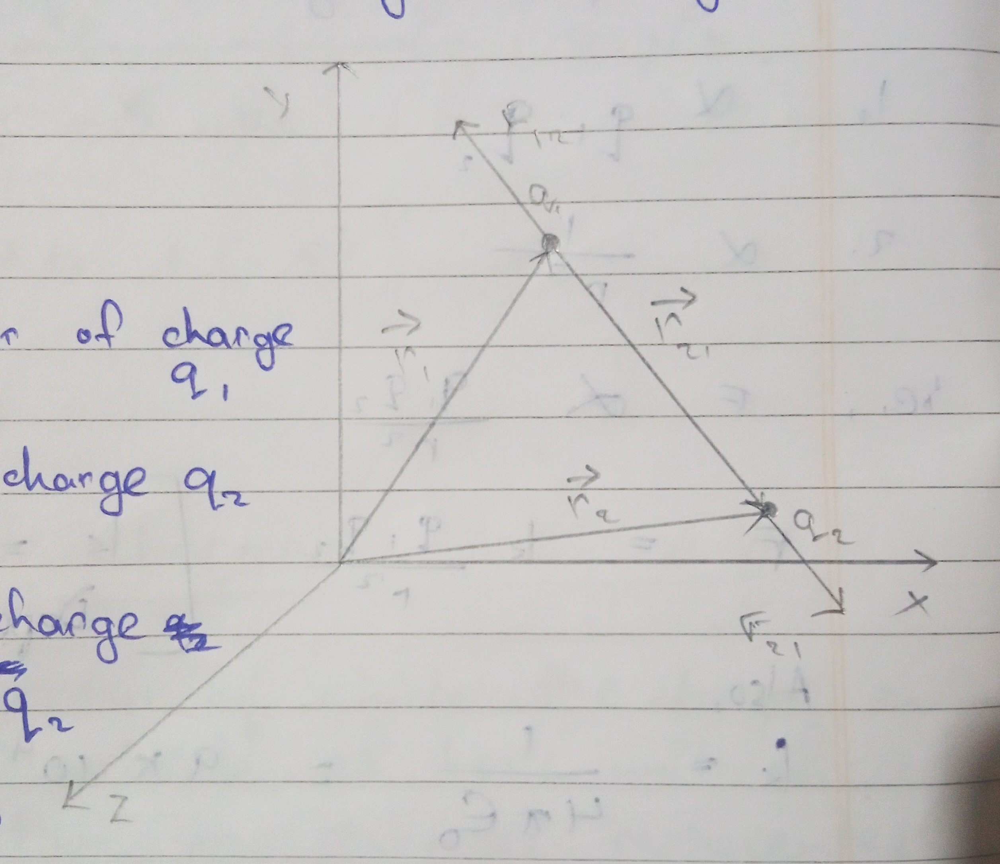
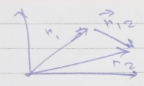
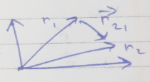
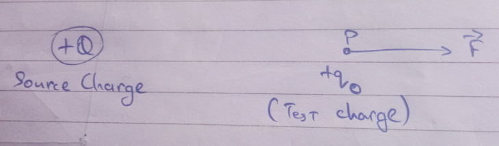
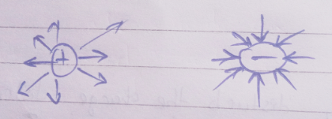

# Electric Charges and Fields 

# Electric Charges 

- Characteristics
    1. Intrinsic Property (internal property)
    2. Gives rise to electrical force between various objects. 

- $e = 1.6\times10^{-19} \text{ Columb}\ (C)$

- **Electrostatics**: study of charges at rest.
    - Charge types: +ve, -ve

# Conductors, Insulators and Di-electrics 

> [!NOTE]
> All insulators are dielectrics and don't conduct electricity. However, when electric field is applied, induced charges appears on them.

# Basic Property of Electrical Charge

1. **Additivity**: charges can be added, notice charge sign, negative charges repel.
2. **Quantization**: specific value of charges
3. **Conservation**: the net charge is conserved if the system is isolated 

## Additivity of Charge 
Property of virtue by which the total charge of a system is obtained simply by adding algebraically all the charges present in the system.

$q=q_1+q_2+q_3....$

> [!NOTE]
> Proper sign convention should be used while adding charges.

> [!CAUTION] Find net charge of a system containing 4 charges 
> $2\mu C, -3\mu C, 4\mu C, -5 \mu C$  
> 
> $q = {2+(-3)+4+(-5)}\mu C$  
> $\implies -2\mu C$

## Quantization of Charge 
The property by virtue by which the charge on a body is an integral multiple of the basic unit of charge (i.e., electron and proton) represented as '$e$'.

$q = ne$ [n = 1, 2, 3....; $e = 1.6\times 10^{-19}C$]

> [!NOTE]
> Only integral charges can be transferred. 

# Conservation of Charges 
1. The total charge in an isolated system remains constant. 
2. The electric charge can neither be created nor destroyed, they can only be transferred from one body to another.

# Columb's Law of Electrical Force 
This law states that the force of attraction or repulsion between two stationary charges is 

1. $\propto q_1 \cdot q_2$
2. $\propto \frac{1}{r^2}$

i.e., $F \propto \frac{q_1\cdot q_2}{r_2}$

$F = k\frac{q_1\cdot q_2}{r_2}$ [$k$ = electrostatic force constant. Depends on medium]

Also,  
$k = \frac{1}{4\pi\epsilon_0}=9\times 10^9 Nm^2C^{-2}$

Here $\epsilon$ = permittivity of free space (air/vacuum)

$\epsilon = 8.75 \times 10^{-12} Nm^2C^{-2}$

> [!TIP]
> Electrical force is a central force.

> [!NOTE]
> While using this formula, sign convension of charges should be used carefully because $+ve$ value of force represents repulsion while $-ve$ value represents attraction.

# Columb's Law in Vector Form 
- In this form, no need to use the sign of charges. 

We know,   
$F = k\frac{q_1q_2}{r^2}$

Let $\vec{r}_1$ = position of charge $q_1$  
$\vec{r_2}$ = position vector of $q_2$  
$\vec{r}_{21}$ = position vector of charge $q_1$ with respect to $q_2$  
$\vec{r}_{12}$ = position vector of charge $q_2$ with respect to $q_1$

 

Now,  
$\vec{r}_{21}=\vec{r}_2-\vec{r}_1$  
and, $\vec{r}_{12}=\vec{r}_1-\vec{r}_2$

Again if,  
$\vec{F}_{12}$ represents force on charge $q_1$ due to $q_2$ then in vector form it is given as, 

$\vec{F_12}=k\frac{q_1q_2}{r^2}\hat{r}_{12}$

Similarly, $\vec{F}_{21} = k\frac{q_1q_2}{r^2}\hat{r}_{21}$

Again, these two forces can also be written as,

$\vec{F}_{12}=k\frac{q_1q_2}{r^2}\hat{r}_{12}=k\frac{q_1q_2}{r^2}\frac{\vec{r}_12}{|\vec{r}_{12}|}$  
$\implies k\frac{q_1q_2}{r^2_{12}}\frac{\vec{r_{12}}}{r_{12}}$  
$\implies k\frac{q_1q_2}{r^3_{12}}\vec{r}_{12}$  
$\implies k\frac{q_1q_2}{r^3_{12}}(\vec{r}_1-\vec{r}_2)$

|||
|-|-|
|$\text{PV of 1 with respect to 2}\\\vec{r}_1+\vec{r}_12 = \vec{r_2}\\\vec{r}_{12}=\vec{r}_2-\vec{r_1}(q_1 \text{ to }q_2)$|$\text{PV of 2 with respect to 1}\\\vec{r}_1+\vec{r}_12 = \vec{r_2}\\\vec{r}_{21}=\vec{r}_2-\vec{r_1}(q_1 \text{ to }q_2)$|

## Importance of Coulomb's Law in Vector Formula
1. It shows that electrical force is a central force.
2. $\hat{r}_{12} = -\hat{r}_{21}\\\therefore \vec{F}_{12} = -\vec{F}_{21}$

This shows Coulomb's Law follow Newton's 3rd law of motion. 

## Limitations of Coulomb's Law
1. It is only valid for static charges.
2. Valid for point charges having a distance greater than $10^{-15}\ m$, below this distance nuclear forces dominate.

# Permittivity 
When two charges are placed in a medium other than air or vacuum, the force between the charges is greatly affected.  
Permittivity is the property of the medium that determines the electrical force that will exist between two charges inside a medium. 

# Di-Electric Constant (aka Relative Permittivity)
- **Sign**: $\epsilon_r,\ K,\ \kappa$

**Absolute permittivity $\epsilon$**: it is the permittivity of the medium in which the force of interaction between two pairs of charges separated by a distance is calculated.  
Under this condition, 
$$
F = \frac{1}{4\pi\epsilon}\frac{q_1q_2}{r^2}
$$

> [!NOTE]
> Permittivity of air or vacuum is written as $\epsilon_0=8.85\times1`0^{-12}\ C^2N^{-1}m^{-2}$

# Relative Permittivity (Di-Electric Constant) 
- **Sign**: $\epsilon_r,\ K,\ \kappa$
It is defined as the ratio of the absolute permittivity of the medium to the absolute permittivity of the free space. 

$\epsilon_r = \frac{\epsilon}{\epsilon_0}$

It can also be defined as the ratio of the force of interaction between two charges separated by a certain distance in air or vacuum to the force of interaction between two same charges separated by the same distance inside a medium. 

Let,  
$\underset{\text{(Inside medium)}}{F}=\frac{1}{4\pi\epsilon}\frac{q_1q_2}{r^2}$  
$\underset{Air/Vacuum}{F}=\frac{1}{4\pi\epsilon_0}\frac{q_1q_2}{r_2}$

$\therefore \epsilon_r=\frac{F_\text{Air/vacuum}}{F_\text{Inside medium}}$

> [!IMPORTANT]
> $\epsilon_r=\frac{\epsilon}{\epsilon_0}=\frac{F_\text{air/vacuum}}{F_\text{Inside medium}}$

> [!NOTE]
> $\epsilon_r$ (air) or $\kappa_\text{air}$ = 1  
> $\epsilon_r$ (water) or $\kappa_\text{water}$ = 81

# Principle of Superposition of Charges
It states that the force between any number of charges at rest is the vector sum of all the forces on that charge due to all other charges taken at a time. The force due to individual charges is unaffected by the presence of other charges.

I.e.,  
$\vec{F}=\vec{F}_{12}+\vec{F}_{13}+\vec{F}_{14}$

We need to find the net force on charge $q_1$

Let $\vec{r}_1$, $\vec{r}_2$ and $\vec{r}_3$ be the position vector of charge $q_1$, $q_2$ and $q_3$.

From the superposition principle,  
$\vec{F}_1 = \vec{F}_{12}+\vec{F}_{13}$  
$\implies k\frac{q_1q_2}{r^2_{12}}\hat{r}_{12}+k\frac{q_1q_3}{r^2_{12}}\hat{r}_{13}$  
$\implies k\ q_1[\frac{q_2}{r^2_{12}}+\frac{q_3}{r^2_{13}}\hat{r}_{13}]$

In generalized form,  
$\vec{F}_1=kq_1[\underset{i=2}{\overset{n}{\Sigma}}\frac{q_i}{r_{1i^2}}\hat{r}_{1i}]$

# Electric Fields / Electric Intensity / Electric Field Strength

- It is denoted by $\vec{E}$

The space or region around which the effect of a charge can be felt by other charges.  
It can also be defined as the force experienced by a unit positive test charge placed at that point without disturbing the position of the source charge. 

 

If a test charge $q_0$ experiences a force $\vec{F}$ at a point P then electric field at that point is given by  
$$
\vec{E}= \frac{\vec{F}}{q_0}
$$

Electric field is a vector quantity and the direction of an electric field is always from $+ve$ charge towards $-ve$ charge.

# Some Important Points 
1. The test charge $q_0$ may disturb the charge distribution of the source charge so the value of $\vec{E}$ may change. To overcome this problem we can assume the test charge to be vanishingly small, i.e., $\underset{q_0\rightarrow0}{\lim}\frac{\vec{F}}{q_0}$. This formula works because if $q_0$ is small, $\vec{F}$ is also small and the ratio of $\frac{\vec{E}}{q_0}$ will have a finite value. 
2. Even if mathematically, $\vec{E}=\frac{\vec{E}}{q_0}$, $\vec{E}$ is independent of $q_0$. This is because force is directly proportional to $q_0$ making the ratio $\frac{\vec{F}}{q}$ independent of it. In other words, even if the test charge is absent, an electric field exists at a point. 
3. The value of $\vec{E}$ depends on space coordinate, i.e., $\vec{r}=x\hat{i}+y\hat{j}+z\hat{k}$ and can have different values for different positions of test charge all over the space.
4. The positive charge will direct the electric field radially outward while the negative charge radially inward.  

 

5. The magnitude of the electric field due to a source charge is the same on an imaginary sphere when the source charge is at the center.

# SI Unit and Dimension of $\vec{E}$

SI unit = $N/C$ or $V/m$  
Dimension = $[MLT^{-3}A^{-1}]$

> [!NOTE]
> Every charged particle falls slower or takes more time to accelerate inside an electric field compared to light charged particles. 

# Electric Field due to a Point Charge
