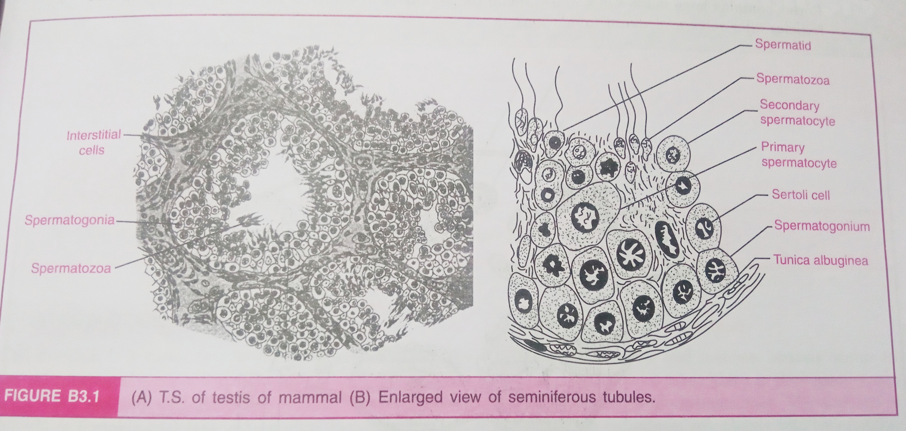
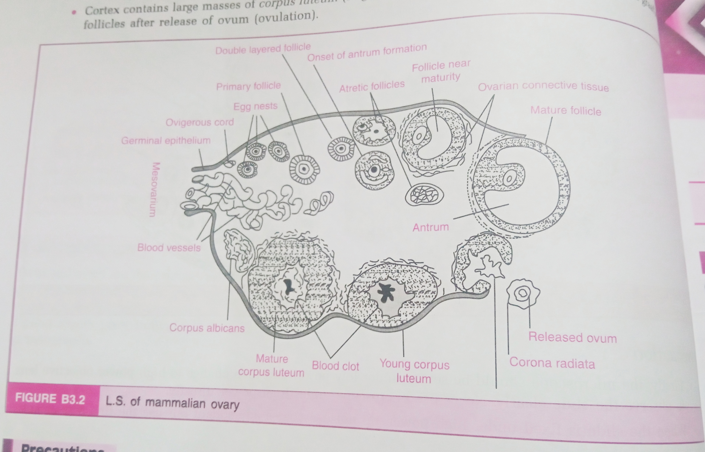

# Aim of the Experiment
To study and identify various specimens through permanent slides and preserved specimens and comment on them.  

# Material Required 
Microscope, permanent slides of the Testis, Ovary, Plasmodium, Blastocyst, preserved specimen of Lichen, Cuscuta and Ascaris. 

# TS of Testis
## Observations

- Testis is covered by three layers- *tunica vaginalis* (outermost), *tunica albuginea* (middle layer) and *tunica vasculosa* (innermost).
- It carries numerous seminiferous tubules in the form of loops. 
- The connective tissues are found around the seminiferous tubules containing masses of interstitial cells (leydig's cells), blood vessels and nerve fibers. 
- The lining of seminiferous tubules is formed by cuboidal *spermatogenic* cells and *sertoli* cells.
- Spermatogenic cells are stacked and are present in the form of spermatogonia, primary spermatocytes, secondary spermatocytes, spermatids and sperms. 
- Sertoli cells are elongated and pyramidal and are found between the germinal epithelium of seminiferous tubules. 

# TS of Ovary 
## Observations

- A solid structure surrounded by germinal epithelium and is followed by *tunica albuginea* (fibrous tissue)
- The inner mass of the ovary is differentiated into the outer _cortex_ and inner *medulla*.
- The germinal epithelium forms *primordial follicles* which migrate into the ovarian cortex.
- The medulla contains primary follicles, vesicular follicles and Graafian follicles. 
- The mature follicles (graafian) contain a large ovum in the fluid-filled cavity (antrum) surrounded by many layers of follicular cells (theca externa, theca interna, membrana granulosa and germ hill).
- Medulla also contains blood vessels, nerve fibers and various smooth muscles.
- Cortex contains large masses of *corpus luteum* (large masses of yellow cells) formed by the rupture of Graafian follicles after the release of ovum (ovulation).

# Cuscuta 

**Kingdom**: Plantae  
**Phylum**: Magnoliophyta  
**Class**: Eudicots  
**Order**: Solanales  
**Family**: Convolvulaceae  
**Genus**: *Cuscuta*

## Identifying Features 
- The body of Cuscuta is slender and vine-like, lacking true roots and chlorophyll, which imparts a yellowish or reddish coloration.
- It exhibits a winding, thread-like stem that twines around host plants, facilitating nutrient absorption through specialized structures called haustoria.
- Leafless or minimally-leaved, Cuscuta species rely entirely on their host plants for nutrition, with reduced leaves that are non-functional for photosynthesis.
- Cuscuta produces small, bell-shaped flowers typically white or pinkish in color, clustered along its stems.
- Following flowering, Cuscuta develops seed capsules containing numerous small seeds, varying in shape and size among species.
- Different Cuscuta species demonstrate specific host plant preferences, ranging from a wide host range to more restricted host selections.

## Mode of Parasitism
Cuscuta infects trees by twining its stems around them and forming haustoria, which penetrates the host's tissues, drawing water and nutrients.

## Symptoms of Parasitism
- Persistent Stunted Growth
- Pronounced Weakness and Wilt
- Noticeable Yellowing or Discoloration
- Marked Reduction in Flowering and Fruit Production
- Imminent Death of Host Plant

# Plasmodium 

**Kingdom**: Protista  
**Phylum**: Apicomplexa
**Class**: Aconoidasida 
**Order**: Haemosporida
**Family**: Plasmodiidae
**Genus**: *Plasmodium*

# Lichen 

**Kingdom**: Fungi  
**Phylum**: Ascomycota  
**Class**: Lecanoromycetes  
**Order**: Lecanorales  
**Family**: Parmeliaceae
**Genus**: *Flavoparmelia*
**Species**: *Flavoparmelia caperata*

## Identifying Features
- Common greenshield lichen presents a foliose thallus with a flat, leaf-like appearance, lacking true roots and chlorophyll, resulting in a distinctive olive-green to brownish-green coloration.
- Its thallus exhibits rounded or elongated lobes that overlap, providing a loose attachment to substrates such as tree bark, rocks, or man-made structures.
- Small, pale rhizines are present on the underside of the lobes, contributing to anchorage and absorption of water and nutrients from the substrate.
- *Flavoparmelia caperata* often produces soredia, powdery reproductive structures scattered over the thallus surface or along its margins, aiding in dispersal and reproduction.
- This lichen species is commonly found in diverse habitats, including forests, woodlands, and urban environments, thriving in moderate humidity conditions.
- Ecologically, it plays a role in soil formation and nutrient cycling, serving as a habitat and food for various microorganisms, insects, and small animals.

## Mode of Reproduction
### Asexual Reproduction 
- **Fragmentation**: Lichens reproduce asexually by breaking apart into fragments due to factors like wind, water, or physical disturbances. These fragments can establish new colonies.
- **Soredia**: Lichens also produce soredia, small clusters of fungal hyphae intertwined with algae or cyanobacteria cells. Dispersed by wind or other means, they can germinate to form new lichen individuals.

### Sexual Reproduction
- **Ascospores**: Many lichens produce spores within structures called asci. Released into the environment, these ascospores can germinate to form new lichens when they contact compatible algal or cyanobacterial cells.
- **Fungal Hyphae Fusion**: In some cases, lichen fungi fuse with other compatible fungi, forming a new lichen thallus. This thallus can then associate with algae or cyanobacteria to create a functional lichen.

# Ascaris
# Blastocyst 

# Precautions
- The microscope should be set up under low power and then changed to high power objective lens to observe the slide clearly. Never use the microscope under high power directly. 