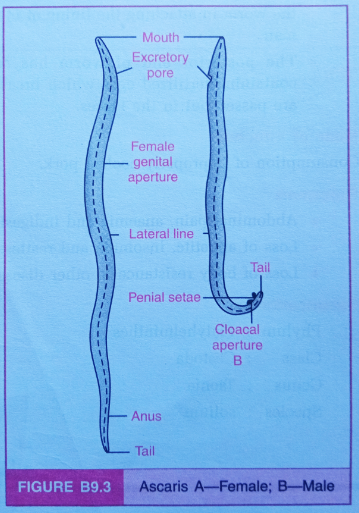

# Aim of the Experiment
To study and identify various specimens through permanent slides and preserved specimens and comment on them.  

# Material Required 
Microscope, permanent slides of the Testis, Ovary, Plasmodium, Blastocyst, preserved specimen of Lichen, Cuscuta and Ascaris. 

# TS of Testis
## Observations

- Testis is covered by three layers- *tunica vaginalis* (outermost), *tunica albuginea* (middle layer) and *tunica vasculosa* (innermost).
- It carries numerous seminiferous tubules in the form of loops. 
- The connective tissues are found around the seminiferous tubules containing masses of interstitial cells (leydig's cells), blood vessels and nerve fibers. 
- The lining of seminiferous tubules is formed by cuboidal *spermatogenic* cells and *sertoli* cells.
- Spermatogenic cells are stacked and are present in the form of spermatogonia, primary spermatocytes, secondary spermatocytes, spermatids and sperms. 
- Sertoli cells are elongated and pyramidal and are found between the germinal epithelium of seminiferous tubules. 

# TS of Ovary 
## Observations

- A solid structure surrounded by germinal epithelium and is followed by *tunica albuginea* (fibrous tissue)
- The inner mass of the ovary is differentiated into the outer _cortex_ and inner *medulla*.
- The germinal epithelium forms *primordial follicles* which migrate into the ovarian cortex.
- The medulla contains primary follicles, vesicular follicles and Graafian follicles. 
- The mature follicles (graafian) contain a large ovum in the fluid-filled cavity (antrum) surrounded by many layers of follicular cells (theca externa, theca interna, membrana granulosa and germ hill).
- Medulla also contains blood vessels, nerve fibers and various smooth muscles.
- Cortex contains large masses of *corpus luteum* (large masses of yellow cells) formed by the rupture of Graafian follicles after the release of ovum (ovulation).

# Blastocyst 
## Observations 

- It is a spherical mass of cells. 
- It carries a fluid-filled cavity called blastocoel. 
-  It is surrounded by an outer envelope of cells called trophoblast or trophoectoderm.
-  It also carries a group of inner mass cells (embryoblast) in the blastocoel cavity. 
-  The embryoblast (inner mass cells) later form the embryo and the trophoblast gets attached to the endometrium layer of the uterus for implantation.

# Plasmodium 

**Kingdom**: Protista  
**Phylum**: Apicomplexa  
**Class**: Aconoidasida  
**Order**: Haemosporida  
**Family**: Plasmodiidae  
**Genus**: *Plasmodium*  
**Species**: *vivax*

- **Disease caused:** Malaria 

## Identifying Features
- Plasmodium enters humans as sporozoites via female Anopheles mosquito bites.
- Infected by biting humans, female Anopheles mosquitoes store and multiply Plasmodium parasites in their salivary glands, transmitting sporozoites to humans when they bite again.
- Sporozoites, single-nucleated, spindle-shaped organisms, display wriggling motion. 
- Plasmodium needs both humans and mosquitoes to complete its life cycle, with the female Anopheles mosquito as the vector. 
- Plasmodium multiplies in liver cells, then rupture RBCs, releasing the toxin *haemozoin*.

## Symptoms 
1. Headache and nausea 
2. Chill, shiver, then fever recurs every 3 to 4 days.
3. Fever is subsidized by profuse sweating. 

# Entamoeba 

**Kingdom:** Eukaryota  
**Phylum:** Amoebozoa  
**Class:** Archamoebae  
**Order:** Amoebida  
**Family:** Entamoebidae  
**Genus:** *Entamoeba*  
**Species:** *histolytica*

- **Disease caused:** amoebiasis or amoebic dysentery

## Identifying features
- It's a human intestinal/rectal endoparasite.
- Exists as trophozoite and cyst.
- Trophozoite is pathogenic and exhibits irregular shape and possesses a single pseudopodium.
- Protoplasm divides into ectoplasm and endoplasm. The nucleus, ingested RBCs, and food vacuole reside in the endoplasm. 
- The cystic form, spherical and infective, harbors four nuclei while residing in the intestinal lumen. 
- Protected by a thick wall, the cystic form stores glycogen and nuclei.

## Mode of Infection 
Infection spreads through food or water containing Entamoeba cysts. When unpeeled fruits or uncooked vegetables are consumed, cystic Entamoeba enters the intestinal lumen via the fecal-oral route.

## Symptoms of Disease
Ulceration and bleeding through rectum, abdominal pain, cramps, vomiting, very acute diarrhoea and anaemia. 

# Ascaris

**Kingdom:** Animalia  
**Phylum:** Nematoda  
**Class:** Secernentea  
**Order:** Ascaridida  
**Family:** Ascarididae  
**Genus:** *Ascaris*  
**Species:** *lumbricoides*

- **Disease caused:** Ascariasis 

## Identifying Features 

- Body is elongated, cylindrical, unsegmented, pointed at both ends. 
- Body is surrounded by thick cuticle. 
- Sexual dimorphism is present with males smaller than females.
- Male bear mouth, excretory pore, and cloacal aperture. Posterior end is strongly curved with penial setae pair.
- Females are larger with mouth, excretory pore, female genital aperture, and anus. Posterior end is straight.
- One dorsal, one ventral, and two lateral lines run the entire body length.

## Mode of Infection
Through contaminated food and water having embryonated eggs. 

## Symptoms of Disease 
- Loss of appetite, diarrhoea and vomiting. 
- Abdominal discomforts- colic pain. 
- Retarded body growth and impairment in mental efficiency. 

# Blastocyst 
## Observations 

- It is a spherical mass of cells. 
- It carries a fluid-filled cavity called blastocoel. 
-  It is surrounded by an outer envelope of cells called trophoblast or trophoectoderm.
-  It also carries a group of inner mass cells (embryoblast) in the blastocoel cavity. 
-  The embryoblast (inner mass cells) later form the embryo and the trophoblast gets attached to the endometrium layer of the uterus for implantation.

# Plasmodium 

**Kingdom**: Protista  
**Phylum**: Apicomplexa  
**Class**: Aconoidasida  
**Order**: Haemosporida  
**Family**: Plasmodiidae  
**Genus**: *Plasmodium*  
**Species**: *vivax*

- **Disease caused:** Malaria 

## Identifying Features
- Plasmodium enters humans as sporozoites via female Anopheles mosquito bites.
- Infected by biting humans, female Anopheles mosquitoes store and multiply Plasmodium parasites in their salivary glands, transmitting sporozoites to humans when they bite again.
- Sporozoites, single-nucleated, spindle-shaped organisms, display wriggling motion. 
- Plasmodium needs both humans and mosquitoes to complete its life cycle, with the female Anopheles mosquito as the vector. 
- Plasmodium multiplies in liver cells, then rupture RBCs, releasing the toxin *haemozoin*.

## Symptoms 
1. Headache and nausea 
2. Chill, shiver, then fever recurs every 3 to 4 days.
3. Fever is subsidized by profuse sweating. 

# Entamoeba 

**Kingdom:** Eukaryota  
**Phylum:** Amoebozoa  
**Class:** Archamoebae  
**Order:** Amoebida  
**Family:** Entamoebidae  
**Genus:** *Entamoeba*  
**Species:** *histolytica*

- **Disease caused:** amoebiasis or amoebic dysentery

## Identifying features
- It's a human intestinal/rectal endoparasite.
- Exists as trophozoite and cyst.
- Trophozoite is pathogenic and exhibits irregular shape and possesses a single pseudopodium.
- Protoplasm divides into ectoplasm and endoplasm. The nucleus, ingested RBCs, and food vacuole reside in the endoplasm. 
- The cystic form, spherical and infective, harbors four nuclei while residing in the intestinal lumen. 
- Protected by a thick wall, the cystic form stores glycogen and nuclei.

## Mode of Infection 
Infection spreads through food or water containing Entamoeba cysts. When unpeeled fruits or uncooked vegetables are consumed, cystic Entamoeba enters the intestinal lumen via the fecal-oral route.

## Symptoms of Disease
Ulceration and bleeding through rectum, abdominal pain, cramps, vomiting, very acute diarrhoea and anaemia. 

# Ascaris

**Kingdom:** Animalia  
**Phylum:** Nematoda  
**Class:** Secernentea  
**Order:** Ascaridida  
**Family:** Ascarididae  
**Genus:** *Ascaris*  
**Species:** *lumbricoides*

- **Disease caused:** Ascariasis 

## Identifying Features 

- Body is elongated, cylindrical, unsegmented, pointed at both ends. 
- Body is surrounded by thick cuticle. 
- Sexual dimorphism is present with males smaller than females.
- Male bear mouth, excretory pore, and cloacal aperture. Posterior end is strongly curved with penial setae pair.
- Females are larger with mouth, excretory pore, female genital aperture, and anus. Posterior end is straight.
- One dorsal, one ventral, and two lateral lines run the entire body length.

## Mode of Infection
Through contaminated food and water having embryonated eggs. 

## Symptoms of Disease 
- Loss of appetite, diarrhoea and vomiting. 
- Abdominal discomforts- colic pain. 
- Retarded body growth and impairment in mental efficiency. 

# Cuscuta 

**Kingdom**: Plantae  
**Phylum**: Magnoliophyta  
**Class**: Eudicots  
**Order**: Solanales  
**Family**: Convolvulaceae  
**Genus**: *Cuscuta*

## Identifying Features 
- The body of Cuscuta is slender and vine-like, lacking true roots and chlorophyll, which imparts a yellowish or reddish coloration.
- Cuscuta's thread-like stem twines around hosts, absorbing nutrients via haustoria.
- Leafless or with minimal leaves, Cuscuta species depend entirely on their hosts for nutrition, having non-functional leaves for photosynthesis.
- Cuscuta bears small, bell-shaped flowers, usually white or pinkish, clustered on its stems.
- After flowering, Cuscuta forms seed capsules with many small seeds, which differ in shape and size among species.
- Different Cuscuta species exhibit specific host plant preferences, ranging from a wide variety of hosts to more restricted selections.
- Cuscuta's thread-like stem twines around hosts, absorbing nutrients via haustoria.
- Leafless or with minimal leaves, Cuscuta species depend entirely on their hosts for nutrition, having non-functional leaves for photosynthesis.
- Cuscuta bears small, bell-shaped flowers, usually white or pinkish, clustered on its stems.
- After flowering, Cuscuta forms seed capsules with many small seeds, which differ in shape and size among species.
- Different Cuscuta species exhibit specific host plant preferences, ranging from a wide variety of hosts to more restricted selections.

## Mode of Parasitism
Cuscuta infects trees by twining its stems around them and forming haustoria, which penetrates the host's tissues, drawing water and nutrients.

## Symptoms of Parasitism
- Persistent stunted growth
- Pronounced weakness and wilt
- Persistent stunted growth
- Pronounced weakness and wilt
- Noticeable Yellowing or Discoloration
- Marked reduction in flowering and fruit production
- Imminent death of host plant
- Marked reduction in flowering and fruit production
- Imminent death of host plant

# Lichen 

**Kingdom**: Fungi  
**Phylum**: Ascomycota  
**Class**: Lecanoromycetes  
**Order**: Lecanorales  
**Family**: Cladoniaceae  
**Genus**: *Cladonia*  
**Species**: *portentosa*

## Identifying Features
- It exhibits a fruticose growth form, featuring upright stalks resembling miniature trees. It displays a grayish-green to bluish-green coloration.
- The thallus typically comprises branched and shrubby structures with multiple podetia.
- The podetia, resembling miniature trees, are a distinctive feature of *Cladonia portentosa*.
- It commonly shows a grayish-green to bluish-green coloration.
- *Cladonia portentosa* thrives in forests, woodlands, and urban areas with moderate humidity, aiding in soil formation and nutrient cycling, and providing habitat and food for various organisms.

## Mode of Reproduction
### Asexual Reproduction 
- *Soredia:* Small clusters of algal cells surrounded by fungal hyphae. They break off from the parent lichen and can grow into new lichens when dispersed by wind or animals.
- *Isidia:* Tiny, finger-like projections containing both fungal and algal cells. They detach from the parent lichen and can initiate new lichens when dispersed.

### Sexual Reproduction
- *Ascospores:* Produced within specialized structures called asci, formed in reproductive structures called apothecia. Ascospores are released into the environment and can germinate to form new lichens if they encounter a compatible algal partner.

# Precautions
- The microscope should be set up under low power and then changed to high power objective lens to observe the slide clearly. Never use the microscope under high power directly. 
- Fine adjustment knob should be used to focus the slide under high power. Care should be taken that the objective lens should not touch the slide in any case. 
- Specimen should be handled with care and hold the container upright if stored with preservative liquid. 
- If handling live specimens, use proper specific procedures. 
- Handle permanent slides with care so as not to break them. 