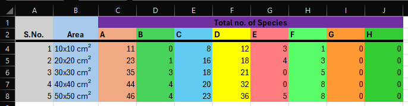
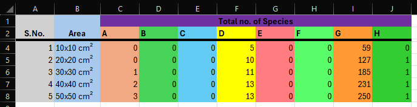
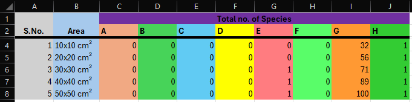

## Aim of the Experiment 
To study the population density of plants of a given area by the quadrate method. 

## Materials Required 
1. Meter Scale 
2. String or cord
3. Paper 
4. Pencil 

## Procedure 
1. Select a sample site where different types/species are to be studied. 
2. Measure a 50x50 cm field area with the meter scale by using 4 nails and tying a string with them (one quadrate).
3. Now divide the quadrate into smaller squares of 10x10 cm, 20x20 cm and so on by using string and nails, starting from point A.
4. Count the number of plants of a particular species firstly in 10x10 sq. cm area and then the another species in the same area, if present. 
5. Increase the area to 20x20 cm and record the additional number of species located in this area. 
6. Repeat the same procedure till the whole area of 50x50 sq. meter is covered. 
7. Count and add the total number of plant species of all the squares to get the total number of a particular species of the quadrate. 

Quadrate can be of any size and to calculate the size of quadrates, the data recorded in observation-I is analyzed by drawing a graph/histogram on two axis- X-axis is taken for number of species and Y-axis for the size of quadrate. When the graph shows flattened or no further gradual increase of species, this point is taken as minimum area of the quadrant required for study of species. In the below mentioned graph, a quadrant is considered for 50x50 cm. 

8. Repeat the same for 3rd, 4th quadrates and so on. 

## Observations 
### Observation-I 

### Observation-II 

### Observation-III 

