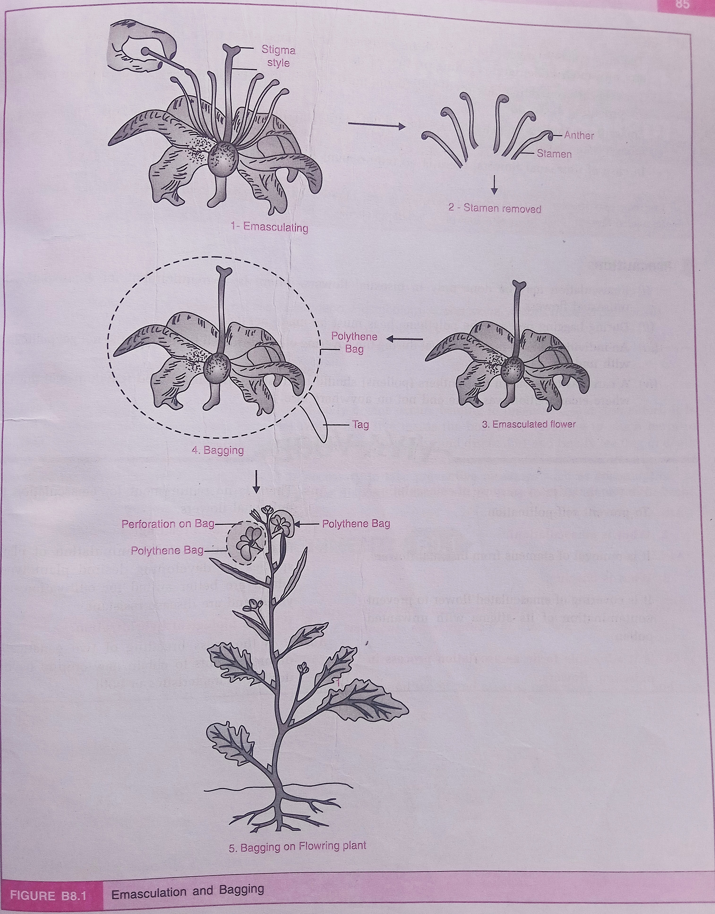

# Aim of the Experiment 
To study controlled pollination, emasculation, tagging and bagging through models/charts/live-flowers. 

# Material Required 
1. Forceps 
2. Scissors 
3. Needle 
4. Polythene bag or muslin cloth 
5. Tags 

# Comments 
## Emasculation 

- It is a technique/process of removing stamens of a flower before they attain reproductive maturity. It is preferably done when the flower is in bud stage. 
- It is done in bisexual flowers to prevent self-pollination. 
- The anthers/stamens are removed/cut with the help of sterilized forceps or scissors and needle. 
- The anthers/stamens removal or Emasculation is generally performed in large size flower. 

## Bagging 
- The emasculated flowers are enclosed in polythene bags, depending upon the size of flowers, to prevent any unwanted pollen grains falling on the stigma of flowers.
- The bags are generally made up of polythene, muslin cloth or paper and these are then made to perforate for providing air to flowers. 
- Emasculated flowers on maturity, are dusted with desired pollens after removing these bags. These are again rebagged and labelled.
- In case of unisexual flowers, there is no requirement for emasculation. 

## Tagging
- Tagging is the process of labeling flowers during cross-pollination experiments to maintain accurate records of the breeding process.
- After bagging, tags are attached to the flowers to indicate essential information such as the **date of emasculation, date of pollination, name of the male and female parents and other relevant experimental data**.
- The tags are usually made from materials like paper or plastic that can withstand environmental conditions.
- The information written on the tags ensures that the breeding process is traceable, facilitating proper identification and further research on the resulting seeds or plants.
- Tagging helps in keeping track of specific crosses and prevents confusion during the harvesting of seeds, ensuring that the desired genetic traits are studied accurately.

# Precautions 
1. Emasculation may be done only in bisexual flowers. There is no requirement of emasculation in unisexual flowers. 
2. During bagging process, the polythene bags must be made aerated.
3. An individual has to make sure that during the covering the emasculated flower, it must not get pollinated with undesired pollens. 
4. A care has to be taken that anthers (pollens) should be dusted only on selected female parent flowers where emasculation was done and not on anywhere else. 

# Conclusion
This experiment demonstrates the essential techniques for controlled pollination, emphasizing the importance of emasculation, bagging, and tagging in preventing unwanted pollination and ensuring accurate breeding outcomes.