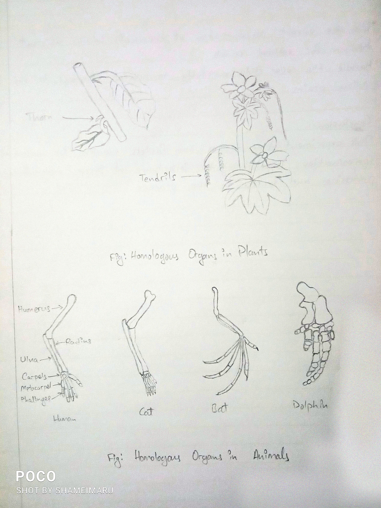

## Aim of the Experiment
To study homologous and analogous organs using models/charts/specimens.

## Materials Required
- Models or charts of different organisms
- Specimens of animals (if available)
- Pictures or diagrams of homologous and analogous structures

## Procedure
1. Examine the provided models, charts, or specimens that show homologous and analogous organs.
2. Observe the structures of different organisms, paying attention to similarities and differences in shape, size, and function.
3. Identify homologous organs, which have similar structures but different functions in different species.
4. Identify analogous organs, which have different structures but perform similar functions across species.
5. Note down your observations about how these organs have evolved based on common ancestry (homologous) or similar environmental pressures (analogous).

## Observations
- **Homologous organs**: Found in organisms that share a common ancestor. These organs have similar structural origins but may perform different functions (e.g., human arm and bat wing).
- **Analogous organs**: Found in organisms that do not share a common ancestor but have evolved similar functions due to environmental pressures (e.g., wings of birds and wings of insects).

|  | | 
|-|-|

## Examples
- **Homologous Organs**: The forelimbs of humans, whales, and bats share the same basic skeletal structure but serve different purposes (grasping, swimming, flying).
- **Analogous Organs**: The wings of birds and insects are functionally similar as both are used for flight, but their anatomical structures are different.

## Precautions
1. Ensure accurate observation of models/specimens to correctly identify homologous and analogous organs.
2. Use clear diagrams or specimens that clearly show structural similarities and differences.

## Conclusion
This experiment shows that homologous organs share ancestry, while analogous organs evolve separately due to similar environments.