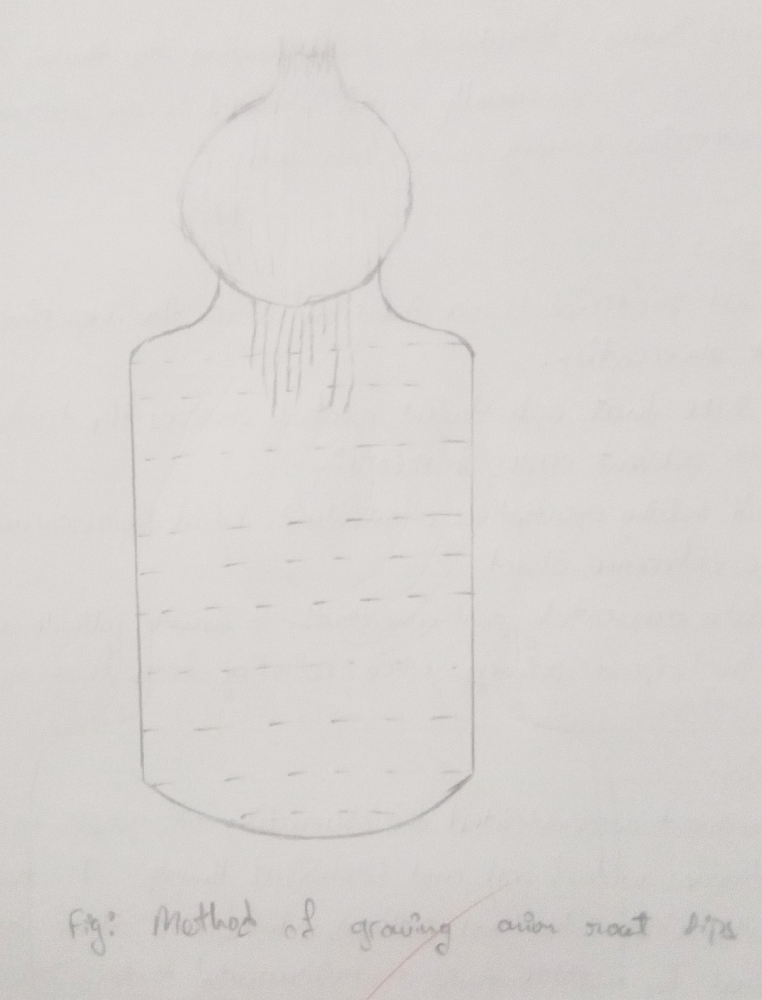
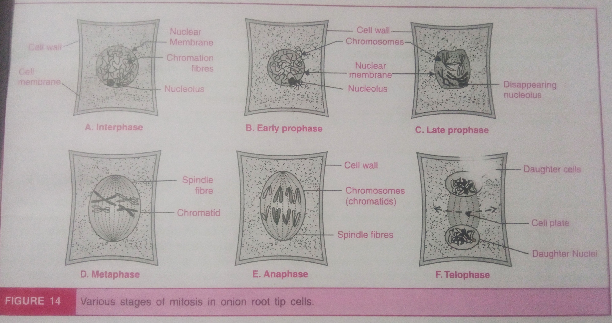

## Aim of the Experiment 
To prepare a temporary mount of the given root tip to study different stages of meiosis. 

## Materials Required 
1. Onion bulb 
2. Conical flask 
3. Scissor 
4. Forceps 
5. Needle 
6. Coverslip 
7. Blotting paper 
8. Spirit lamp 
9. Microscope 
10. Acetocarmine 
11. Acetic acid 
12. Methyl alcohol 
13. Hydrochloric acid 

## Procedure 
### Growing and Preservation of Onion Roots 

1. Take an onion bulb of medium size and remove its old roots from its base with the help of scissor. 
2. Place this onion bulb on a conical flask filled with water. Make it ensure that base of the onion is in touch with water. Keep it for 5 to 7 days till new roots emerge out.
3. Cut these fresh roots and fix them in mixture of acetic acid and methyl alcohol (1:3 ratio) for future use. 
4. Hydrolyze 2 to 3 root tips by gently warming to 45$\degree$C in 1 M $HCl$ for 15 minutes. 

### Slide Preparation
1. Take 2-3 roots and wash them properly in water. 
2. Take a clean slide and put few drops of acetocarmine on it. Put 2-3 roots in this acetocarmine and cut it into small pieces so that roots may take up stain properly. 
3. Heat the tip of needle and touch it to the acetocarmine placed on the slide. This makes the stain specific for the nuclear material. 
4. Gently warm up the slide over the spirit lamp. This causes evaporation of acetocarmine, so put more stain to prevent drying of the slide. Repeat for 2-3 times for better staining. 
5. Now put coverslip on the root tips and gently press it after squashing the root tips with forceps or needle. 
6. Wrap the slide with blotting paper and again gently apply pressure with hands so that root squash may spread up properly and uniformly and extra stain may be wiped by blotting paper. 
7. Observe the slide under low power microscope to locate the dividing cells and then under high power to examine the specific dividing cells for various stages of mitosis. 

## Observations 
It is indirect nuclear division and is completed under the following phases: 
### Karyokinesis 
1. Interphase 
    - Metabolically active stage with distinct nuclear envelope and nucleolus. 
    - Chromosomes appear in the form of chromatin network in the nucleus. 
2. Prophase 
    - The shortening and thickening of chromosomes occur due to coiling and nucleus shows clear and distinct chromosomes. 
    - Each chromosome appears as two threaded structure and they are joined by a specialized region, the centromere.
    - Nuclear membrane is present. Nucleolus is prominent. 
3. Metaphase 
    - Nuclear membrane disappears and spindle is formed. Chromosomes are arranged at the equatorial plate and forms a metaphase plate which is at right angles to the pole.
    - Chromosomes are joined with the spindle fibers by their centromeres and the ir arms face towards the poles.
    - Centromeres are thick, short and condensed. 
4. Anaphase
    - Chromosomes divide at the centromere region and each chromosome forms two daughter chromatids
    - The daughter chromatids move apart from the equatorial plate to the opposite poles. The centromere is seen at its leading edge with the arms of chromosomes trailing behind.
    - The daughter chromatids assume various shapes when they move toward the pole.
    - In late anaphase, the chromatids are found near the pole.
5. Telophase 
    - The chromatids starts aggregating at the opposite poles and form two groups.
    - The nuclear wall and nucleolus reappear. 
    - Chromosomes become thin and long.
    - Protoplasmic spindle disappear. 
    - The two nuclei are formed at the two poles of a cell.

### 2. Cytokinesis 
A cell plate is formed at the equatorial plate. This place starts in the center and expands centrifugally until it divides the cell into two parts.

## Precautions 
1. Use neat and clean slide for preparing a mount of root tip. 
2. The mounting material should be properly crushed for clear view of chromosomes. 
3. The acetocarmine stain should be filtered before using it.
4. The entry of air-bubbles in the slide must be avoided.
5. The extra acetocarmine should be mopped off from the slide with the help of filter paper. 

---

## Viva
1. Aceto-alcohol fixative is used to bring the cell's activity to stasis. 
2. Fixative denatures the protein and lipids so there is no enzyme action and no further cell division. 
3. Acetic acid fixes the pH level and preserves the nucleic acid and proteins by fixing cellular structures, maintaining the shape and details of the cell.
4. Acetocarmine stain is used to color the chromosomes of the cell. 
5. Acetocarmine is prepared by adding carmine powder in 45% glacial acetic acid. 1 liter has 10 g powder and is kept for 24 hours stored in 4 degree celsius to avoid denaturation.
6. Carmine powder is also called **Coccus carmine** and is obtained from *Dactylopius coccus*. 
7. Iron rust can also be used to intensify the coloration. 
8. Dividing cells of the onion are only seen during 8-9 am. 