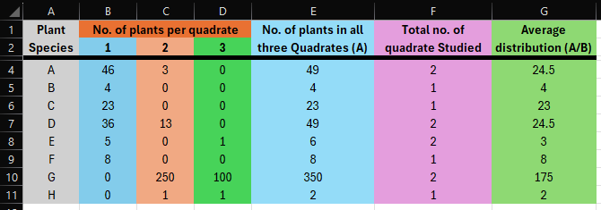

## Aim of the Experiment 
To study the plant population frequency by quadrate method. 

## Materials Required 
1. Meter scale
2. Field
3. String or wire 
4. Nails 
5. Paper 

## Procedure 
1. Measure a sample site for studying the population frequency of the plant. 
2. Measure 1x1 sq. meter or 50x50 sq. cm area or so on and tie a string around it with the help of nails making it a quadrate.
3. A quadrate can be divided into subunits for easy counting of plants if their numbers are large.
4. Now, count all the plants of a particular species in all smaller subunits and also the another species, if they are present. 
5. Now, count all the plants of a particular species in all smaller subunits and also the other species. This will provide count of all plants of particular species as well as other species in the quadrate.
6. Repeat the experiment by measuring 1x1 sq. meter or 50x50 sq. cm area in the field at the same distance and again record the count and number of plant species for 2nd quadrate. 

$$
\text{Average occurrence} = \frac{\text{No. of plants of particular species}}{\text{Total number of quadrates}}
$$

## Observations 

## Discussion 
Frequency can be expressed in percentage calculated by dividing the number of quadrates in which a species occurs by the total number of quadrates. 

$$
\frac{\text{No. of Quadrates Occupied Sp.}}{\text{Total no. of Quadrates}} \times 100
$$

If a species occurs in 25 out of 50 quadrates, it has a frequency of 50%. So the frequency of plant species helps in understanding the distribution of species in that particular area.

## Precautions 
1. The measurement of quadrates should be accurate and not overlapping with each other. 
2. Quadrates should be marked in one field only.
3. The individuals of only one plant species should be counted or considered at a time.
4. The cord or string shouldn't be too thick.