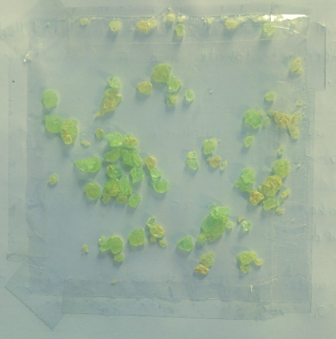

# Aim of the Experiment 
To prepare double salt of Ferrous ammonium sulfate $[FeSO_4\cdot (NH_4)_2\cdot H_2O]$ or Mohr's Salt. 

# Apparatus & Materials Required 

- **Apparatus**: two beakers (250 ml), china dish, funnel, funnel stand, glass rod, wash bottle, bunsen burner, tripod stand, watch glass, filter papers and wire gauze. 
- **Chemicals**: Ferrous sulfate crystals, ammonium sulfate crystals and dilute sulfuric acid. 

# Principle 
Mohr's salt is prepared by dissolving an equimolar mixture of hydrated ferrous sulfate and ammonium sulfate in water containing a small amount of sulfuric acid. This results in the formation of light blue or green crystals of ferrous ammonium sulfate. 

$FeSO_4 \cdot 7H_2O + (NH_4)_2SO_4 \rightarrow FeSO_4\cdot(NH_4)_2SO_4\cdot SO_4\cdot 6H_2O + H_2O$

# Procedure 

1. Take a 250 ml beaker and wash it with distilled water. Transfer 10g ferrous sulfate and 5 g ammonium sulfate crystals to it. 
2. Add 3-4 ml of dilute sulfuric acid to prevent hydrolysis of ferrous sulfate. 
3. In another beaker, boil 20-25 ml water for 5 minutes to expel dissolved $O_2$
4. Add the boiling water into the first beaker containing the salt and dilute $H_2SO_4$ and stir it with a glass rod. 
5. Filter the solution to remove insoluble impurities and transfer the filtrate to a china dish. 
6. Heat the solution in the china dish for some time to concentrate it to the crystallization point. 
7. Place the china dish over a beaker full of cold water. On cooling, crystals of Mohr's salt are separated out. 
8. Decant off the mother liquor and wash the crystals with ethyl alcohol to remove any sulfuric acid sticking to them. 
9. Dry the crystals between the folds of the filter paper and dry the crystals on a rough balance. 

# Result

The yield of crystals = 10.8 g  
The color of crystals = Yellowish green  
The shape of crystals = monocyclic 

# Precautions 
- The solution shouldn't be heated beyond the crystallization point. 
- Add dilute sulfuric acid to prevent hydrolysis of $Al_2(SO_4)_3$.
- Do not disturb the solution while it is being cooled. 
- Cool the solution slowly to get good crystals. 
- Don't concentrate the solution beyond the crystallization point. 