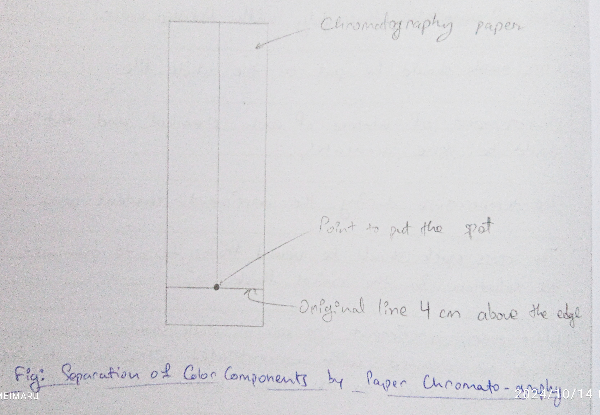

## Aim of the Experiment 
To separate the colored components in the mixture of red and blue inks by ascending paper chromatography and find the $R_f$ value.

## Material Required 
1. Glass jar 
2. Glass rod 
3. Filter paper 
4. Jar cover 
5. Fine capillary tube 
6. Ethyl alcohol 
7. Mixture of red and blue ink. 

## Procedure 

1. Take strip of chromatography paper, draw a line from one end. 
2. Also draw a line length-wise from the center of paper. With the help of capillary tube, put a drop of mixed ink solution at a point. 
3. Dry it and repeat 2-4 times so that the spot becomes rich in mixture. 
4. Suspend the filter paper vertically in the glass jar 2 cm above solvent level. 
5. When solvent traveled 15 cm, take out the paper and then cool in ice water for a few minutes. 
6. Filter the yellow colored solid, wash it with water to remove traces of alkali. 
7. Recrystallization of benzyl acetone. 
8. Weight and record yield and melting point. 

## Observation 
| S. No. | Substance | Distance traveled by different components | Distance traveled by solvent | $R_f$ value | 
|-|-|-|-|-|
| 1. | Red ink + blue ink | Red (A cm) = 11.7 | $X$ = 13.6 | $R_f = A/X = 0.86$ | 
| 2. | Red ink + blue ink | Blue (B cm) = 12.5 | $X$ = 13.6 | $R_f = B/X = 0.92$ | 

## Result 
1. $R_f$ (red) = 0.86 
2. $R_f$ (Blue) = 0.92

## Precautions 
1. Wash the ppt. with water to remove traces of NaOH sticking to it. 
2. Use minimum amount of rectified spirit to dissolved crude sample of crystallization. 