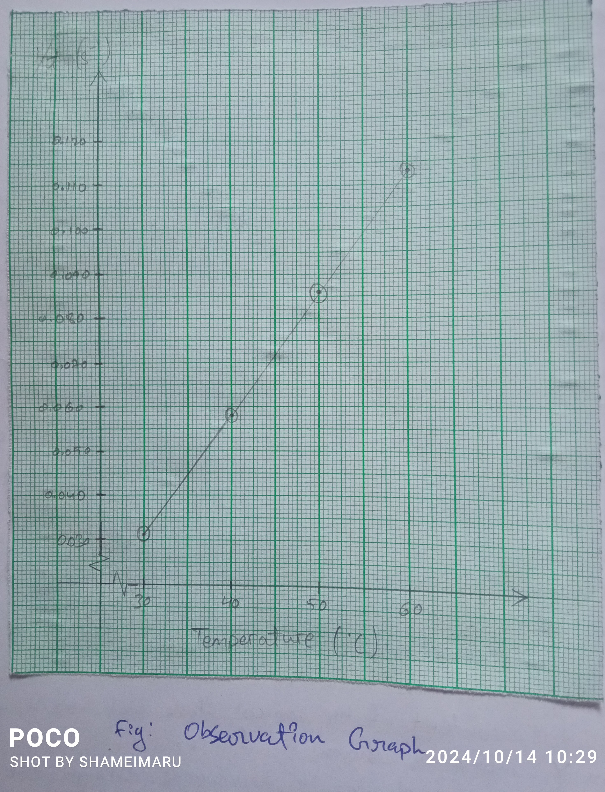

## Aim of the Experiment 
To study the effect of temperature on the rate of reaction between sodium thiosulphate and hydrochloric acid. 

## Apparatus Required 
1. Conical flasks of 150 ml 
2. Pipette 10 ml 
3. Stopwatch 
4. Thermometer 
5. Measuring cylinder/burette 50 ml 
6. White tile 
7. Tripod stand 
8. Wire gauze 

## Chemical Required 
1. 0.1 M sodium thiosulphate
2. 1 M hydrochloride solution 
3. Concentrated nitric acid 
4. Distilled water 

## Theory 
IT has been experimentally proved that the rate of reaction for most of the reaction becomes approximately double for every 10$\degree$ rise in temperature because the molecules obtain energy which is greater than or equal to threshold energy, i.e., effective collision becomes double. Hence, rate of chemical reaction depends on temperature. The effect of temperature on the rate of chemical reaction between sodium thiosulphate reaction and hydrochloric acid also increases. 

## Procedure 
1. Take a white tile and put a cross mark with a black/blue marker. 
2. Wash the burette, pipette and 150 ml conical flasks thoroughly with distilled water and keep it to dry.
3. Rinse a burette with a little amount of 0.1 M sodium thiosulphate and fill it with the same, i.e., 0.1 M sodium thiosulphate solution.
4. Add 10 ml of 0.1 M sodium thiosulphate solution into 150 ml and flask with the help of a burette and note its temperature. Let the temperature be $t \degree C$. 
5. Now add 10 ml of 1 M $HCl$ into the conical flask and immediately start the stopwatch. 
6. Swirl the contents of the conical flask and keep it on the tile with the X mark as shown in figure.
7. View the cross mark from top to downwards through the reacting mixture in the conical flask. When the cross mark becomes invisible stop the stopwatch and note down the time taken. 
8. Empty the conical flask by throwing away the contents and then wash it with concentrated nitric acid so as to remove all the sulphur sticking to the conical flask. There after clean the conical flask with distilled water thoroughly. 
9. Again add 10 ml of 0.1 M sodium thiosulphate into 150 ml conical flask withe the help of a burette and heat the content keeping over the wire gauze to $10 \degree C$ more than the temperature of the first experiment, i.e., $(t+10)\degree C$. 
10. Stop heating and add 10 ml of $HCl$ into the conical flask. Immediately start the stopwatch. 
11. Swirl the content of the conical flask and keep it on the tile with an X mark as shown in the figure. 
12. View the cross mark top to downwards through the reacting mixture in the conical flask. When the cross mark becomes invisible stop the stopwatch and note down the time taken. 
13. Repeat the same process for temperatures $(t+20)\degree C$, $(t+30)\degree C$ and $(t+40)\degree C$ and note down the time taken for the X mark to become invisible in each case. 
14. Record your observation data in a tabular form, interpret the conclusions as shown in the table below. 

## Observation Table 

|S. No. | Vol. of $HCl$ | Vol. of $Na_2S_2O_3$ | Initial Temperature | Final Temperature | Time taken for cross to become invisible | $1/t (s^{-1})$
|-|-|-|-|-|-|-|
| 1. | 10 ml | 10 ml | $30\degree C$ | $30\degree C$ | 32.26 $s$ | 0.031 | 
| 2. | 10 ml | 10 ml | $40\degree C$ | $37\degree C$ | 17.24 $s$ | 0.058 |
| 3. | 10 ml | 10 ml | $50\degree C$ | $46\degree C$ | 11.63 $s$ | 0.086 |
| 4. | 10 ml | 10 ml | $60\degree C$ | $57\degree C$ | 8.85 $s$ | 0.113 |

## Graph Plotting 

With the help of above data in the observation table, plot a graph between temperature taken in $\degree C$ on X-acis and 1/time on y-axis. The resulting graph should be a straight line. 

## Result 
The rate of chemical reaction between sodium thiosulphate and hydrochloric acid increases with increase in temperature.

## Precautions 
1. Clean the apparatus thoroughly with distilled water. 
2. Cross mark should be put on a white tile or paper. 
3. The cross mark should be viewed from top to downwards through the solution in the conical flask. 
4. After every experiment the conical flask should be emptied and cleaned with concentrated nitric acid to remove all sulphur stuck to its inner wall.