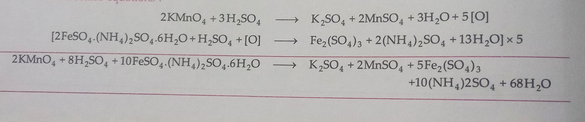
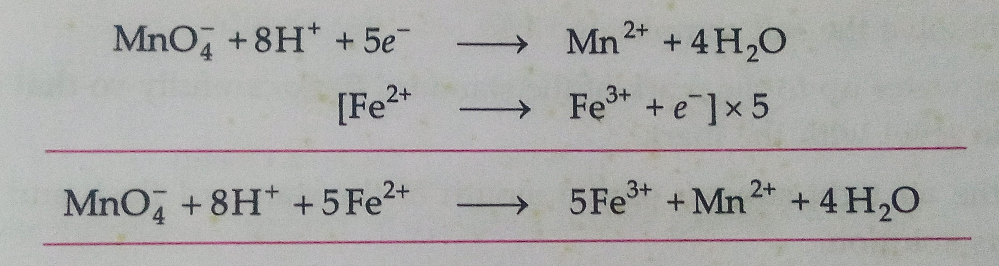

## Aim of the Experiment 
To prepare 250 ml of M/50 standard solution of ferrous ammonium sulphate (Mohr's salt). With the help of this standard solution determine the concentration/molarity of the given $KMnO_4$ solution.

## Apparatus Required 
1. Chemical balance 
2. Weight box
3. Conical flask
4. 250 ml measuring flask
5. Burette stand
6. Two 100 ml beakers 
7. 10 ml pipette 
8. Funnel 
9. White tiles 
10. Wire gauze 
11. Wash bottle 
12. Burner 

## Chemical Required 
1. Potassium permanganate solution 
2. Dilute sulphuric acid 
3. Distilled water 
4. Ferrous ammonium sulphate 

## Theory 
Ferrous ammonium sulphate is a double salt and acts as a reducing agent against $KMnO_4$ whereas Potassium permanganate is an oxidizing agent and it oxidizes iron present in Mohr's salt. Hence the reaction between the two is a redox reaction therefore the titration is called Redox titration. Potassium permanganate acts as a self indicator and the color at the end point changes from colorless to pink. 

To prepare M/50 solution of Mohr's salt, the weight of Mohr's salt required can be calculated by using the formula: 

$$
\text{Molarity} = \frac{W_b \times 1000}{M_b \times \text{volume in ml}} \text{ OR } W_b = \frac{\text{Molarity} \times M_b \times \text{volume in ml}}{1000}
$$

- $W_b$ = weight of Mohr's salt
- $M_b$ = molecular mass of Mohr's salt = 392 g/mol

**Molarity** = M/50

$$
W_b = \frac{392 \times 250}{50 \times 1000} = 1.96 g 
$$

Weight of Mohr's salt solution = 1.96 g 

### Reaction Involved: 
- Molecular equations: 

- Ionic equation 
 

## Procedure 
### [A] Preparation of 250 m of standard solution of M/50 Mohr's salt: 
1. With the help of a chemical balance weight 1.96 g of Mohr's salt to prepare M/50 solution. 
2. Now take 250 ml standard flask and transfer the salt into it with the help of a funnel. 
3. Add little amount of distilled water followed by 5-10 ml of dilute sulphuric acid to prevent hydrolysis. 
4. Now add more distilled water with the help of wash bottle into the standard flask with constant stirring to dissolve the salt completely. 
5. Add distilled water up to the mark of the standard flask carefully so that the lower meniscus of water is in the level of the mark. 
6. Now place the air tight stopper on the mouth of the standard flask and shake it to make a homogeneous solution. 

### [B] Titration of $KMnO_4$ with ferrous ammonium sulphate (Mohr's salt)
1. Take a 50 ml burette and wash it thoroughly with distilled water and then rinse it with few ml of given $KMnO_4$. 
2. Now take burette stand and clamp the burette vertically over it. 
3. Pour the given $KMnO_4$ solution into the burette with the help of 100 ml beaker using a funnel. 
4. Take a pipette and wash it thoroughly with distilled water and then rinse it with few ml of given Mohr's salt solution.
5. Now pipette out 10 ml of standard Mohr's salt solution and pour it into a clean and dry 100 ml conical flask. 
6. Add one test tube of dilute $H_2SO_4$ solution into the conical flask to make the solution acidic.
7. Place the conical flask along with its content below the nozzle of the burette. 
8. Now start adding $H_2SO_4$ solution from the burette drop wise in to the conical flask with continuous swirling until a permanent pink color just appears in the solution of conical flask. 
9. Note down the reading of the upper meniscus of the $KMnO_4$ solution in the burette. 
10. Repeat the experiment 3-4 times to obtain three concordant reading.

## Observation 
- **Volume of the pipette**: 10 ml
- **Molarity**: 1/50 mol/liter
- Weight of Mohr's salt dissolved in 250 ml of distilled water = 1.96 g 

| S. No. | Vol. of Mohr Salt solution | Initial Reading of Burette | Final Reading of Burette | Vol. of $KMnO_4$ solution used | 
|:-:|:-:|:-:|:-:|:-:|
| 1. | 10 | 50 | 25.8 | 24.2 | 
| 2. | 10 | 50 | 25.6 | 24.4 | 
| 3. | 10 | 50 | 25.8 | 24.2 | 
| 4. | 10 | 50 | 25.8 | 24.2 | 

## Calculations 
| $KMnO_4$ | Mohr's salt | 
|-|-|
| $M_1$ = ? | $M_2$ = 1/50 | 
| $V_1$ = 24.2 ml | $V_2$ = 20 ml | 
| From ionic equation, | |
| $n_1$ = 1 | $n_2$ = 5 | 

$$
n_1\times M_1\times V_1 = n_2\times M_2 \times V_2
\\
M_1 = 5 \times \frac{1}{50}\times 20 \times \frac{1}{24.2}
\\
M_1 = 0.08 M
$$

- Molarity of $KMnO_4$ solution = $M_2$ = $0.08\ M$
- Strength of $KMnO_4$ = $0.0484 \times 158 = 12.86 \ g/L$

## Result 
The molarity and strength of supplied $KMnO_4$ is found out to be $0.08 M$, approximately, 0.5 M and $12.86\ g/l$ respectively. 

## Precautions 
1. Always add one test tube full of 1 M $H_2SO_4$ solution to 20 ml of Mohr's salt solution before titration. 
2. Always add $KMnO_4$ solution drop wise else the solution will become brown due to $MnO_2$ formation. 
3. Always add dilute sulphuric acid into Mohr's salt solution before preparing. 
4. Always take the reading of $KMnO_4$ solution in the burette from the lower meniscus. 
5. Always use distilled water for preparing the solution. 