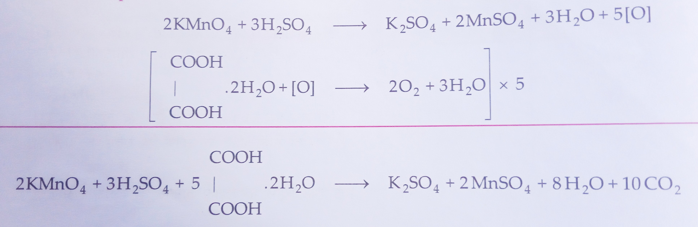
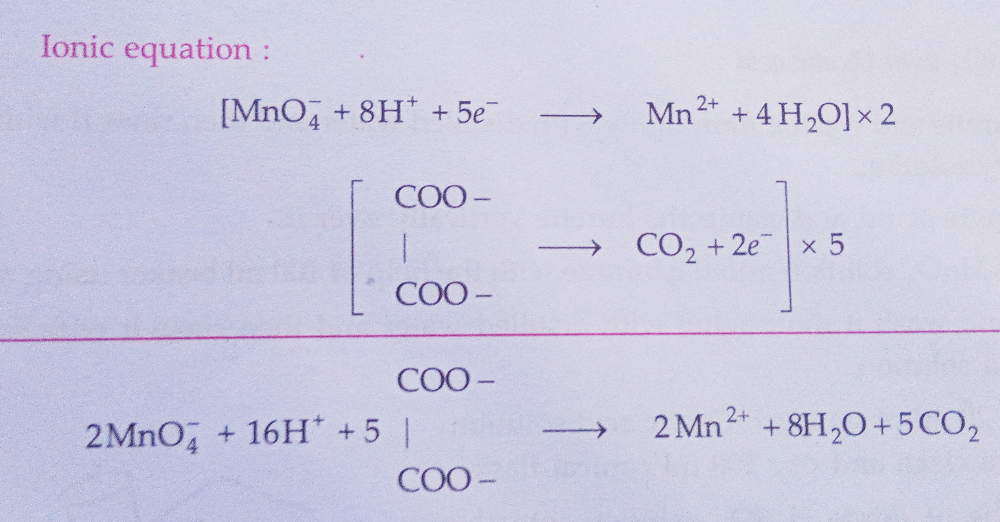
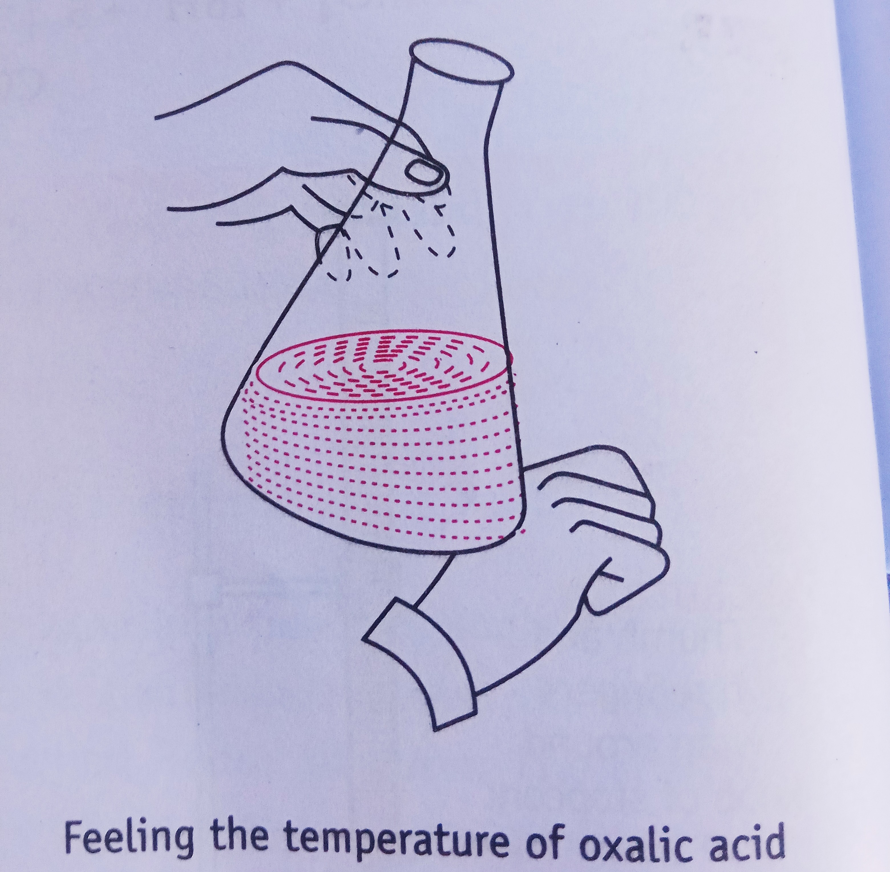

## Aim of the Experiment 
To prepare M/20 solution of oxalic acid and with its help, determine the molarity and strength of given solution of potassium permanganate. 

## Apparatus Required 
1. Chemical balance 
2. Weight box 
3. Conical flask 
4. 250 ml of measuring flask 
5. Burette stand 
6. Two 100 ml beakers 
7. 20 ml pipette 
8. Funnel 
9. White tiles 
10. Wire gauze 
11. Wash bottle 

## Chemical Required 
1. Potassium permanganate solution 
2. Dilute sulphuric acid
3. Distilled water 
4. Oxalic acid 

## Theory 
Oxalic acid acts as a reducing agent against $KMnO_4$ whereas potassium permanganate acts as an oxidizing agent and it oxidizes oxalic acid into carbon dioxide and water. Hence the reaction between the two is a redox reaction therefore the titration is called Redox Titration. The reaction between potassium permanganate and oxalic acid at room temperature is slow due to which oxalic acid after acidification in the conical flask is heated to about $(50-60)\degree C$. Potassium permanganate acts as a self indicator and the color at the end point changes from colorless to pink. 

To prepare M/20 solution of oxalic acid, the weight of oxalic acid required can be calculated by using the formula: 

$$
\text{Molarity} = \frac{W_b \times 1000}{M_b \text{Volume in ml}} \text{ OR } W_b = \frac{\text{Molarity}\times M_b \times \text{volume in ml}}{1000}
$$

- $W_b$ = weight of oxalic acid 
- $M_b$ = molecular mass of oxalic acid = 126 g/mol

Molarity = M/20

Weight of oxalic acid required = 1.575 g 

### Reaction Involved 

## Procedure 
### [A] Preparation of 250 m of standard solution of M/20 Oxalic acid: 
1. With the help of a chemical balance weight 1.575 g of solid oxalic acid to prepare M/20 solution.
2. Now take 250 ml of standard flask and transfer the solid oxalic acid into it with the help of a funnel. 
3. Now add distilled water with the help of a wash bottle into the standard flask with constant stirring to dissolve the salt completely. 
4. Add distilled water up to the mark of the standard flask carefully so that the lower meniscus of water is in level with the mark. 
5. Now place the air tight stopper on the mouth of the standard flask and shake it to make a homogeneous solution. 

### [B] Titration of $KMnO_4$ with Oxalic acid:

1. Take a 50 ml burette and wash it thoroughly with distilled water and then rinse it with few ml of given $KMnO_4$ solution. 
2. Now take a burette stand and clamp the burette vertically over it.
3. Pour the given $KMnO_4$ solution into the burette with the help of 100 ml beaker using a funnel. 
4. Take a pipette and wash it thoroughly with distilled water and then rinse it with few ml of given oxalic acid solution. 
5. Now pipette out 20 ml of standard oxalic acid solution and pour it into a clean and dry 100 ml conical flask. 
6. Add one test tube of dilute $H_2SO_4$ solution into the conical flask to make the solution acidic. Heat the content of the conical flask to about $(50-60)\degree C$.
7. Place the conical flask along with its content below the nozzle of the burette. 
8. Now start adding $KMnO_4$ solution from the burette drop wise into the conical flask with continuous swirling until a permanent pink color just appear in the solution of conical flask. 
9. Note down the reading of upper meniscus of the $KMnO_4$ solution in the burette. 
10. Repeat the experiment/procedure 3-4 times to obtain concordant readings. 

## Observation 
- Volume of pipette = 20 ml 
- Molarity of Oxalic acid solution = 1/20 mol/liter
- Weight of oxalic acid dissolved in 250 ml of distilled water = 1.575 g 

|S. No. | Vol. of oxalic acid solution (ml) | Initial burette reading | Final reading | Vol. of $KMnO_4$ solution (ml)| 
|-|-|-|-|-|
| 1. | 20 | 0 | 7.9 | 7.9 |  
| 2. | 20 | 7.9 | 15.9 | 8.0 |
| 3. | 20 | 15.9 | 23.9 | 8.0 |
| 4. | 20 | 23.9 | 31.9 | 8.0 |

## Calculations 
| $KMnO_4$ | Oxalic acid | 
|-|-|
| $M_1$ = 1/20 | $M_2$ = ? | 
| $V_1$ = 8 ml | $V_2$ = 20 ml | 
| $n_1$ = 2 | $n_2$ 5 | 

$$
\frac{M_1V_1}{n_1} = \frac{M_2V_2}{n_2}
\\
\frac{1}{20} \times \frac{8}{2} = \frac{M_2 \times 20}{5}
\\
\implies M_2 = 0.05 M
$$

The molarity of oxalic acid solution is 0.05 M. 

Strength of oxalic acid = $\text{Molarity} \times \text{Molecular mass}$

$\implies 0.05 \times 126 = 6.3\ gl^{-1}$

% purity of oxalic acid = $\frac{6.3}{6.5}\times 100 = 96.92$

## Result 
The molarity and percentage of purity of supplied oxalic acid solution is found to be 0.05 M and 96.92% respectively. 

## Precautions 
1. Burette, pipette and conical flask should be washed before use. 
2. Always add $KMnO_4$ solution drop wise or otherwise the solution will become brown due to $MnO_2$ formation. 
3. Always heat the conical flask with its content about $(50-60)\degree C$.
4. Always take the reading of $KMnO_4$ solution in the burette from the lower meniscus.
5. Always use distilled water for preparing the solution. 