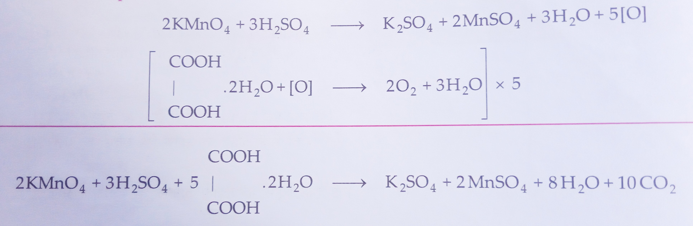
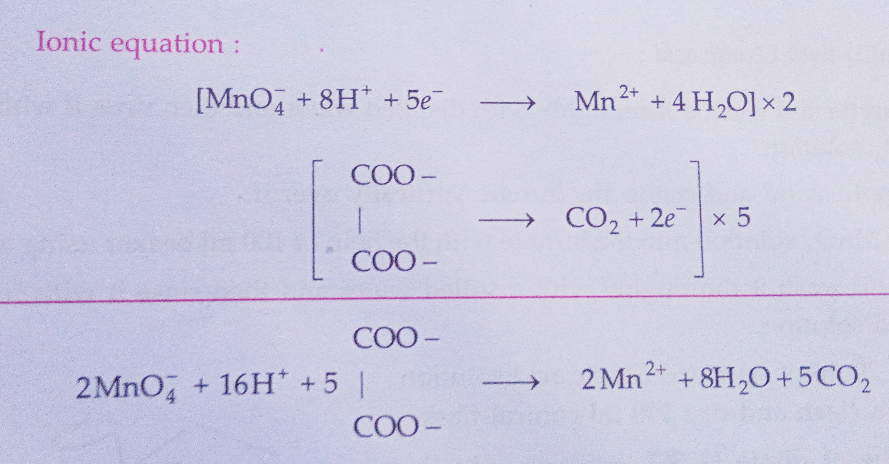
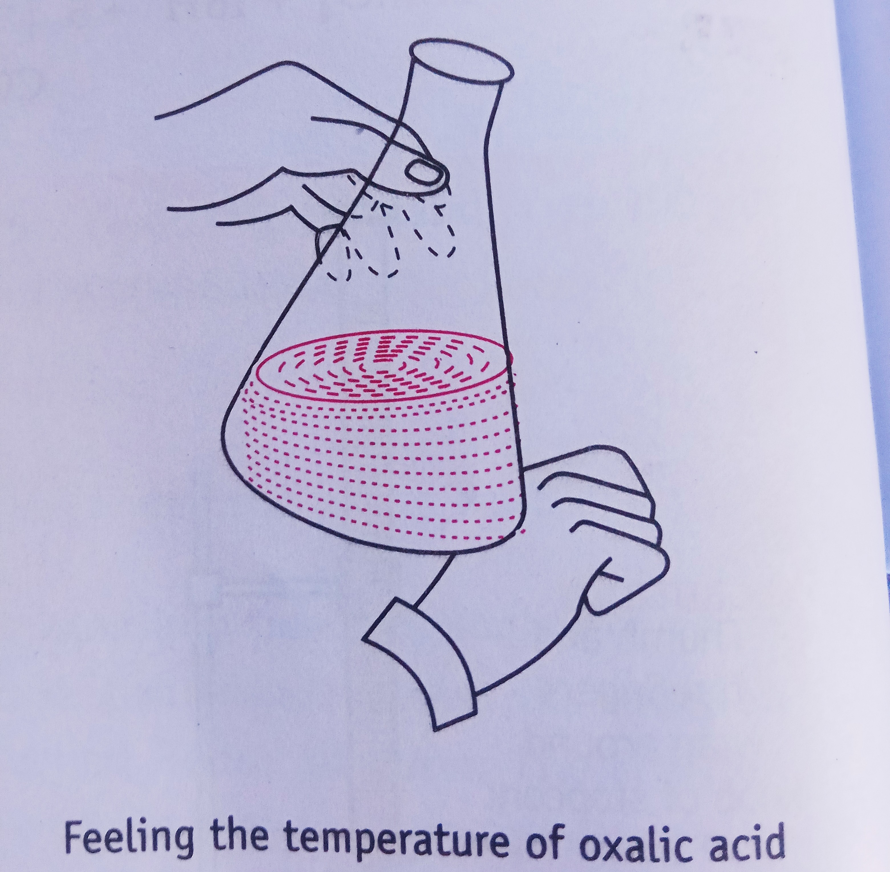

## Aim of the Experiment 
To prepare M/50 solution of oxalic acid and with its help, determine the molarity and strength of given solution of potassium permanganate. 

## Apparatus Required 
1. Chemical balance 
2. Weight box 
3. Conical flask 
4. 250 ml of measuring flask 
5. Burette stand 
6. Two 100 ml beakers 
7. 10 ml pipette 
8. Funnel 
9. Wire gauze 
10. Wash bottle 

## Chemical Required 
1. Potassium permanganate solution 
2. Dilute sulphuric acid
3. Distilled water 
4. Oxalic acid 

## Theory 
Oxalic acid reduces potassium permanganate, while potassium permanganate oxidizes oxalic acid to carbon dioxide and water, making their reaction a redox titration. The reaction is slow at room temperature, so the oxalic acid is heated to 50–60°C after acidification. Potassium permanganate serves as a self-indicator, changing the solution from colorless to pink at the endpoint.

To prepare M/50 solution of oxalic acid, the weight of oxalic acid required can be calculated by using the formula:  

$$
\text{Molarity} = \frac{W_b \times 1000}{M_b\times \text{Volume in ml}} \text{ OR } W_b = \frac{\text{Molarity}\times M_b \times \text{volume in ml}}{1000}
$$

- $W_b$ = weight of oxalic acid 
- $M_b$ = molecular mass of oxalic acid = 126 g/mol
- Molarity = M/50

$$
W_b = \frac{126 \times 250}{50 \times 1000} = 0.63 g
$$

$\therefore$ Weight of oxalic acid required = 0.63 g 

### Reaction Involved 
- Molecular Equation 

- Ionic Equation

## Procedure 
### [A] Preparation of 250 m of standard solution of M/50 Oxalic acid: 
1. With the help of a chemical balance weigh 0.63 g of solid oxalic acid to prepare M/50 solution.
2. Now take 250 ml of standard flask and transfer the solid oxalic acid into it with the help of a funnel. 
3. Now add distilled water with the help of a wash bottle into the standard flask with constant stirring to dissolve the salt completely. 
4. Add distilled water up to the mark of the standard flask carefully so that the lower meniscus of water is in level with the mark. 
5. Now place the air tight stopper on the mouth of the standard flask and shake it to make a homogeneous solution. 

### [B] Titration of $KMnO_4$ with Oxalic acid:

1. Take a 50 ml burette and wash it thoroughly with distilled water and then rinse it with few ml of given $KMnO_4$ solution. 
2. Now take a burette stand and clamp the burette vertically over it.
3. Pour the given $KMnO_4$ solution into the burette with the help of 100 ml beaker using a funnel. 
4. Take a pipette and wash it thoroughly with distilled water and then rinse it with few ml of given oxalic acid solution. 
5. Now pipette out 20 ml of standard oxalic acid solution and pour it into a clean and dry 100 ml conical flask. 
6. Add one test tube of dilute $H_2SO_4$ solution into the conical flask to make the solution acidic. Heat the content of the conical flask to about $(50-60)\degree C$.
7. Place the conical flask along with its content below the nozzle of the burette. 
8. Now start adding $KMnO_4$ solution from the burette drop wise into the conical flask with continuous swirling until a permanent pink color just appear in the solution of conical flask. 
9. Note down the reading of upper meniscus of the $KMnO_4$ solution in the burette. 
10. Repeat the experiment/procedure 3-4 times to obtain concordant readings. 

## Observation 
- Volume of pipette = 10 ml 
- Molarity of Oxalic acid solution = 1/50 mol/liter
- Weight of oxalic acid dissolved in 250 ml of distilled water = 0.63 g 

| S. No. | Vol. of oxalic acid solution (ml) | Initial burette reading | Final reading | Vol. of $KMnO_4$ solution used (ml)| 
|-|-|-|-|-|
| 1. | 10 | 50 | 48 | 2.0 |  
| 2. | 10 | 48 | 46 | 2.0 |
| 3. | 10 | 46 | 44 | 2.0 |
| 4. | 10 | 44 | 41.9 | 2.1 |

## Calculations 
| $KMnO_4$ | Oxalic acid | 
|-|-|
| $M_1$ = ? | $M_2$ = 1/50 | 
| $V_1$ = 2 ml | $V_2$ = 10 ml | 
| From ionic equation, ||
| $n_1$ = 5 | $n_2$ = 2 | 

$$
n_1\cdot M_1\cdot V_1 = n_2\cdot M_2\cdot V_2
\\
M_1 = 2 \times \frac{1}{50}\times 10\times \frac{1}{2\times 5}
\\
M_1 = 0.04\ M
$$

- Molarity of $KMnO_4$ solution = $M_1$ = $0.04\ M$
- Strength of $KMnO_4$ solution = $M_1 \times 158 = 6.32\ gL^{-1}$

## Result 
The molarity and strength of given $KMnO_4$ are found to be 0.04 M and 6.32 g/L respectively. 

## Precautions 
1. Burette, pipette and conical flask should be washed before use. 
2. Always add $KMnO_4$ solution drop wise or otherwise the solution will become brown due to $MnO_2$ formation. 
3. Always heat the conical flask with its content about $(50-60)\degree C$.
4. Always take the reading of $KMnO_4$ solution in the burette from the lower meniscus.
5. Always use distilled water for preparing the solution. 