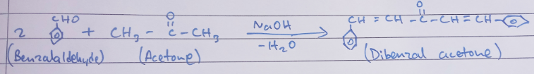

## Aim of the Experiment 
To prepare dibenzal acetone 

## Materials Required 
1. Conical flask 
2. Test tubes 
3. Corks 
4. Thermometer 
5. Water bath 
6. Funnel 
7. Filter paper 
8. Benzalaldehyde 
9. Acetone 
10. Ethanol 
11. Sodium hydroxide 

## Theory 
- Chemical reaction: 
 

## Procedure 
1. Take 2 ml of benzalaldehyde in a test tube or conical flask and add 1 ml of acetone to it. Cork the test tube and keep it in the test tube stand. 
2. Take 20 ml of 5 M $NaOH$ solution in a conical flask and add 10 ml of ethanol to it. Close the mouth of the conical flask using a cork. 
3. Take a water bath and add mixture of $HCl$ and water so that the temperature of the water remains $15-20 \degree C$. Place the conical flask in water bath for 5-10 minutes. 
4. Add the mixture of benzalaldehyde aldehyde and acetone to cold solution of $NaOH$ and ethanol with the help of droppers and stir the mixture. 
5. Keep the conical flask containing the mixture immersed in the water bath below $20\degree C$. Keep swirling the reaction mixture slowly for few minutes till we get the product. 
6. Filter the product and collect it in the china dish. Add 4-5 ml of ice cold water and wash the product and filter it again. Keep the product in petri dish and dry it. Weigh the product and find the weight. 
7. To recrystallize the product, dissolve it in a mixture of 70% ethanol in water. 

## Result 
- **Color of the crystals**: Pale yellow 
- **Expected weight**: 4 g 

## Precautions 
1. Add $NaOH$ solution drop wise with constant shaking of the conical flask. 
2. Wash the ppt. with ice cold water to remove the molecules of $NaOH$.