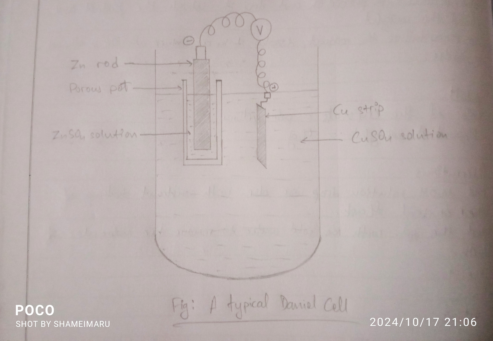

## Aim of the Experiment 
To set up simple Daniel cell and determine its EMF. 

## Materials Required 
1. One beaker 
2. Porous pot 
3. Connecting wires 
4. Milli-voltmeter 
5. Sand paper
6. Zinc strip 
7. Copper strip
8. 1 M $ZnSO_4$ solution 
9. 1 M $CuSO_4$ solution

## Theory

When a copper electrode is dipped in copper sulphate solution and is connected to a zinc electrode dipped in zinc sulphate solution, then electrons flow from zinc electrode to copper electrode and the following chemical reaction takes place: 

$$
\ce{Zn(s)\rightarrow Zn^2+(aq) + 2e^-}
\\
\ce{Cu^2+ + 2e^- \rightarrow Cu(s)}
$$

Overall reaction: $\ce{Zn(s) + Cu^2+(aq)\rightarrow Zn^2+(aq) + Cu(s)}$

## Procedure 
1. Take $CuSO_4$ solution in a clean beaker. 
2. Clean the copper wire with the help of sand paper and dip it into $CuSO_4$ solution. 
3. Take $ZnSO_4$ solution in a porous pot. 
4. Clean the zinc strip with the help of sand paper and dip it into $ZnSO_4$ solution. 
5. Keep the porous pot in the beaker. 
6. Connect the copper strip with the positive terminal and zinc strip with the negative terminal of the voltmeter. 
7. Note the position of the pointer in the voltmeter and record the reading. 

## Observation 
The EMF of the Daniel Cell is 1 V. 

## Precautions 
1. The concentration of $CuSO_4$ and $ZnSO_4$ should neither be too low nor be too high. 
2. The porous pot should not be completely dipped into the $CuSO_4$ solution, i.e., the $CuSO_4$ solution shouldn't be allowed to enter the porous pot. 
3. Clean the strip of $Zn$ and $Cu$ before using it. 
4. Carry out the procedure carefully. 
5. Note the reading only when the pointer becomes stable.  