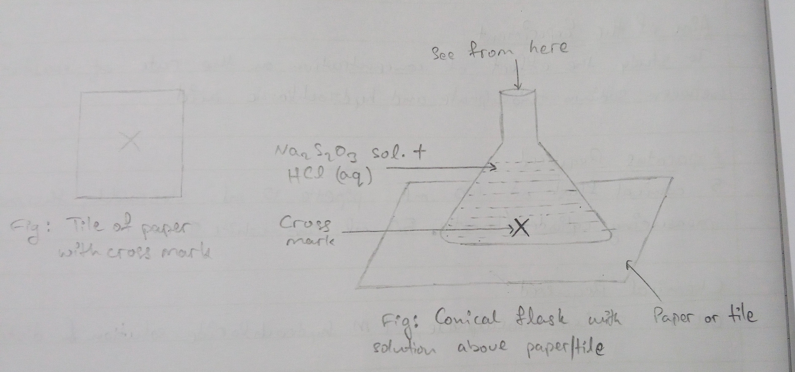
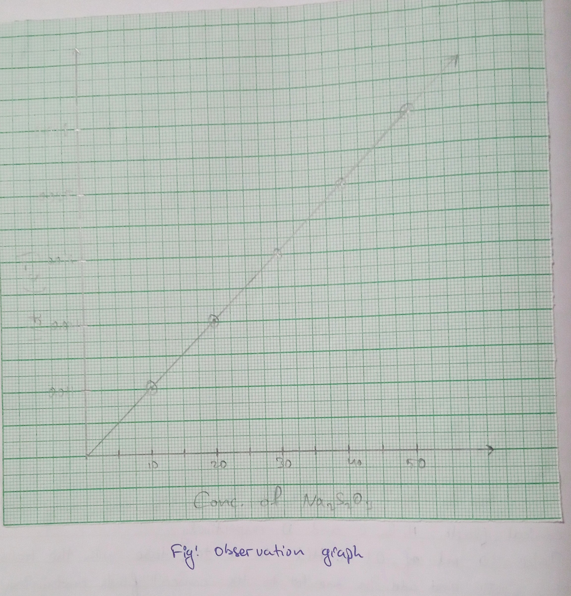

# Aim of the Experiment 
To study the effect of concentration on the rate of reaction between sodium thiosulphate and hydrochloric acid.

# Apparatus Required 
5 conical flasks of 100 ml, pipette of 10 ml, stopwatch, thermometer, measuring cylinder/burette of 50 ml and white tile. 

# Chemical Required 
0.1 M of sodium thiosulphate, 1 M hydrochloride solution and distilled water. 

# Theory 
The rate of reaction decreases with time as the concentration of reactants decreases, Thus the rate of reaction is directly proportional to the concentration of the reactants, i.e., sodium thiosulphate and hydrochloride. It can be verified by carrying out experiments in which either the concentration of sodium thiosulphate is changed and the concentration of hydrochloric acid the same or vice versa (at constant temperature).

Reaction involved: 

$$
\underset{\text{Sodium thiosulphate}}{Na_2S_2O_3} + 2HCl \rightarrow 2NaCl + H_2O + SO_2 + S \\
\text{OR} \\
S_2O_3^{-2} + 2H^+ \rightarrow H_2O + SO_2 + S
$$

The colloidal of sulphur so formed during the reaction gives turbidity (milky appearance) to the solution, which can be utilized to study the rate of the reaction as turbidity increases with increases in time.

# Procedure 

1. Take a white tile and put a cross mark with a blue/black marker. 
2. Wash the burettes, pipette and five 100 ml conical flasks thoroughly with distilled water and keep them dry. 
3. Label the conical flasks as A, B, C, D, and E respectively. 
4. Rinse the burette with a small amount of 0.1 M sodium thiosulphate solution and fill it with the same, i.e., 0.1 M sodium thiosulphate. 
5. Add 10, 20, 30, 40 and 50 ml of 0.1 M sodium thiosulphate through the burette into the conical flasks A, B, C, D and E respectively.
6. Rinse another burette with a small amount of distilled water and fill it with distilled water. 
7. Now add 40, 30, 20 and 10 ml of distilled water to the conical flasks A, B, C and D respectively. 
8. Take 10 ml of 0.1 M $HCl$ in a test tube with the help of a pipette and add one lot to the conical flask containing 10 ml water. Immediately start the stopwatch.
9. Swirl the contents of the conical flask and keep it on the tile with an X mark as shown. 
10. View the cross mark from top to downwards through the reacting mixture in the conical flask. When the cross mark becomes invisible, stop the stopwatch and note down the time taken. 
11. Repeat the time taken in each case for the cross mark to become invisible. 
12. Record your observation data in a tabular form, interpret and draw conclusions as shown in the table below.

# Observation

| Conical Flask | Volume of sodium thiosulphate in ml | Volume of water in ml | Total volume of solution in ml | Volume of $HCl$ in ml | Time taken for cross to become invisible | 1/t $s^{-1}$ | 
|:-:|:-:|:-:|:-:|:-:|:-:|:-:|
| A | 10 | 40 | 50 | 10 | 90 s | 0.011 |  
| B | 20 | 30 | 50 | 10 | 67 s | 0.014 | 
| C | 30 | 20 | 50 | 10 | 59 s | 0.016 | 
| D | 40 | 10 | 50 | 10 | 39 s | 0.025 | 
| E | 50 | 0 | 50 | 10 | 35 s | 0.028 | 

# Plotting the Graph 
Plot a graph between 1/t $(s^{-1})$ and concentration $Na_2S_2O_3$ by taking 1/t along the vertical axis and concentration of $Na_2S_2O_3$ along the horizontal axis. It should be a straight-sloping line. 

# Result
From the Graph, it is clear that 1/t is directly proportional to the concentration of $Na_2S_2O_3$ solution. But 1/t is directly the measure of rate of reaction. Therefore, rate of reaction between $Na_2S_2O_3$ and $HCl$ is directly proportional to the concentration of $Na_2S_2O_3$ which is one of the reactants. 

# Precautions 
1. Clean all apparatus thoroughly with distilled water. 
2. Cross mark should be put on the white tile. 
3. Measurement of volumes of each chemical and distilled water should be done accurately.
4. The temperature during the experiment shouldn't vary.
5. The cross mark should be viewed from top to downwards through the solution in the Conical Flask. 
6. After every experiment, the conical flask should be empty and should be cleaned with concentrated nitric acid to remove all sulphur stuck to its inner wall. 