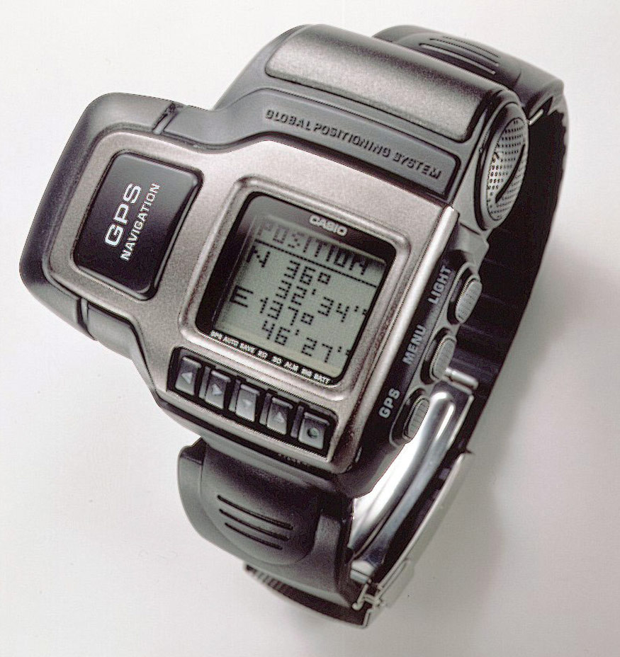
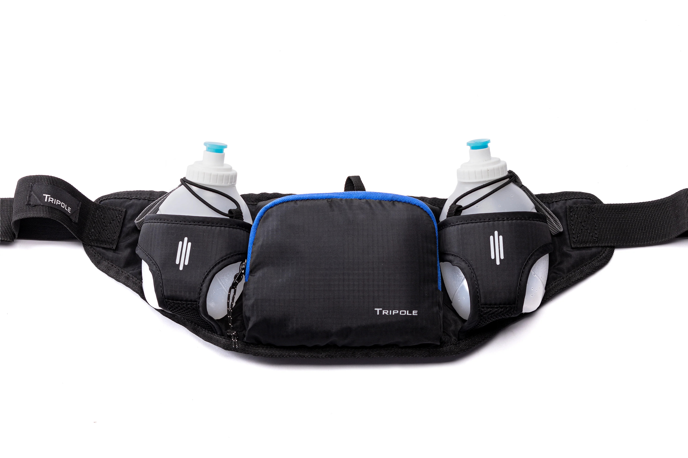

# Marathon
A marathon is a long-distance running event covering a standard distance of **42 kilometers (26 miles)**. It is considered one of the most grueling endurance sports, requiring physical resilience, stamina, and mental determination.

## Field and Equipment

- **Field**:  
  - Marathons are generally run on paved roads but can sometimes include sections of trails or cross-country paths.  
  - The course is marked, with water stations and medical support available at regular intervals.  

- **Equipment**:  
  - **Running Shoes**: Properly cushioned and supportive running shoes tailored to the runner’s gait and foot structure are essential.  
  - **Apparel**: Lightweight, moisture-wicking clothes are ideal to keep the runner cool and minimize chafing.  
  - **GPS Watch**: Used by runners to monitor pace, distance, and race progress.  
  - **Hydration Gear**: While water stations are provided, some runners prefer carrying hydration belts or bottles for easier access.

## Rules
1. **Course Completion**: Runners must complete the designated course without taking shortcuts. Any deviation can lead to disqualification.  
2. **Time Limits**: Many marathons have a cutoff time, typically between 5 to 7 hours. Runners finishing after this may not receive an official result.  
3. **Starting Line**: Staggered starts are common, with elite athletes starting first, followed by other runners in waves based on expected completion times.  
4. **No External Assistance**: Runners must not use vehicles, pacers (unless provided by the event), or other aids to complete the race.  
5. **Number Bibs**: The runner's number bib must be visible on the front of their outfit throughout the event.  

## Terminologies
1. **Pace**: The time it takes to run a mile or kilometer (e.g., 6 minutes per mile).  
2. **Splits**: Times recorded at specific points along the race, such as each mile or kilometer.  
3. **Hitting the Wall**: A term describing the sudden depletion of energy, often occurring around the 20th mile due to glycogen exhaustion.  
4. **Negative Split**: Running the second half of the race faster than the first.  
5. **Carb-Loading**: Consuming carbohydrate-rich meals in the days leading up to the marathon to maximize muscle glycogen stores.  

## Skills
1. **Endurance**: Building stamina through months of training is fundamental.  
2. **Pacing**: Maintaining a steady pace ensures energy is conserved for the entire race.  
3. **Mental Toughness**: Overcoming physical discomfort and staying motivated are key to completing the race.  
4. **Hydration and Nutrition**: Managing fluid intake and energy replenishment helps avoid dehydration or energy crashes.  
5. **Recovery**: Post-race care, including hydration, stretching, and rest, prevents injuries and promotes faster healing.

## Conclusion  
A marathon is a test of endurance, determination, and preparation, symbolizing the pinnacle of human resilience. Its inclusion in Olympic culture highlights its historical and athletic significance, tracing back to the ancient Greek legend of Pheidippides. The marathon embodies the Olympic spirit of perseverance and unity, making it a celebrated and iconic event.
