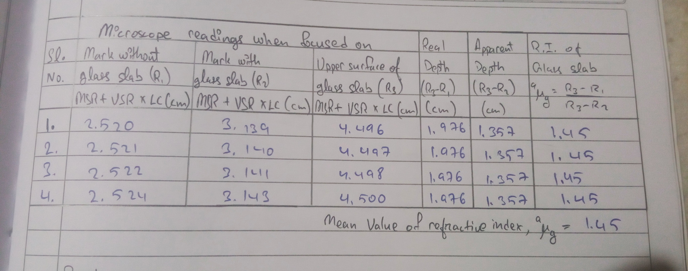
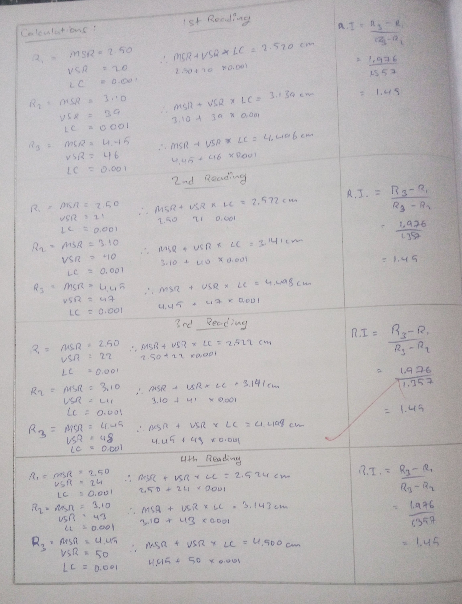

# Aim of the Experiment 
To determine the refractive index of a glass slab using a traveling microscope. 

# Apparatus and Material Required 
A traveling microscope, a glass slab, lycopodium powder/chalk dust, a spirit level and a small piece of white paper. 

# Theory/Working Formula 
If a glass slab is placed in air on a horizontal surface and its bottom is viewed from the top, it appears to be raised due to the phenomenon of refraction. The difference between the apparent bottom and the upper surface of the slab gives the apparent thickness of the slab. For normal observation, the refractive index of the glass slab with respect to air is

$$
^a\mu_g = \frac{\text{Real thickness of the glass slab}}{\text{Apparent thickness of the glass slab}} = \frac{AD}{AI} = \frac{R_3-R_1}{R_3-R_2}
$$

# Observations 
Least count of the traveling microscope: 

20 main scale divisions $(MSD)$ = 1 cm 

$\therefore 1 MSD = \frac{1}{20}\ cm$ 

$50 \text{vernier scale divisions (VSD)} = 49 MSD$

$\therefore 1 VSD = \frac{49}{50}\ MSD = \frac{49}{50} \times \frac{1}{20}\ cm$

$\text{Least count of the microscope} = 1\ MSD - 1\ VSD$

$\implies [\frac{1}{20}-\frac{49}{50}\times\frac{1}{20}]\ cm$  
$\implies \frac{1}{20}\times\frac{1}{50}$

$\therefore LC = 0.001 cm$

# Calcualtions 

# Results 
Refractive index of glass slab, $^a\mu_g = 1.45$  
Actual value from standard tables = 1.5  
Percentage error = $\frac{\text{Actual value}-^a\mu_g}{\text{Actual value}}\times 100$  
$\implies \frac{1.5 -1.45}{1.5}\times 100$  
$\implies 3.33\%$

# Precautions 
1. The least count of the microscope should be determined before experimenting. 
2. The axis of the microscope should be set parallel to the vertical scale.
3. Only a few particles of lycopodium powder should be sprinkled on the upper surface of the glass slab. 
4. Use a magnifying glass for observing coinciding vernier scale division.

# Sources of Error 
1. The axis of microscope may not be normal to the surface of the glass slab. 
2. If lycopodium powder sprinkled on the glass slab forms a thick layer, it will not exactly represent the upper surface of the glass slab and will cause error in the result. 
3. While focusing the microscope on the image of the ink mark/lycopodium powder, the rack and pinion arrangement might have been disturbed. .