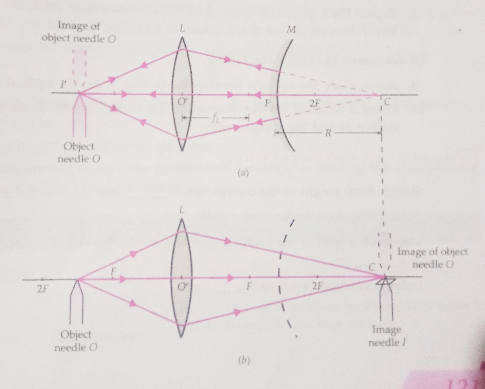

## Aim of the Experiment 
To find the focal length of a convex mirror, using a convex lens. 

## Apparatus and Material Required 
1. Optical bench with four uprights 
2. Thin convex lens
3. Convex mirror 
4. Two optical needles 
5. Knitting needle 
6. Half-meter scale 

## Theory 
If we place an object O between $F$ and $2F$ of a convex lens $L$, a real, inverted and magnified image $I$ is formed at a point $C$ on the other side of the lens. Now a convex mirror $M$ is placed between the convex lens and point $C$ and so adjusted that a real and inverted image $I'$ coincides with object $O$. This happens when the rays starting from object $O$, after refraction through the lens, fall normally on the convex mirror. Such normal rays are along the radii of curvature of the convex mirror so that point $C$ must be the centre of curvature of the convex mirror.

To locate the point $C$, the convex mirror is removed without disturbing the positions of object $O$ and lens $L$. An image needle is placed at the position of image $I$ of object $O$, formed by the convex lens and parallax is removed between the image of object $O$ and image needle.

Then $f = \frac{R}{2} = \frac{PC}{2}$

## Ray Diagrams 
 

## Procedure 
### To find the rough focal length of the convex lens 
1. Hold the convex lens in the right hand. Obtain a sharp image of the sun or a distant object on a wall (or at the back of your practical notebook).
2. Measure the distance between the lens and the sharp image with a half-metre scale. This distance gives a rough value for the focal length of the convex lens.

### To locate image obtained by using both convex lens and convex mirror
3. Place the optical bench horizontally on the working table.
4. Mount the needle $O$, convex lens $L$ and the convex mirror $M$ in three separate uprights on the optical bench. See that the distance of the needle $O$ from the convex lens $L$ is greater than the focal length of the latter. Adjust the tip of needle $O$, optical centre $O'$ of lens $L$ and the pole $P$ of the mirror $M$ at the same height.
5. Now adjust the position of mirror $M$ or needle $O$, if necessary, so that a real inverted image of needle $O$ is formed in coincidence with the needle itself. Remove the parallax tip to tip between needle $O$ and its inverted image by adjusting the position of mirror $M$. Note the positions of object needle $O$, convex lens $L$ and convex mirror $M$ on the optical bench.

### To locate the image obtained by using convex lens only
6. Remove the mirror upright altogether *without disturbing the positions of needle* $O$ *and lens* $L$. Mount the second needle $I$ in the fourth upright and place it on the optical bench on the other side of the convex lens.
7. Adjust the position of the image needle $I$ (without disturbing $O$ and $I$) so that there is no parallax between this needle $I$ and the image of needle $O$. Note the position of needle $I$ on the optical bench.
8. Repeat the experiment (steps 4 to 7) four times with different positions of needle $O$ and the lens $L$. Record all the observations in a tabular form.

### To determine the index correction 
9. Again place the upright holding the mirror M on the optical bench.
10. Using a knitting needle, determine the index correction between the back surface of the mirror $M$ and the image needle $I$.

## Observation and Calculations 
- Rough focal length of the convex lens = cm 
- Actual length of the knitting needle, x = cm 
- Observed length of the knitting needle between the convex mirror and the image needle, y = cm 
- Index correction, $e=x-y= \text{cm}$ 

> [!CAUTION]
> Add table here

- Mean value of radius of curvature of the convex mirror, R = cm 
- Focal length, $f = \frac{R}{2}$ = cm 

## Result 
Focal length of the given convex mirror = cm 

## Precautions 
1. The apertures of the convex lens and the convex mirror should be small, otherwise the image formed will be distorted. 
2. The focal length of the convex lens should be greater than that of the convex mirror. 
3. All the uprights should be vertical. 
4. Parallax should be removed tip to tip. 
5. Index correction must be carefully determined and correctly applied. 

## Sources of Error 
1. The principal axis of the convex lens may not be parallel to the length of the optical bench.
2. The uprights may not be vertical.
3. Parallax might not have been removed properly. 
4. While removing the convex mirror, the positions of the uprights holding the object needle and the convex lens might have been disturbed.