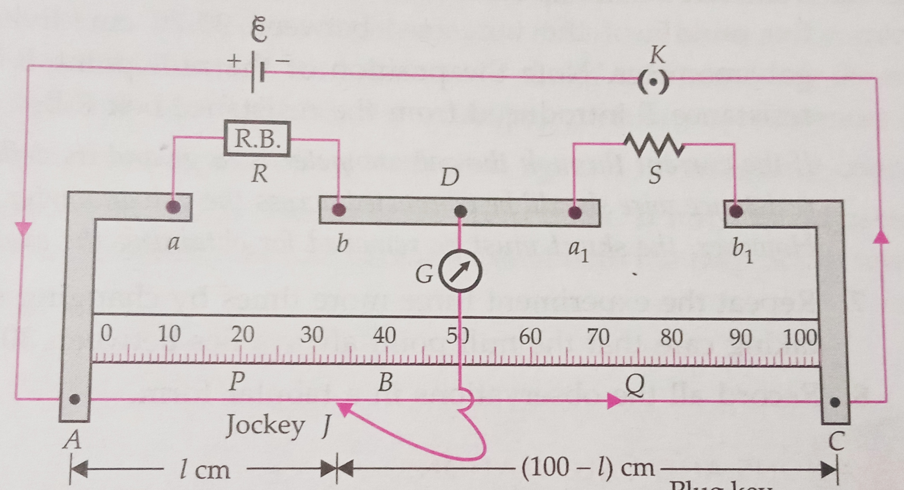
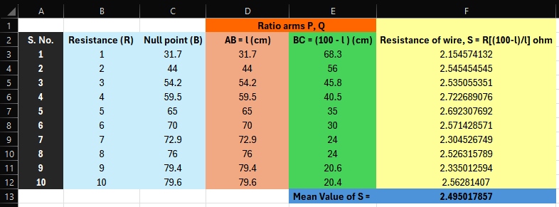

# Aim of the Experiment
To find resistance of a given wire/standard resistor using meter bridge.

# Apparatus and Material Required 
1. Meter bridge 
2. Sensitive Galvanometer 
3. 1 resistance wire
4. Resistance box 
5. Jockey 
6. Plug key 
7. Dry cell or battery eliminator 
8. Connecting wires 
9. Piece of Sand Paper 
10. Screw gauge

# Theory 
With the known resistance P in the left gap and the unknown resistance S in the right gap of the meter bridge, suppose the null point B is obtained at a distance of $l$ cm from the left en A. By The principle of Wheatstone bridge,

$$
\frac{P}{Q} = \frac{R}{S} \\
\text{or}\ \frac{\text{Resistance of wire AB}}{\text{Resistance of wire BC}} = \frac{R}{S} \\ 
\text{or}\ \frac{l}{100-l} = \frac{R}{S} \\
\text{or}\ \boxed{S = R [\frac{100-l}{l}]}\Omega
$$

<!-- 1. **Measurement of unknown resistance**: with the known resistance **R** in the left gap and the unknown resistance **S** in the right gap of the meter bridge, suppose the balance point is obtained at a distance l cm from the left end, then the unknown resistance is given by 
$$
S = R (\frac{(100-l)}{l})
$$

2. **Law of series combination of resistances**: when two resistances $R_1$ and $R_2$ are connected in series, their equivalent resistance $R_S$ is given by $R_S = R_1 - R_2$ -->

# Circuit Diagram

# Observation 
- Material: nichrome 
- Least count of meter scale: 0.1 cm 
- Length: 30 cm 

# Result 
Resistance of the given wire = **2.49** $\Omega$ 

# Precautions 
1. All the connections should be neat and tight.
2. The plugs in the resistance box must be kept tight by giving them a gentle twist after inserting. 
3. Move the jockey gently over the bridge wire and do not rub it against the wire. 
4. The battery circuit should be closed first before pressing the jockey on the bridge wire and reverse order should be followed at the time of break. 
5. The current through the bridge wire should be passed for only as much time as is essential for getting a null point.

# Precautions 
1. The bridge wire may not be of uniform area of cross-section along its entire length. 
2. Due to prolonged flow of current, the wire gets heated up and its resistance changes.
3. The galvanometer pointer may not be exactly at the zero mark. 