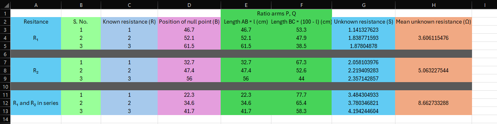

# Aim of the Experiment 
To verify the law of series combination of resistances using a meter bridge. 

# Apparatus and Material Required 
1. Meter bridge 
2. Sensitive galvanometer 
3. 2 resistance wires 
4. Resistance box 
5. Jockey 
6. Plug key 
7. Battery eliminator 
8. Thick connecting wires 

# Theory 
1. **Measurement of unknown resistance**: with the known resistance R in the left gap and the unknown resistance S ($R_1$ or $R_2$ or series combination of $R_1$ and $R_2$) in the right gap of the meter bridge, suppose the balance point is obtained at a distance $l$ cm from the left end, then the unknown resistance is given by 

$$
S = R(\frac{100-l}{l})
$$

2. **Law of Series combination of resistances**: when two resistances $R_1$ and $R_2$ are connected in series, their equivalent resistance $R_S$ is given by: $R_S = R_1 + R_2$

# Observation Table 
- Material: **nichrome**
- Least count of meter scale: **0.1 cm** 
- Length: **30 cm** 

# Calculations 
- Experimental value of series combination of resistances, $R_S$ = **8.66** $\Omega$
- Theoretical value of series combination of resistances, $R_S' = R_1 + R_2$ = **8.66** $\Omega$
- Difference = $R_S-R_S'$ = 0 $\Omega$

# Result 
Within the limits of experimental error, the experimental and theoretical values of the series combination of resistances are equal. So the law of combination of series stands verified.

# Precautions 
1. All the connections should be neat and tight. 
2. The plugs of the resistance box must be kept tight by giving a gentle twist after inserting them.
3. The jockey should not be pressed too hard on the wire, as otherwise it will damage the uniformity of the meter bridge. 
4. Move the jockey gently over the bridge wire and do not rub it against the wire. 
5. Ensure that the same lengths of resistance wires $R_1$ and $R_2$ are used for determining $R_S$ as have been used for determining $R_1$ and $R_2$ individually. 

# Sources of Error
1. The meter bridge may not be of uniform area of cross-section along its entire length. 
2. There may be end errors due to resistances of copper strips at the ends of the meter bridge.
3. The effective lengths of the resistance wire used while measuring $R_S$ may not be exactly same as those used while measuring $R_1$ and $R_2$ respectively.