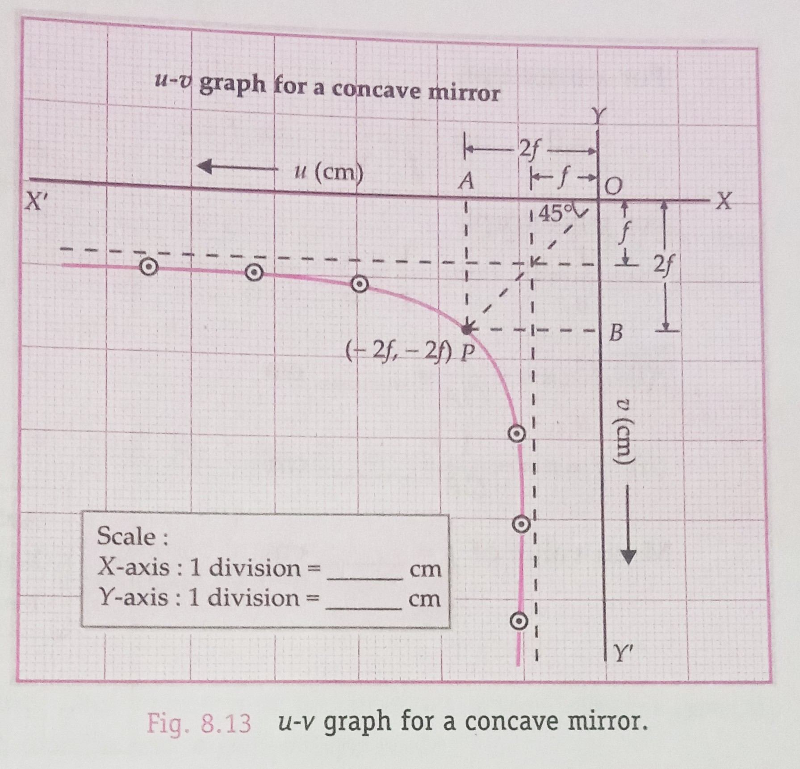
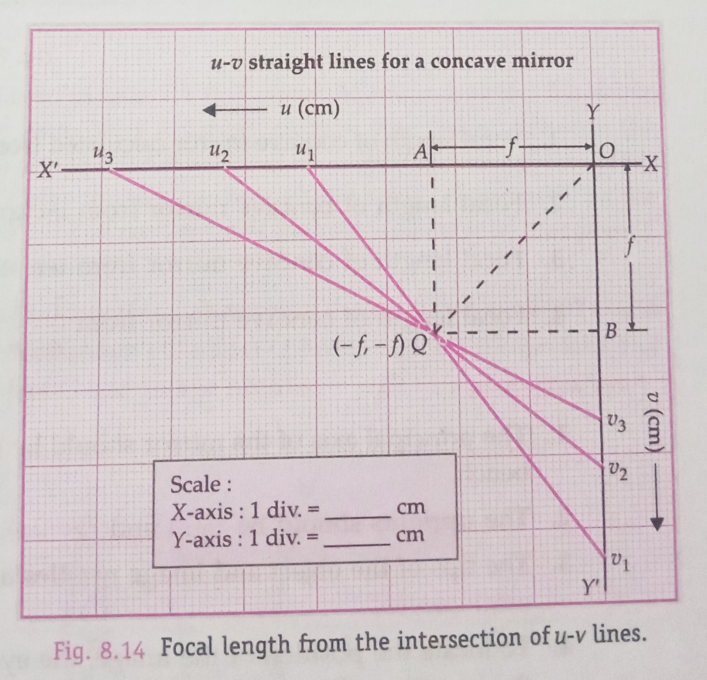
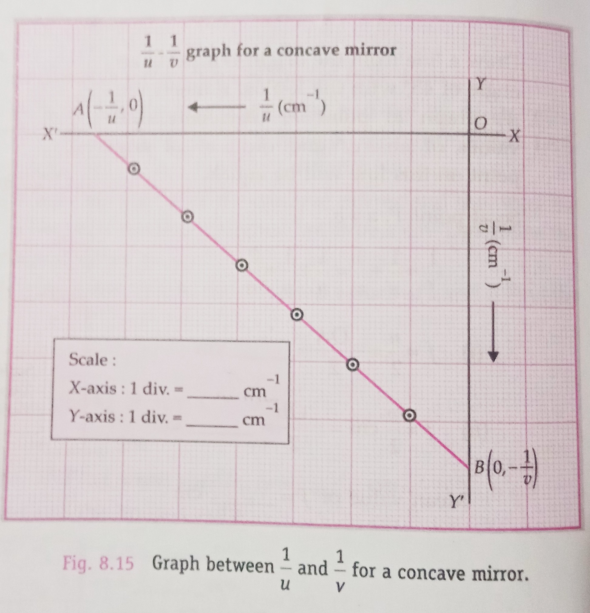

## Observation Table 

- **Focal length**: 20 cm  

## Aim of the Experiment 
To find the value of $v$ for different values of $u$ in case of a concave mirror and to find its focal length. 

## Procedure 
### To find rough focal length of the concave mirror 
1. Hold the concave mirror in your right hand and turn its reflecting surface towards a distant object like a building or a tree by looking through the window of your lab.
2. By slowing moving the mirror forward/backward, obtain an inverted, clear and sharp image of the object on the wall of the lab.
3. Keeping the zero end of the half-metre scale towards the wall, measure the distance between the mirror and the wall. This distance gives the rough focal length of the concave mirror.

### To mount the concave mirror 
4. Place the optical bench on the working table. Clamp the concave mirror on an upright and mount it vertically near one end of the optical bench.
5. With a piece of chalk, mark the approximate positions of focus $F$ and centre of curvature $C$ on the optical bench, at distances equal to rough focal length and twice the rough focal length,
respectively.
6. Take the thin optical needle and treat it as object needle $O$. Mount it in an upright and place it in front of the concave mirror. Adjust its height so that its tip and the pole of the mirror lie in the same horizontal line.
7. Move the object needle $O$ away from the mirror and bring it almost at the point marked $C$. By slightly moving the object needle $O$ back and forth, obtain an inverted image of the same size as the needle. Make slight adjustments of the height of the needle and the mirror inclination so that image is formed just above the object needle. This procedure ensures that the principal axis of the mirror is parallel to the optical bench.

### To locate the image formed by the concave mirror
8. Mount the thick optical needle, called image needle in the third upright. Place this upright on the optical bench beyond $C$. Adjust the height of the image needle $D$ so that its tip lies in the same horizontal line as the tip of the object needle. Fix a small piece of paper on the object needle.
9. Adjust the object needle at a distance about 2 cm less than $2f$ from the concave mirror. A real, inverted and magnified image $I_1$, of this needle will be formed at a distance greater than $2f$. Adjust the image needle at the position of this image.
10. Moving the image needle $I$ forward or backward, remove the parallax tip to tip between the inverted image of object needle and the image needle itself. *If on moving the eye sideways, the image shifts in the direction of motion of the eye, then parallax can be removed by moving the image needle towards the object needle and if the image shifts in the opposite direction, then parallax can be removed by moving the image needle away from the object needle $O$. The position of the image needle! gives the position of the image of the object needle.*
11. Note the positions of the concave mirror $P$, object needle $O$ and image needle $I$ on the optical bench. Find the distance between the concave mirror and the object needle $(PO = u)$, and the distance between the concave mirror and the image needle $(PI = v)$.
12. By bringing the object needle about 2 cm closer to the concave mirror each time, take two more such sets of observations. Check that the object needle always remains between $F$ and $C$.
13. Record all these observations in a tabular form. Find $u$ and $v$ in each case.
14. Write the observations at serial numbers 4-6 by just interchanging the values of $u$ and $v$ in observations at serial numbers 1-3. This makes use of the property of conjugate foci.

### To determine the index correction
15. Measure length of the knitting needle with a half-metre scale. Let it be x cm.
16. Hold the knitting needle between pole P of the concave mirror and the tip of the object needle $O$. Read the distance between the two uprights on the scale on the optical bench. Let it be $y$ cm. Determine the index correction $(x-y)$ for the object distance $u$.
17. Now hold the knitting needle between the pole $P$ of the concave mirror and the tip of the image needle $I$. Note the distance between the two uprights. Let it be $z$ cm. Determine the index correction $(x-z)$ for the image distance $v$.
18. After adding the respective index corrections, record the corrected values of u and v. Find the focal length f in each case.

## Observations and Calculations 
- Rough focal length of the concave mirror = cm 
- Actual length of the knitting needle, x = cm 
- Observed distance between the mirror and the object needle, $y$ = cm 
- Observed distance between the mirror and the image needle, $z$ = cm 
- Index correction for object distance, u, $e_1 = x - y$ = cm 
- Index correction for image distance, v, $e_2 = x - z$ = cm 

> [!CAUTION]
> Insert table here

- Mean value of $f$ = cm 

### Determination of $f$ by graphical methods 
1. **Focal length from the graph between u and u**: As per Cartesian sign convention, both $u$ and $v$ are negative. Choosing a larger and same scale for both *axes*, plot the $u-v$ graph by taking $u$-values along -ve X-axis and $v$-values along -ve Y-axis. As shown in the diagram, the graph will be a rectangular hyperbola. 

Draw a line from the origin $O$ making an angle of $45\degree$ with the X-axis. It meets the $u-v$ graph at point P. Obviously, the values of absicca and ordinate at any point on this line will be equal.

So at point P, $u=v$.

$$
\frac{1}{f} = \frac{1}{u} + \frac{1}{v} = \frac{1}{u} + \frac{1}{u} = \frac{2}{u}
$$ 

$\therefore (i) f = \frac{u}{2} = -\frac{OA}{2} = \text{cm}$

$(ii) f = \frac{v}{2} = -\frac{OB}{2} = \text{cm}$

Mean value of f = cm 

2. **Focal length from $u-v$ lines**: Choosing larger and same scales for both the axes, mark the values of $u$ along -ve X-axis and those of $v$ along -ve Y-axis. Draw straight lines joining the points $u_{1}, u_{2}, u_{3}$ etc; of the X-axis and the corresponding points $v_{1}, v_{2}, v_{3}$ etc; of the Y-axis, as shown in the diagram.

Within the limits of the experimental error, these lines meet at a common point $Q$ which should have co-ordinates $(- f, - f)$

So, 

$$
f = \frac{\text{x-coordinate of point Q + y-coordinate of point Q}}{2}
\\
f = -\frac{OA-OB}{2} = cm 
$$

3. **Focal length from the graph between $\frac{1}{u}$ and $\frac{1}{v}$:** Choosing a suitable and same scale for both the D axes, plot points taking $\frac{1}{u}$ along -ve X-axis and $\frac{1}{v}$ along -ve Y-axis. Draw the best possible straight line through these points and produce it to intersect both the axis, as shown in the diagram. Each intercept, $OA$ on X-axis and $OB$ on Y-axis, gives a value for $\frac{1}{f}$.

For x-intercept, 
$$
\frac{1}{v} = 0 \implies \frac{1}{f} = \frac{1}{u} \implies f = u 
$$

For y-intercept, 
$$
\frac{1}{u} = 0 \implies \frac{1}{f} = \frac{1}{v} \implies f = v
$$

$(i) f = u = -\frac{1}{OA} = cm$

$(ii) f = v = -\frac{1}{OB} = cm$

- Mean value of $f$ = cm

## Result 
1. Focal length of concave mirror calculated from different $u$ and $v$ values as $f = \frac{uv}{u+v}$ = cm 
2. Focal length of concave mirror from $u-v$ graph, $f$ = cm 
3. Focal length of concave mirror from $u-v$ straight lines, $f$ = cm 
4. Focal length of concave mirror from $\frac{1}{u}-\frac{1}{v}$ graph, $f$ = cm 

## Precautions 
1. The principal axis of the mirror should be horizontal and parallel to the length of the optical bench. 
2. The uprights should be rigid and vertical.
3. The tips of the object and image needles and the pole of the mirror must be adjusted at the same height 
4. To locate the position of the image, one eye must be held at a distance of about 30 cm from the image needle. 
5. Index corrections must be carefully determined and applied to object and image distances. 

## Sources 
1. The uprights may not be vertical.
2. Parallax might not have been removed completely.
3. Errors may occur in the result if the top of the optical bench is not horizontal and also it the tips of the two optical needles and the pole of the concave mirror are not at the same horizontal level. 