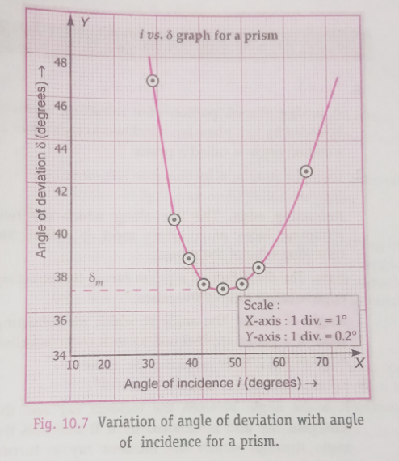

- Date: 14/9/24

## Aim of the Experiment
To determine the angle of deviation of the glass prism by plotting a graph between angle of incidence and angle of deviation and hence to find the refractive index of the material of the prism. 

## Apparatus and Material Required 
1. Drawing board 
2. Triangular glass prism 
3. Alpins 
4. Drawing pins/adhesive tape 
5. Protractor 
6. Ruler 
7. White paper sheets 
8. Graph paper 

## Theory/Working Formulae 
1. When a ray of light passes through a prism, 
$$
\text{Angle of Prism} + \text{Angle of deviation} = \text{Angle of incidence} + \text{Angle of emergence} 
\\
A + \delta = i + e \implies \delta = i + e - A
$$

As $i$ increases, $\delta$ first decreases, becomes minimum and then increases. In the position of minimum deviation $\delta_m$, the ray of light passes symmetrically, i.e., parallel to the base so that $i = e$ and $r = r'$.

2. The relation between $\mu$ and $\delta_m$ is 
$$
\mu = \frac{\sin\frac{A+\delta_m}{2}}{\sin\frac{A}{2}}
$$

## Diagrams 
 

## Procedure 
1. Fix a sheet of white paper on a drawing board with drawing pins/adhesive tape. 
2. Using a sharp pencil, draw a long straight line $XY$ in the middle and parallel to the length of the paper. 
3. Mark seven points $O_1, O_2, ..., O_7$ at equal distances of 6 cm on the line $XY$.
4. Draw normals $N_1O_2, N_2O_2, ..., N_7O_7$ on the line $XY$.
5. Using a protractor, draw straight lines $P_1O_2, P_2O_2, ..., P_7O_7$ corresponding to the incident rays making angles of incidence at $30\degree, 35\degree, 40\degree, 50\degree, 55\degree$ and $60\degree$ respectively with the normals. 
6. By keeping a ruler along a line $XY$, place the prism along the ruler so that its refracting face $AB$ lies on the line $XY$, with point $O_1$ in the middle of $AB$. Draw the boundary of the prism with a sharp pencil. 
7. Fix two alpins $P_1$ and $P_2$ vertically, more than 6 cm apart, on the incident ray line $P_1O_1$ such that pins $P-2$ is close to point $O_1$. 
8. Close the left eye. Looking into the prism from the opposite refracting face $AC$, position the right eye in line with images of the feet of pins $P_1$ and $P_2$. Now fix pins $P3$ and $P_4$ in the line with $P_1$ and $P_2$ as viewed through the prism. Eye should be kept at some distance from the pins so that all the pins can be seen in clear focus simultaneously, as shown in the diagram. Distances $P_1P_2$ and $P_3P_4$ should not be less than 6 cm so as to locate the directions of the incident raw and the emergent ray with an accuracy of the order of $1\degree$. 
9. Remove the alpins and encircle their pin pricks with a sharp pencil. Draw the line joining $P_3$ and $P_4$. Procedure lines $P_1P_2$ (forward) and $P_3P_4$ (backward) so that they meet point M. Draw arrowheads on $P_1P_2$ and $P_3P_4$ to indicate the directions of incident and emergent rays respectively.
10. Using a protractor, measure the angle of incidence $i = \angle P_1O_1N_1$ and also the angle of deviation $\delta = \angle P_4MS$.
11. By placing the prism at locations $O_2, O_3, O_3, O_4, O_5, O_6$ and $O_7$, repeat the experiments for angles of incidence $35\degree, 40\degree, 50\degree, 55\degree$ and $60\degree$, respectively. Measure the corresponding angle of deviation in each case and indicate the values of these angles in the diagram. 
12. Measure the angle of prism A between the refracting faces AB and AC.
13. Record all observations in a tabular form. 

## Observations 
- Angle of prism, $A = 60\degree$

> [!WARNING]
> All the values of angle of deviation are incorrect.

| S. No. | Angle of incidence, $i$ | Angle of deviation, $\delta$ | 
|:-:|:-:|:-:|
| 1. | $30\degree$ | $49\degree$ |
| 2. | $35\degree$ | $52\degree$ |
| 3. | $40\degree$ | $43\degree$ |
| 4. | $50\degree$ | $49\degree$ |
| 5. | $55\degree$ | $43\degree$ |
| 6. | $60\degree$ | $69\degree$ |

## Graph and Calculations 
Choosing suitable scales, plot a graph between $i$ and $\delta$. Take angle of incidence $i$ along X-axis and angle of deviation $\delta$ along Y-axis. Draw free hand smooth curve passing through the maximum number of plotted points. 

Draw a tangent on the lowest point of the curved parallel on the X-axis. Read the angle of minimum deviation $\delta_m$ on the Y-axis of the graph. 

$$
\text{Angle of minimum deviation,}
\\
\delta_m = 

\therefore \text{Refractive index,}

\mu = \frac{\sin\frac{A+\delta_m}{2}}{\sin\frac{A}{2}} = 
$$

## Result 
1. As the angle of incidence increases, the angle of deviation first decreases, reaches a minimum value and then again increases, as is obvious from the $i$ versus $\delta$ graph. 
2. Angle of minimum deviation, $\delta_m$ = 
3. Refractive index of the prism material, $\mu$ = 

## Precautions 
1. An ink mark should be put on the prism to distinguish the refracting angle A from the other angles and the same angle of prism should be used throughout.
2. The angle of incidence shouldn't be less than $30\degree$, as the ray mage the totally reflected inside the prism. 
3. Alpins should be fixed vertically and the pin pricks should be encircled immediately after they are removed. 
4. While fixing alpins, the feet of pins must be adjusted in the same straight line.
5. Indicate the path of the incident, the refracted and the emergent rays by arrowheads.

## Sources of Error 
1. Alpins may not be vertical. 
2. The feet of the alpins may not be in a straight line. 
3. the distances between the pins may be small. 
4. Position of the prism might have disturbed during a given set of observations.
5. Measurement of angles may not be accurate. 