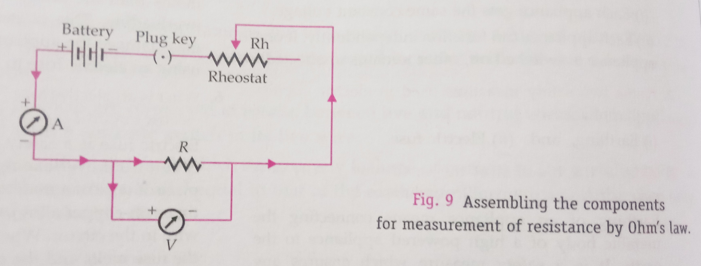

## Aim of the Activity 
To assemble a household circuit comprising three bulbs, three on/off switches, a fuse and a power source. 

## Apparatus and Material Required 
1. Three bulbs (40 W, 220 V each)
2. Three on/off switches 
3. Socket
4. Plug
5. Fuse of 1.0 A 
6. Flexible connecting wires 
7. Main switch 

## Theory 
1. A household circuit works on ac mains of 220 V, 50 Hz. From the mains we get two supplies of different current ratings: 
    1. Light line of 5 A for low power appliances like light bulbs, ceiling fans, fluorescent tubes, etc.
    2. Power line of 15 A for heavy duty appliances like room heater, air conditioner, hot plates, water heater, etc. 
2. If $P_1, P_2, P_3, ...$ are the powers consumed by different appliances, then the total power consumed in the household circuit is: $P = P_1 + P_2 + P_3 + ....$

Current drawn from the mains of V volts will be $I = \frac{P}{V}$

To protect the appliances from damage due to excessive currents, a fuse of rating 10 to 20% higher than the normally drawn current is connected in series with the live wire from the source of power. 

3. Different appliances are connected in parallel between live and neutral wires. Each appliance is provided with a separate switch in its live wire. 
4. Earth wire is a safety measure which ensures any leakage of current to the metallic body of an appliance keeps its potential equal to that of the earth wire (zero volt) and the user may not get a severe electric shock. 

## Circuit Diagram 
 

## Conclusions 
1. Each bulb functions independently of the other through a separate switch. 
2. The three bulbs can function simultaneously with the installed fuse safely. 

## Precautions 
1. The rating of the required fuse must be determined carefully by calculating the maximum current drawn by the circuit. 
2. Never use safety fuse of much higher rating than the current normally drawn from/by the circuit.
3. The safety fuse and the on/off switches must be connected in live wire. 
4. Take care while working with mains. 