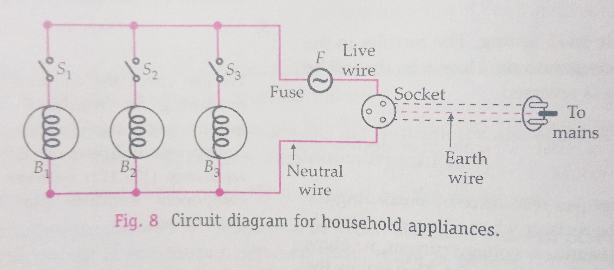

## Aim of the Activity 
To assemble the components of a given electrical circuit. 

## Apparatus and Material Required 
1. A resistor 
2. Ammeter (0-1.5 A)
3. Voltmeter (0-5 V)
4. Battery/Battery Eliminator 
5. One-way-key
6. Rheostat 
7. Connecting wires 
8. Piece of sand paper 

## Theory 
For assembling the components of any circuit, it is advisable to connect the components in the following order. 

1. Source of power (battery/battery eliminator)
2. Plug key (near the battery)
3. Resistors, bulbs, inductors or any other load (to be connected end to end).
4. Measuring instruments, ammeter, voltmeter, meter bridge, potentiometer, etc. Ammeter is connected in series and voltmeter in parallel with the load with positive ends of both towards the positive terminal of the battery. 

## Circuit Diagram 
 

## Procedure 
1. Draw the circuit diagram required for the given activity and arrange the components accordingly on the work table. 
2. Clean the ends of the connecting wires with a piece of sand paper. 
3. Connect the battery, ammeter A, resistance R, rheostat Rh and plug key K all in series and voltmeter V in parallel with resistor R. See that the positive ends of ammeter and voltmeter are connected towards the positive terminal of the battery.
4. Insert the plug in the key K See that the ammeter and voltmeter show deflections on the right hand (positive) side. Adjust the rheostat so that the deflections are within scale.
5. The deflections in ammeter and voltmeter verify the continuity of the assembled circuit. 

## Conclusion 
The components of the given electrical circuit have been correctly assembled. 

## Precautions 
1. Before making the connections, clean the ends of the connecting wires with a piece of sand paper. 
2. Make neat and tight connections. 
3. The ammeter should be connected in series and voltmeter in parallel with the resistor.
4. The positive ends of both ammeter and voltmeter should be connected to the positive terminal of the battery.