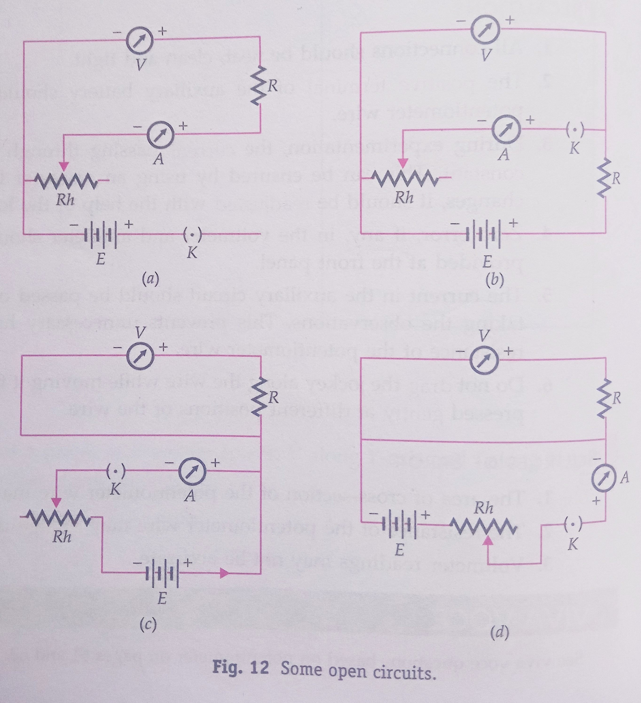

## Aim of the Activity 
To draw the diagram of given open circuit comprising at least a battery, resistor/rheostat, key, ammeter, voltmeter. Mark the components that are not connected in proper order and correct the circuit and circuit diagram. 

## Apparatus and Material Required 
1. Battery 
2. Plug key 
3. Resistor 
4. Rheostat 
5. Ammeter
6. Voltmeter 
7. Connecting wires 
8. Sand paper 

## Theory 
Electrical circuits can be either functional or open type. 

- **Functional Electrical circuit**: an electrical circuit is functional only if all the components are connected in proper order, assuming that all circuit components/devices are in working condition and key is closed. With closed key, all components satisfy the property of continuity. 
- **Open Electrical Circuit**: an open circuit means there is a break in some part of the circuit. This break may be either deliberate such as a key left in open position or a fault such as a broken wire, some burnt out component or a loose connection. This circuit shown discontinuity for one or more components. 

## Circuit Diagrams 
 

## Procedure 
1. Draw the given circuit diagram in the notebook. 
2. In the diagram, mark the components which have not been connected in proper order. 
3. Make a list of all components in the observation table and mark a tick in appropriate column against each component. 
4. Now draw the correct circuit diagram. 
5. Assemble and connect the electrical components in accordance with the corrected circuit diagram.
6. Insert a plug in the key and note the deflections in ammeter and voltmeter. Deflections in these meters towards right hand side verify that the corrected circuit is functional. 

## Observations 
| S. No. | Circuit component | Correct connection | Incorrect connection |  
|:-:|-|:-:|:-:|
| 1. | Battery | | |
| 2. | Resistor | | | 
| 3. | Rheostat | | | 
| 4. | Key | | | 
| 5. | Ammeter | | | 
| 6. | Voltmeter | | |

## Corrected Circuit Diagram 
> [!CAUTION]
> To be fill on the day of activity.

## Result 
The circuit assembled by connecting components in proper order is functionally correct as verified by passing current through it. 

## Precautions 
1. Before making the connections, ends of the connecting wires must be cleaned properly with a piece of sand paper. 
2. The ammeter should be connected in series with the resistor and the voltmeter in parallel with it. 
3. The positive terminals of ammeter and voltmeter should be connected to the positive terminal of the battery. 
4. Rheostat should be connected in the circuit using its one end terminal and the other variable terminal. 
5. The plug key should be kept open throughout. It should be closed only at the time of checking the continuity of the circuit. 