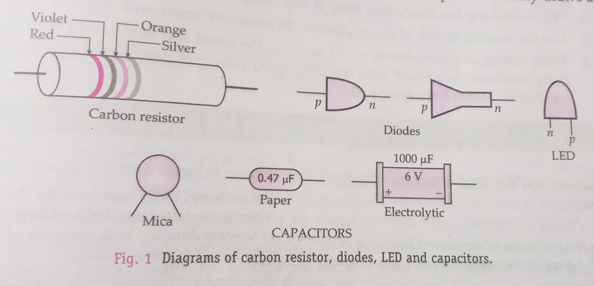

## Aim of the Activity  
To identify a diode, an LED, a resistor and a capacitor from a mixed collection of such items. 

## Apparatus and Material Required 
1. Multimeter 
2. Mixed collection of diode, LED, resistor and capacitor. 

## Theory 
- **Diode**: a two terminal device which conducts current when forward biased and not when reverse biased. It does not emit light during its conduction. 
- **LED**: a light emitting diode is a two terminal device which conducts current when forward biased and not when reverse biased. It emits a characteristic light during its conduction. 
- **Resistor**: a two terminal device which conducts equally in both direction. 
- **Capacitor**: a two terminal device which offers infinite resistance to DC but has finite reactance for AC. When connected across a DC source, a multimeter shown a large current initially (for C > $\mu$F) which decreases to zero quickly. This is because the capacitor initially draws a charge. 

## Diagrams 
 

## Procedure 
1. Look at the color bands on the given components. If a component has set of three color bands followed by a silver or gold band, then component is a resistor. 
2. Insert the black and red leads (or probes) into common and positive terminals of the multimeter. Turn its selector switch to resistance mode - highest range (0-M$\Omega$).
3. Touch the two probes to the two ends of each component one by one. Note the direction of deflection in the multimeter. Interchange the positions of two probes for each component and again note the deflection. 
4. If the multimeter shows an equal deflection in both directions, then the component is a resistor. 
5. If a multimeter shows deflection in one direction without any emission of light from the component and no deflection in the opposite direction, then the component is a diode. 
6. If the multimeter shows deflection in one direction alongside with the emission of light from the component and no deflection in the opposite direction, then the component is an LED. 
7. If the multimeter doesn't show any deflection on connecting its probes either way to a component, then the component is a capacitor. But if the capacitance of the capacitor is large, the multimeter will show a large deflection initially which decreases to zero. 
8. Record all your observations in a tabular form. 

## Observations 
| Item Code | State of conduction of a component | Identified component | 
|:-:|:-|:-:|
| A | Conducts equally in both directions | Resistor | 
| B | Conducts in one direction without emission of light | Diode | 
| C | Conducts in one direction with emission of light | LED | 
| D | Does not conduct, gives an initial deflection which decays to zero | Capacitor |

## Result 
From the mixed grouping of components, the components marked A, B, C and D have been identified as resistor, diode, LED and capacitor respectively. 

## Precautions 
1. While checking the conduction state of any component, clean its leads properly. 
2. Use the selector switch of the multimeter in resistance mode with highest range option. 
3. While testing any component, avoid touching the metal end of either of multimeter probe. Body resistance in parallel with the component resistance may create confusion about the conduction state of the component. 