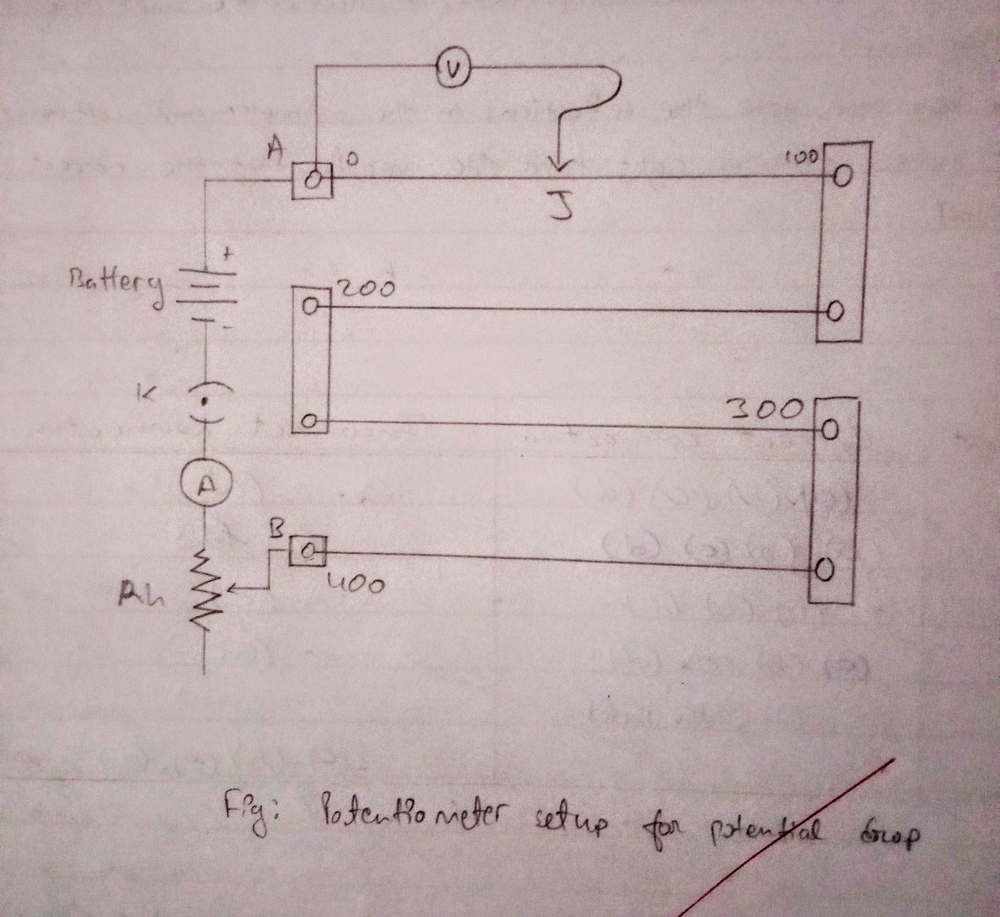

## Aim of the Activity 
To study the variation in potential drop with length of a wire for a steady current. 

## Apparatus and Material Required 
1. Potentiometer 
2. Battery eliminator 
3. Voltmeter 
4. Ammeter 
5. Plug key 
6. Jockey 
7. Low resistance rheostat 
8. Connecting wires 
9. A piece of sand paper 

## Theory 
A potentiometer works on the principle that if a constant current flows through a wire of uniform area of cross section and composition, then the potential drop V across any length l of the wire is directly proportional to the length l. 

$$
V \propto l \text{ or } V = kl \text{ or } k = \frac{V}{l}
$$

Here, k is the potential drop per unit length and is called potential gradient. 

## Circuit Diagram 
 

## Observation 
- Range of voltmeter = 0 to 3 V 
- Least count of voltmeter = 0.05 V 
- Range of ammeter = 0 to 10 A 
- Least count of ammeter = 0.2 A 
- Steady current in ammeter = 0.6 A 

| S. No. | Length of Potentiometer wire l (cm) | Voltmeter reading V (V) | Potential Gradient k =V/l (V/cm) | 
|:-:|:-:|:-:|:-:|
| 1. | 0 | 0 | 0 | 
| 2. | 40 | 0.25 | 0.00625 | 
| 3. | 80 | 0.45 | 0.005625 | 
| 4. | 120 | 0.60 | 0.005 | 
| 5. | 160 | 0.75 | 0.004688 | 
| 6. | 200 | 0.95 | 0.00475 | 
| 7. | 240 | 1.10 | 0.004583 | 
| 8. | 280 | 1.25 | 0.004464 | 
| 9. | 320 | 1.45 | 0.004531 | 
| 10. | 360 | 1.60 | 0.004444 | 
| 11. | 400 | 1.75 | 0.004375 |

- Mean value of k = 0.004428 V/cm 

## Graph 
 

## Result 
1. Within the limits of experimental error, the ratio V/l is found to be constant. This shows that $V\propto l$. Mean value of **k = 0.004428 V/cm**. 
2. V vs. l graph is almost a straight line which shows that $V\propto l$. Value of potential gradient from the graph, $k = \frac{V_2-V_1}{l_2-l_1} = 0.004166 V\ cm^{-1}$

## Precautions 
1. All connections should be neat and tight. 
2. The positive terminal of the auxiliary battery should be connected to end A of the potentiometer wire.
3. Zero error, if any, in the voltmeter and ammeter should be adjusted by the screw provided at the front panel. 
4. Do not drag the jockey along the wire while moving it from one point to another. 
5. The jockey must be only pressed gently at different positions of the wire. 

## Sources of Error 
1. The area of cross-section of the potentiometer may not be uniform. 
2. The resistance of potentiometer wire may change due to heating. 
3. Voltmeter readings may not be accurate. 