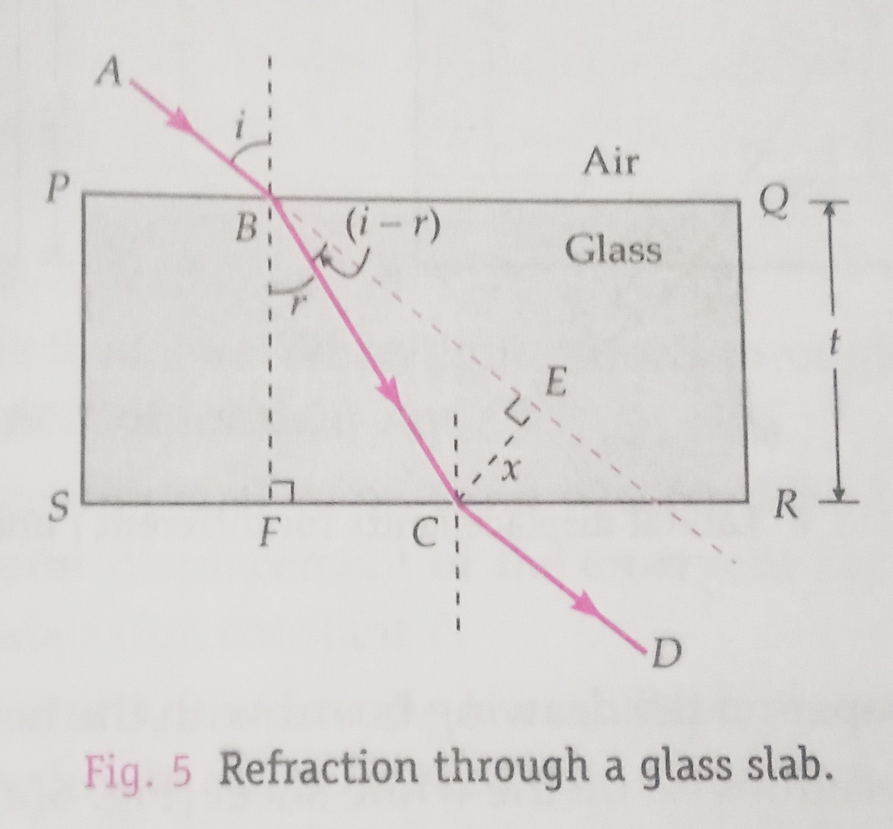
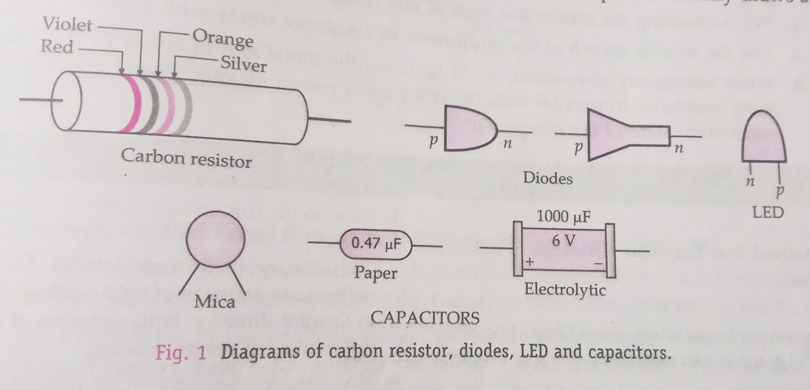

## Aim of the Experiment 
To observe refraction and lateral deviation of a beam of light incident obliquely on a glass slab. 

## Apparatus and Material Required 
1. Rectangular glass slab 
2. Drawing board 
3. White paper sheet 
4. Adhesive tape/drawing pins 
5. Alpins 
6. Protractor 
7. Ruler 
8. Sharp pencil 
9. Eraser 

## Theory 
The diagram shows the path of ABCD of a ray suffering refraction through a rectangular glass slab PQRS. It is seen that 

$$
\text{Angle of incidence } i = \text{Angle of emergence } e 
$$

 

Thus the emergent ray CD is parallel to the incident ray AB. But the emergent ray gets laterally displayed with respect to the incident ray. The perpendicular distance between the incident and emergent rays, when light is incident obliquely on a refracting slab with parallel faces, it is called lateral shift or lateral displacement. 

It is given by, 

$$
d = \frac{t}{\cos r}\sin (i-r) = t \sin i [\frac{\cos i}{(\mu^2-\sin^2i)^{\frac{1}{2}}}]
$$

Clearly, $d_\text{max} = t \sin 90\degree = t$

The lateral shift produced by a glass slab increases with 

1. The increase in thickness $t$ of glass slab 
2. The increase in the value of angle of incidence $i$ 
3. The increase in refractive index $\mu$ of the glass slab. 

## Ray Diagrams 
 

## Procedure 
1. Fix a white sheet of paper on a drawing board with the help of adhesive tape or drawing pins. 
2. Place the glass slab breadthwise on the white sheet. Mark its boundary PQRS with a sharp pencil. 
3. Remove the glass slab. Take a point $B_1$ on face AB. Draw a normal $B_1N_1$ on PQ. With the help of a protractor, draw an incident ray $A_1B_1$ making an angle of incidence of $40\degree$ with the normal $B_1N_1$. 
4. Again, place the glass slab within its boundary PQRS. Fix two alpins $P_1$ and $P_2$ vertically on the incident ray $A_1B_1$, about 8 to 10 cm apart. 
5. Looking into the slab from the opposite face SP, position the eye in such a way that the feet  of pins $P_1$ and $P_2$ appear to be one behind the other. Now fix pins $P_3$ and $P_4$ vertically in line with pins $P_1$ and $P_2$ as viewed through the slab. 
6. Remove the alpins and encircle the pin-pricks. Remove the slab and complete the path of the ray of light $A_1B_1C_1D_1$. Draw perpendiculars $C_1E_1$ on $A_1B_1$ produced and measure the length of $C_1E_1$. This gives the measure of lateral displacement d. 
7. Place the glass slab lengthwise. Repeat the experiment again for the same angle of incidence of $40\degree$. Measure the lateral displacement. 
8. Place the glass slab thicknesswise . Repeat the experiment again for the same angle of incidence $40\degree$. Measure the lateral displacement. 

## Observations 
- Least count of the protractor = degrees 
- Least count of the ruler = mm = cm 
- Breadth of the glass slab, $t_2$ = cm 
- Length of the glass slab, $t_1$ = cm 
- Thickness of the glass slab, $t_3$ = cm 

|S.No.|Thickness of glass slab traversed|Angle of incidence i (degrees)|Angle of emergence e (degree)| Difference i - e (degrees)|Lateral displacement d (cm)|Ratio $\frac{d}{t}$|
|:-:|:-:|:-:|:-:|:-:|:-:|:-:|
| 1. | $t_1$ | 40 | | | $d_1$ | |
| 2. | $t_2$ | 40 | | | $d_2$ | |
| 3. | $t_3$ | 40 | | | $d_3$ | |
| 4. | $t_4$ | 40 | | | $d_4$ | |

## Result 
1. As difference i - e is small, so i = e. When light refracts through a glass slab, the emergent raw is parallel to the direction of the incident ray. 
2. Within the limits of experimental error, from observations 1, 2 and 3 we see that the ratio d/t = constant. The lateral displacement of the emergent ray is directly proportional to the thickness of the glass slab (for constant i). 

## Precautions 
1. The boundary of the glass slab should be marked with a sharp pencil. 
2. Alpins should be fixed vertically and about 8 to 10 cm apart. 
3. The feet of the alpins and not their heads should be adjusted in the same straight line. 
4. Just after removing an alpin, encircle the pin-prick with a sharp pencil. 