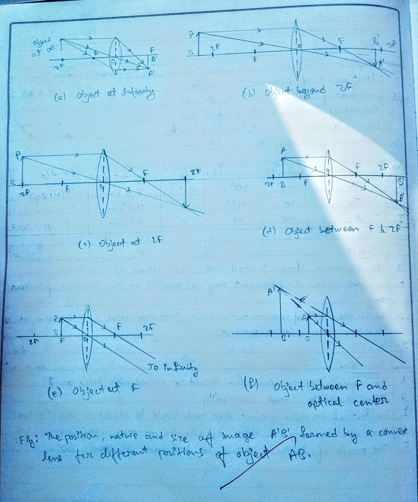
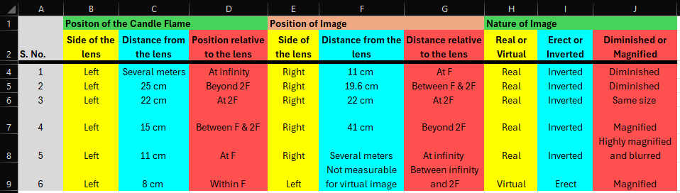
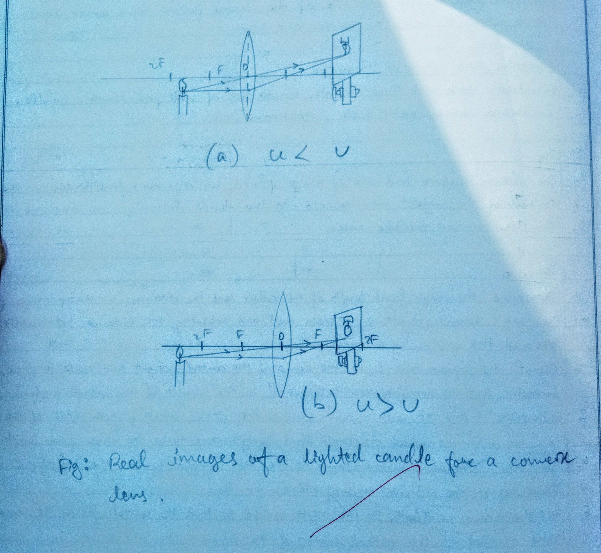

## Aim of the Activity 
To study the nature and size of image formed by a convex lens on a screen by using a candle and screen. 

## Apparatus and Material Required 
1. An optical bench with three uprights
2. Convex lens of small focal length
3. Candle 
4. Cardboard screen 
5. Meter scale 
6. Match Box 

## Theory 
The position, nature and size of image formed by a convex lens depends on the position of the object with respect to the lens. Following ray diagrams show the various possible cases. 

## Ray Diagram
 

## Observations 
- Rough focal length of convex lens, f = 11 cm 
- Position of 2F from the lens, 2f = 22 cm 

## Working Diagram
 

## Conclusions 
1. As the object moves towards the focus, the size of image increases and moves away from the focus. In all the positions the image is real, inverted and formed on the other side of the lens. 
2. When the object is at focus, the image is real, inverted and blurred being highly magnified. 
3. When the object is at distance less than the focal length, the image is virtual, erect and magnified. It is formed on the same side of the object. 

## Precautions 
1. The experiment must be performed at a shaded place free from air droughts.
2. The candle flame should be as high as the optical center of the lens. 
3. The aperture of the lens must be small for getting a distinct image.
4. The principal axis of the lens should be horizontal and parallel to the optical bench. 
