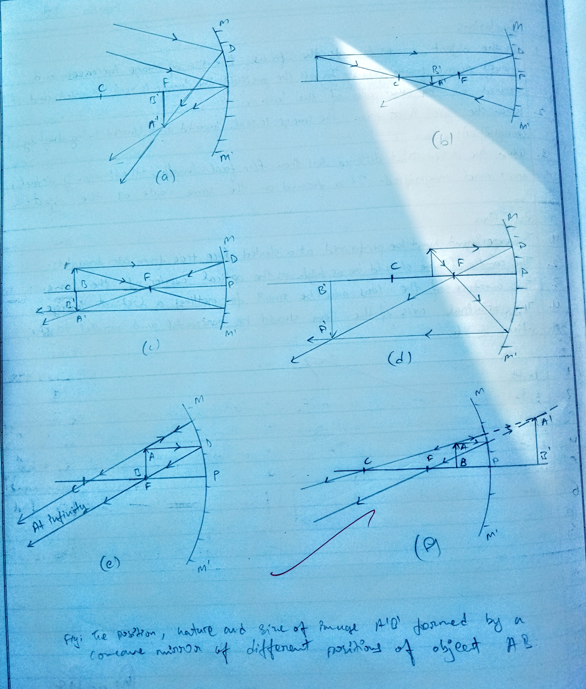
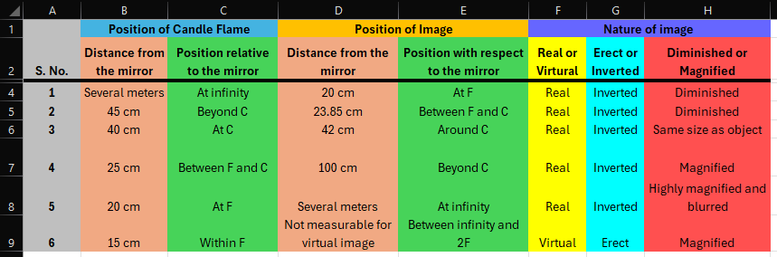
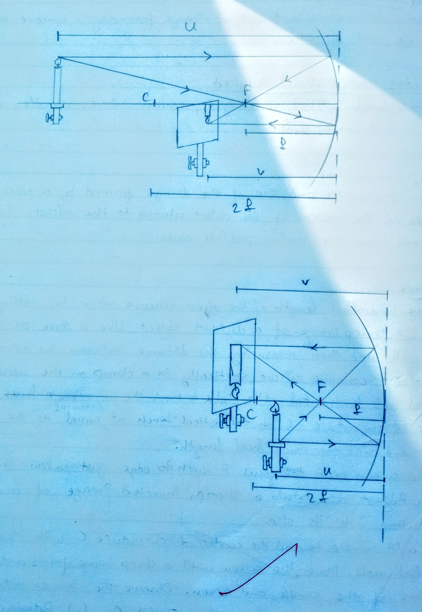

## Aim of the Experiment 
To study the nature and size of image formed by a concave mirror using a candle and a screen.

## Apparatus and Material Required
1. An optical bench with three uprights.
2. Concave mirror 
3. Candle 
4. Matchbox 
5. Screen 
6. Meter scale 

## Theory 
The position, nature and size of the image formed by a concave mirror depends on the position of the object relative to the mirror. Following ray diagrams show the various possible cases 

## Ray Diagrams 
 

## Observations 
- Rough focal length of concave mirror, f = 20 cm 
- Approximate radius of curvature of the concave mirror, R = 2f = 40 cm 

## Working Diagrams 
 

## Conclusions 
1. As the object moves towards the concave mirror from infinity, the image moves away from the focus till when the object is at the focus, the image moves away to infinity.
2. The size of the image increases as it moves away from the mirror. 
3. If the object is placed between infinity and F, the image formed by a concave mirror is real and inverted. 
4. If the object is placed between F and the pole, the image is formed behind the concave mirror and it is virtual, erect and magnified. 

## Precautions 
1. The principle axis of the mirror should be horizontal. 
2. The uprights holding the mirror, candle and screen should be rigid and vertical.
3. The experiment should be performed in a shaded region where no direct light reaches. 
4. The aperture of the mirror should not be small otherwise the image formed will not be distinct. 
5. Eye should be placed at a distance more than 25 cm from the image formed on the screen.