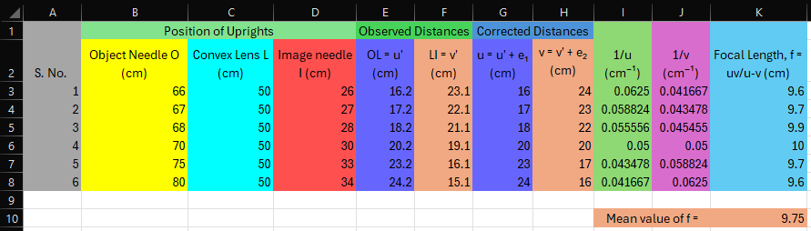

## Aim of the Experiment 
To find the focal length of convex lens. 

## Apparatus and Material Required 
1. Optical bench 
2. Three uprights with clamps 
3. Two sharp-edged needles 
4. Convex lens of focal length less than 20 cm 
5. Index needle/knitting needle 
6. Half meter scale 

## Theory/Working Formula 
1. If an object needle is placed between f and 2f of a convex lens, its real, inverted and magnified image is formed beyond 2f on the other side of the lens. By placing another needle, called image needle there, we can locate the image of the first needle by removing the parallax between the image and the second needle itself. 

2. The relation between the object distance u, image distance v, and focal length f of a convex lens is given by the thin lens formula, 

$$
\frac{1}{f} = \frac{1}{u} \text{ or } f = \frac{uv}{u-v}
$$

According the new Cartesian sign convention, u is negative and v is positive when a convex lens forms a real image. Also, f is positive for a convex lens. 

## Observations and Calculations 
- Rough focal length of a convex lens = 10 cm 
- Actual length of needle, x = 
- Observed length of the needle between object needle and convex lens, y = 
- Observed length of the needle between image needle and convex lens, z = 
- Index correction for object distance $u = e_1 = x-y =$
- Index correction for image distance $v = e_2 = x-z =$

## Result 
Focal length of the convex lens calculated from u and v values of $f = \frac{uv}{u-v}=$ 9.75 cm 

## Precautions 
1. The uprights should be rigid and vertical. 
2. Parallax should be removed tip to tip. 
3. The object an image needles should not be interchanged during the course of the experiment. 
4. Index corrections for u and v must be carefully determined and applied. 

## Sources of Error 
1. The uprights may not be vertical. 
2. Parallax might not have been removed completely. 
3. The optical bench may not be horizontal with the table. 
