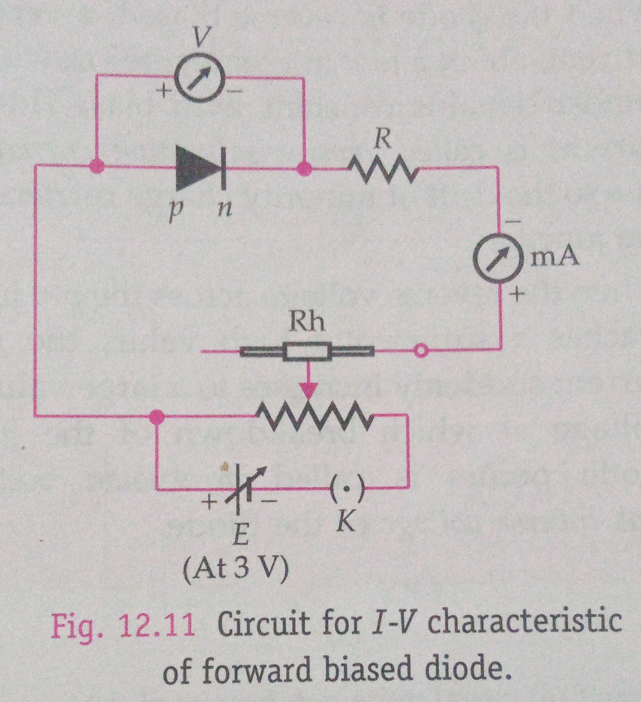
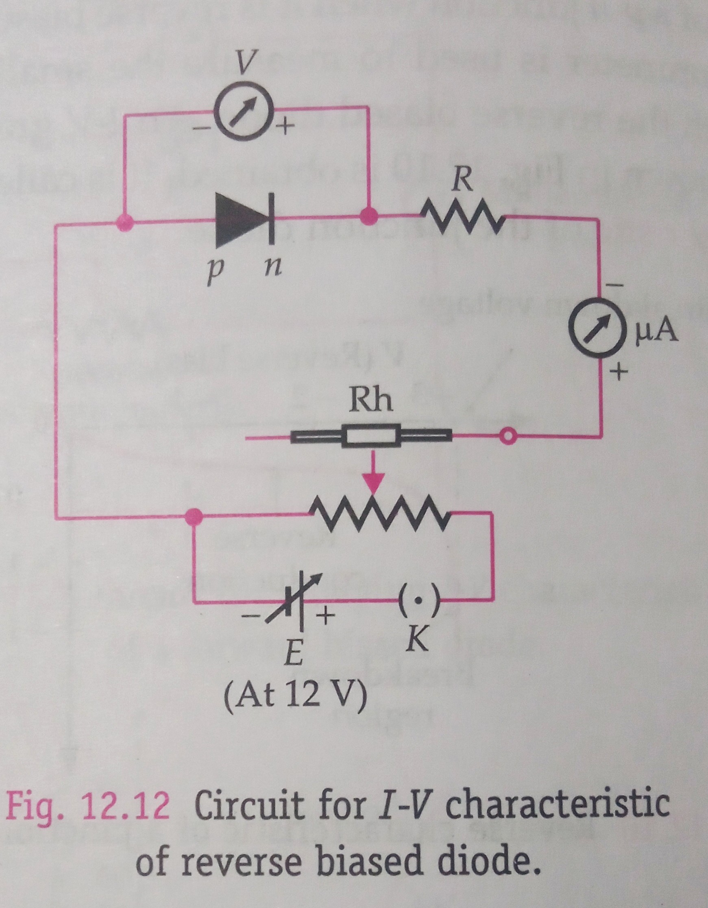
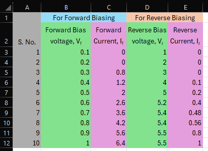
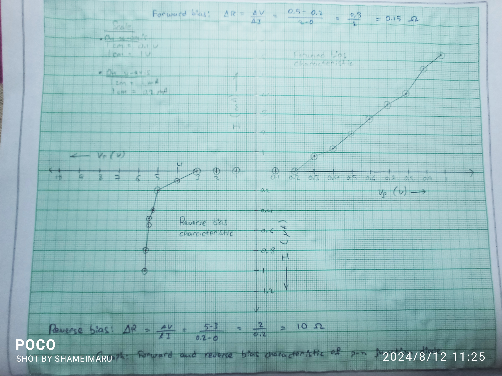

# Aim of the Experiment 
To draw the I-V characteristic curve for a p-n junction diode in forward bias and reverse bias. 

# Apparatus and Material Required 
A p-n junction diode (0A-79 or IN4007), a resistor (10-12 V) of value (3 $\Omega$, 1/2 W), a variable voltage power supply, voltmeter (0-3 V), milliammeter (0-200 mA), voltmeter (0-12 V), microammeter (0-200 $\mu A$), a plug key, connecting wires and a sand paper. 

# Theory 
A graph showing the variation of current flowing through a p-n junction with the voltage applied across it is called current-voltage or I-V characteristic of a p-n junction. 

- **Forward bias characteristic**: If the positive terminal of a battery is connected to p-side and the negative terminal to the n-side, then the p-n junction is said to be forward biased. With the increase in bias voltage, initially the current increases very slowly almost negligibly, till the voltage across the diode crosses a certain value, called the threshold voltage or cut-in-voltage. After the voltage, the diode current increases rapidly, even for a small increase in the bias voltage. 
- **Reverse bias characteristic**: If the positive terminal of a battery is connected to the n-side and the negative terminal to the p-side, then the p-n junction is said to be in reverse biased. When the reverse bias voltage increases, initially the current increases but soon becomes constant. This current is very small (a few $\mu A$). It is called reverse saturation current. 

|  |  |
|-|-| 

# Observations 
Range of voltmeter $\rightarrow$ 0-1 V, LC=0.02  
Range of ammeter $\rightarrow$ 0-10 mA, LC = 0.4 

# Graph Plotting 

# Calculations 
1. Plot a graph b/w forward voltage $V_f$ and forward current $I_f$ taking $V_f$ along x-axis and $I_f$ along y-axis. The obtained graph is the forward bias characteristic of p-n junction diode.
2. Plot the graph b/w reverse voltage $V_r$ and reverse current $I_r$ taking $V_r$ along -ve x-axis and $I_r$ along -ve y-axis. The obtained graph is the reverse bias characteristic of p-n junction diode. 

# Result 
1. The I-V characteristic curve for forward biasing of the given diode is shown in the graphs. 
2. From the forward characteristic curve, cut-in-voltage for the given junction diode is **0.2 V**.
3. From the reverse characteristic curve, cut-in-voltage for the given junction diode is **0.3 V**.
4. In forward bias, the dynamic resistance is **0.15 $\Omega$**
5. In reverse bias, the dynamic resistance is **10 $\Omega$**.
6. In reverse bias, the saturation current is **0.2 $\mu A$**.

# Precautions 
1. During forward biasing, the current through the diode should not exceed its permissible limit.
2. The passage of current through the diode for longer duration may heat up the diode that might cause issues. 
3. The current through the diode should be passed only when the observations are being taken. 

# Source of Error
1. The junction diode used in the experiment may be damaged one. 
2. The p-n junction, voltmeter, milliammeter and ammeter may not have been connected with proper polarities to the power supply. 