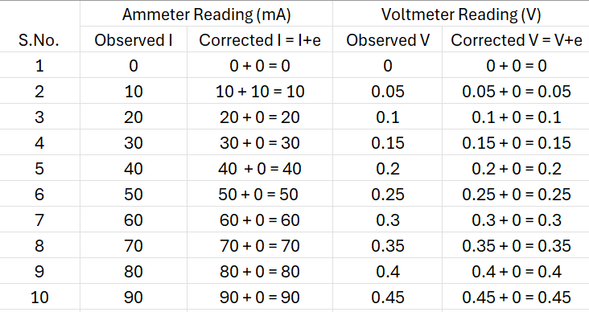
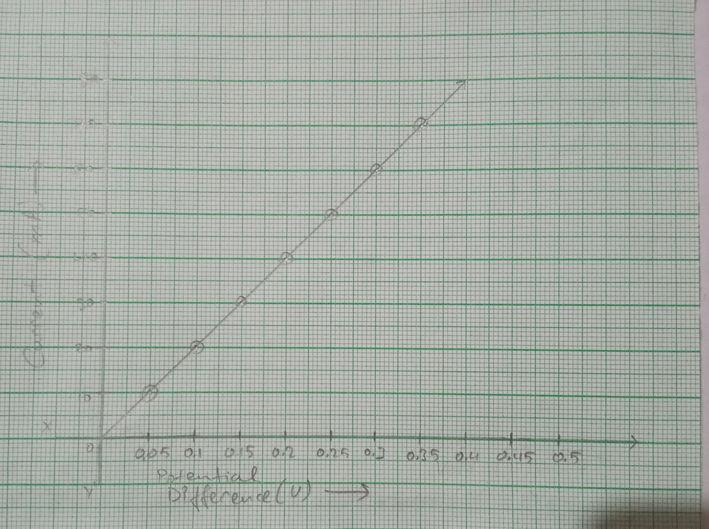

# Aim of the Experiment 
To determine the resistivity of given wire by plotting a graph of potential difference versus current. 

# Apparatus and Material Required 
1. Two resistance wires (of constantan and nichrome and about 1 m in length)
2. A voltmeter (0-3 V)
3. A milliammeter (0-500 mA)
4. A low-resistance rheostat
5. A battery eliminator
6. Plug Key 
7. Connecting wires
8. A piece of sandpaper 
9. Screw gauge
10. Meter scale

# Theory
According to Ohm's Law, the current I flowing through a conductor is directly proportional to the potential difference V applied across its ends provided with physical conditions (temperature and pressure) of the conductor remain unchanged. 

$$
V \propto I \text{ or } V = IR \text{ or } R = \frac{V}{I}
$$

where R is the resistance of the conductor. Obviously, the graph between the current I and the applied voltage V will be a straight line passing through the origin. 

$$
R = \frac{1}{\text{Slope of I-V graph}}
$$

But the resistance R of a wire of length l, area of cross-section A and specific resistance $\rho$ is given by,

$$
R = \rho \frac{l}{A} = \rho\frac{1}{r^2\pi} \text{ where r is the mean radius of the wire}
$$

# Observation 
- Length of the wire, l = **10 cm** = **0.1 m** 
- Range of Ammeter = **0-1 A**
- Range of Voltmeter = **0-3 V**
- Least count of Ammeter = **0.02 A**
- Least count of Voltmeter = **0.5 V**
- Zero error of Ammeter, $e_1$ = **0 A**
- Zero error of Voltmeter, $e_2$ = **0 V**

# Graph Plotting

# Calculations 
Diameter of wire, d = 0.50 mm 
Radius of wire, $r = \frac{d}{2} = 0.25\ mm = 0.25 \times 10^{-3}\ m$  
Length f wire, $l = 10\ cm = 10 \times 10^{-2}\ m = 0.1\ m$  
Resistance of wire, $R = 5.1\ \Omega$  
Resistivity, $\rho = \frac{R\pi r^2}{l}=0.04\ \Omega m$

# Result 
1. The current through the given resistance wire varies linearly with the potential difference across its ends. 
2. Specific resistance of given wire = $0.04\ \Omega m$

# Precautions 
1. All the connections should be neat and tight.
2. The ends of the wires must be cleaned with a sand paper. 
3. The ammeter and voltmeter used should be of suitable range. For low currents, a milliammeter should be used. 

# Sources of Error 
1. The wire used may not be of uniform area of cross section. 
2. Resistance of wire may change due to excessive heating. 
3. There may be an error in the measurements of radius of the wire due to backlash error in the screw gauge. 