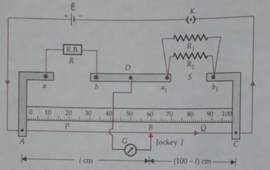

## Aim of the Experiment
To verify the law of parallel combination of resistances using a meter bridge. 

## Apparatus and Material Required
1. Meter bridge
2. Sensitive galvanometer 
3. Two resistance wires 
4. Resistance box 
5. Jockey
6. Plug key 
7. Battery eliminator 
8. Thick connecting wires 

## Theory 
1. **Measurement of unknown resistance**: with the known resistance R in the left gap and the unknown resistance $S$ ($R_1$ or $R_2$ or parallel combination of $R_1$ and $R_2$) in the right gap of the meter bridge, suppose the balance point is obtained at a distance $l$ cm from the left end, then the unknown resistance is given by
$$
S = R(\frac{100-l}{l})
$$

2. **Law of parallel combination of resistances**: when two resistances $R_1$ and $R_2$ are connected to parallel, their equivalent resistance $R_P$ is given by
$$
\frac{1}{R_P} = \frac{1}{R_1} + \frac{1}{R_3} \text{ or } R_P = \frac{R_1R_2}{R_1+R_2}
$$

## Circuit Diagram

## Observation table 

## Calculations 
- Experimental value of parallel combination of resistances, $R_P$ = 2.16 $\Omega$
- Theoretical value of parallel combination of resistances, $R_P'$ = $\frac{R_1R_2}{R_1+R_2}$ = 2.10 $\Omega$
- Difference = $R_P-R_P'$ = 0.06 $\Omega$

## Result 
Within the limits of the experimental error, the experimental and the theoretical values of the parallel combination of the resistances are equal. So the law of parallel combination of the resistances stands verified. 

## Precautions
1. All the connections should be neat and tight. 
2. All the plugs of the resistance box must be kept tight by giving them a gentle twist after inserting.
3. The jockey should not be pressed too hard on the wire, as otherwise it will damage the uniformity of the meter bridge wire. 
4. The battery circuit should be kept closed first before pressing the jockey on the bridge wire and reverse order should be followed at the time of break.
5. The current through the bridge wire should be passed for only as much time as is essential for getting a null point. 

## Sources of error
1. The meter wire may not be of uniform area of cross-section along its entire length.
2. There may be end errors due to resistances of copper strips at the ends of the bridge wire.
3. Due to prolonged flow of current, the resistance wires may get heated up and their resistances may change. 
4. The effective lengths of the wires used while measuring $R_P$ may not be exactly same as those used while measuring $R_1$ and $R_2$ individually. 