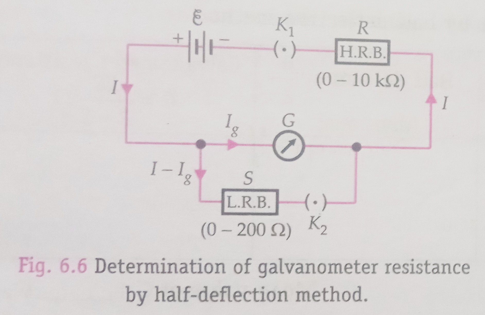
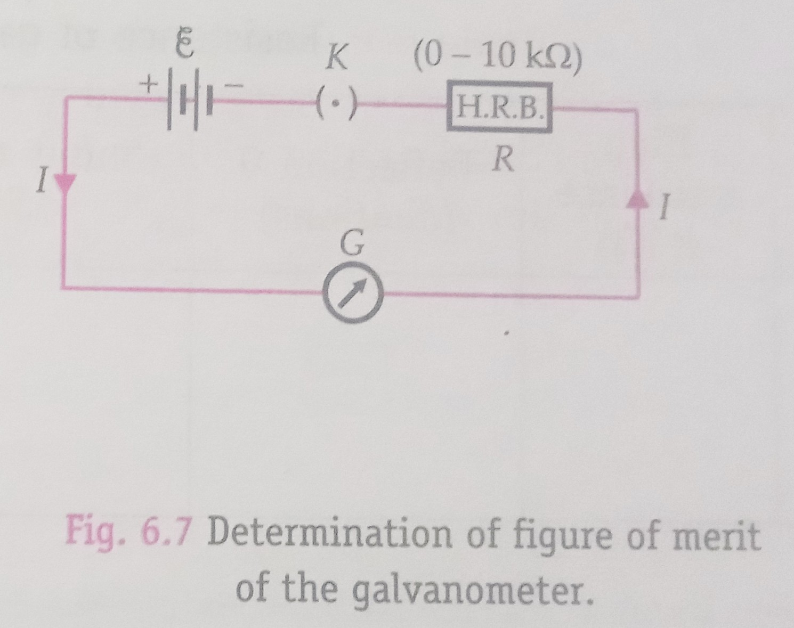

## Aim of the Experiment 
To determine the resistance of a galvanometer by half deflection method and to find its figure of merit. 

## Apparatus and Material Required 
1. Weston type galvanometer 
2. Battery of 3 V/a battery eliminator
3. High resistance box (0-10 $k\Omega$)
4. Low resistance box (0-200 $\Omega$)
5. Two one-way keys
6. Voltmeter (0-3 V) 
7. Connecting wires 
8. Piece of sand paper 

## Working Formulae 
1. The resistance of G of a galvanometer by half deflection method is given by 
$$
G = \frac{RS}{R-S}
$$
where R is the resistance in series with the galvanometer and S is the shunt resistance. 
2. The figure of merit of the galvanometer is given by 
$$
k = \frac{\mathcal{E}}{(R+G)\theta}
$$
where $\theta$ is the deflection produced with series resistance R and $\mathcal{E}$ is the emf of the battery. 

## Circuit Diagrams 
|||
|-|-|

## Observations and Calculations 
### Resistance of galvanometer by half deflection method 
|S. No.|High resistance R ($\Omega$)|Deflection $\theta$ (divisions)|Shunt resistance S ($\Omega$)| Half deflection $\theta$/2 (divisions)|Galvanometer resistance $G=\frac{RS}{R-S}\Omega$
|-|-|-|-|-|-|
| 1. | 6500 | 30 | 140 | 15 | 143.081 | 
| 2. | 7500 | 26 | 130 | 13 | 132.293 | 
| 3. | 8000 | 24 | 140 | 12 | 142.493 | 
| 4. | 8500 | 22 | 130 | 11 | 132.99 | 

- Mean value of G = 137.019 $\Omega$

- Emf of battery, $\mathcal{E}$ = 2 $V$
- Resistance of the galvanometer, G = 137.019 $\Omega$

### Figure of merit of the Galvanometer 
|S.No.|High resistance R ($\Omega$)|Deflection $\theta$ (divisions)|Figure of merit $k = \frac{\mathcal{E}}{(R+G)\theta} A\ div^{-1}$|
|:-:|:-:|:-:|:-:|
| 1. | 3000| 30 | 0.000367 | 
| 2. | 3500| 26 | 0.000549 | 
| 3. | 4600| 20 | 0.000422 | 
| 4. | 5000| 18 | 0.000389 | 

- Mean value of k = 0.000499

- Total no. of divisions on either side of zero mark of the galvanometer scale, M = 50 divisions 
- Current required for full scale deflection, $I_g$ = $nk$ = 0.0124 $A$

## Result 
1. Resistance of galvanometer by half-deflection method, $G$ = 137.019 $\Omega$
2. Figure of merit of the galvanometer, $k$ = 0.000499 $A\ \text{div}^{-1}$
3. Current required for full scale deflection in the galvanometer, $I_g = 0.0124 A$

## Precautions 
1. All the connections show be neat, clean and tight. 
2. All the plugs of the two resistance boxes should be kept tight by giving them a gentle twist. 
3. The value of the series resistance R should be large. This ensures correct value of G. 
4. To decrease the deflection in the galvanometer, the shunt resistance S should be decreased. 
5. The emf of the battery should remain constant. For this, a freshly charged battery should be used. 

## Sources of Error 
1. The plugs in the resistance boxes may not be clean or tight. 
2. the emf of the battery may not be constant. 
3. The divisions on the galvanometer scale may not be of equal size. 